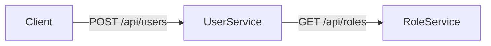
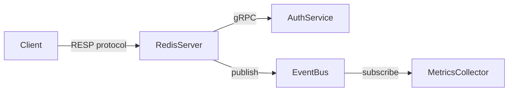

# Synthesis — Trace Aggregation and Spec Handoff

> Reference: Read after `/code-explore synthesis` is invoked.

## Purpose

Aggregate all accumulated traces into a synthesis document: consolidated entity/API maps, identified patterns, Feature candidates, and handoff preparation for reverse-spec or smart-sdd.

---

## Prerequisites

- At least 1 trace must exist in `specs/explore/traces/`. If not:
  ```
  ⚠️ No traces found. Run /code-explore trace "topic" to explore
  the codebase before synthesizing.
  ```

## Cross-Directory Handoff

If explore artifacts are in a **different directory** from where the user wants to build (e.g., traces in `/other/project/specs/explore/` but building in `~/my-project/`):

1. Generate `synthesis.md` in the explore directory (alongside traces)
2. **Copy synthesis.md to CWD**: `cp /other/project/specs/explore/synthesis.md ~/my-project/specs/explore/synthesis.md`
3. **Cleanup offer** (HARD STOP):
   ```
   📋 Synthesis complete. Explore artifacts are in /other/project/specs/explore/.

   Cleanup options:
   ```
   AskUserQuestion:
   - **"Keep explore branch"** → Leave `explore-study` branch for future reference
   - **"Delete explore branch"** → `git checkout main && git branch -D explore-study` in target repo
   - **"Keep as-is"** → No cleanup

---

## Synthesis Process

### Comparison Mode

If the user has explored multiple projects (multiple `specs/explore/` directories exist across different paths), synthesis can operate in **comparison mode**:

1. Locate all `specs/explore/orientation.md` files across explored projects
2. For each project, extract: tech stack, Domain Profile, module map, entity list, API list
3. Generate a comparison table:

| Aspect | Project A | Project B |
|--------|----------|----------|
| **Tech Stack** | {stack A} | {stack B} |
| **Domain Profile** | {profile A} | {profile B} |
| **Modules** | {count A} | {count B} |
| **Entities** | {list A} | {list B} |
| **Shared Patterns** | {patterns found in both} | — |
| **Unique to A** | {A-only patterns} | — |
| **Unique to B** | — | {B-only patterns} |

4. Highlight architectural differences and similarities
5. If handoff follows, recommend which patterns to adopt from each project

This mode activates automatically when synthesis detects exploration artifacts from more than one target directory.

### Step 1 — Read All Traces

Read every `specs/explore/traces/*.md` file and extract structured data:
- All Flow tables → aggregated call map
- All Entities Observed → consolidated entity list
- All APIs Observed → consolidated API list
- All Business Rules → consolidated rule list
- All Observations → categorized by icon (💡 ❓ ⚠️ 🔧)

### Step 2 — Entity Consolidation

Merge entities observed across multiple traces:
- Same entity name in different traces → merge fields (union)
- Different traces may reveal different fields of the same entity
- Flag conflicts: if same entity has contradictory field types across traces

```markdown
## Consolidated Entity Map

| Entity | First Seen | Traces | Fields (merged) | Candidate Owner |
|--------|-----------|--------|-----------------|-----------------|
| User | Trace 001 | 001, 003, 005 | id, name, email, role, avatar | C001-auth |
| Session | Trace 001 | 001, 004 | id, userId, token, expiresAt, refreshToken | C001-auth |
| Order | Trace 003 | 003, 006 | id, items, status, userId, total, createdAt | C003-orders |
```

#### Consolidated Entity Relationship Diagram

After consolidation, generate a Mermaid erDiagram showing all discovered entities and their relationships:

```mermaid
erDiagram
    {Entity1} ||--o{ {Entity2} : "has many"
    {Entity2} }|--|| {Entity3} : "belongs to"
```

If `CONTEXT_AWARE = true`, include registered entities from `EXISTING_ENTITIES` and mark new entities with a `[NEW]` suffix in the diagram.

#### Entity Conflict Resolution

When multiple traces discover the same entity with different field sets or types:
1. **Union fields**: Combine all observed fields from all traces
2. **Type conflicts**: If same field has different types across traces (e.g., `metadata: string` in trace 001, `metadata: JSON` in trace 003), flag with `⚠️ Type conflict` and record both observations
3. **Optional fields**: If a field appears in some traces but not others, mark as `optional` in the consolidated view
4. **Resolution**: Present conflicts to the user in the synthesis review — don't silently pick one

### Step 3 — API Consolidation

Merge APIs observed across traces:

```markdown
## Consolidated API Map

| Method | Path | Traces | Provider Module | Consumers |
|--------|------|--------|-----------------|-----------|
| POST | /api/login | 001, 004 | auth/ | ui/, cli/ |
| GET | /api/orders | 003, 006 | orders/ | ui/ |
```

#### API Dependency Graph

Generate a Mermaid flowchart showing API call chains and dependencies:



If `CONTEXT_AWARE = true`, include registered APIs and mark new APIs with dashed lines (`-.->`) in the diagram.

### Step 3.5 — Server/Network Component Map (conditional)

> Generate this section only when the source project's Detected Domain Profile includes a network-server archetype, grpc interface, message-queue concern, or the orient detected a server concurrency model.

For server/network projects, produce an additional **Server Component Map** that captures the architectural layers specific to servers:

```markdown
## Server Component Map

| Layer | Component | Source Module | Traces |
|-------|-----------|---------------|--------|
| **Listener** | TCP accept loop on :8080 | `cmd/server.go` | 001 |
| **Protocol** | Redis RESP parser | `protocol/resp.go` | 001, 003 |
| **Middleware** | Auth interceptor → Rate limiter → Logger | `middleware/` | 002 |
| **Handler** | GET, SET, DEL command handlers | `handler/` | 001, 003, 004 |
| **Storage** | In-memory store + AOF persistence | `storage/` | 003, 005 |
| **Background** | Key expiration goroutine, AOF compaction | `background/` | 005 |
| **Admin** | Health check endpoint on :9090 | `admin/` | — |
```

#### Network Topology (if multi-service)

If traces reveal cross-service calls (gRPC clients, HTTP clients to other services, message publish/subscribe):



### Step 4 — Observation Aggregation

Group observations by icon type:

```markdown
## Accumulated Insights

### Patterns to Adopt (💡)
| Insight | Source Trace | Applicability |
|---------|-------------|---------------|
| Token count caching | Trace 001 | Apply to context engine |
| Sandbox tool execution | Trace 003 | Enhance with Docker isolation |

### Design Improvements (🔧)
| Improvement | Source Trace | Priority |
|-------------|-------------|----------|
| Make maxTokens configurable | Trace 001 | High |
| Granular error handling | Trace 003 | Medium |

### Unresolved Questions (❓)
| Question | Source Trace | Impact |
|----------|-------------|--------|
| Semantic similarity for relevance? | Trace 002 | Affects context quality |

### Risks and Concerns (⚠️)
| Concern | Source Trace | Mitigation |
|---------|-------------|------------|
| catch-all error handling | Trace 003 | Need specific error types |
```

### Step 5 — Target Domain Profile Derivation (5 axes + Scale)

#### Context-Aware Profile Handling

If `CONTEXT_AWARE = true`:
- **Do NOT derive a new Target Domain Profile from scratch**
- Instead, use `EXISTING_PROFILE` as the base
- Only flag **additions** (newly detected concerns/interfaces not in existing profile)
- Output: "Suggested Profile Updates" table showing what to add to sdd-state.md

| Axis | Current (sdd-state.md) | Suggested Addition | Evidence |
|------|----------------------|-------------------|----------|
| Concern | auth, realtime | + geospatial | Traces 003, 005 show geo-query patterns |

If `CONTEXT_AWARE = false` (Fresh Mode), derive the **user's target project Domain Profile** by combining the source project's Detected Domain Profile (from orientation.md) with differentiation decisions accumulated across traces.

1. **Read source profile**: Extract the full Detected Domain Profile (5 axes + Scale) from `orientation.md`
2. **Analyze differentiation signals**: Scan all traces' Observations for domain-relevant changes:
   - 🔧 "Change from TUI to Web" → Axis 1 Interface change
   - 🔧 "Add streaming support" → Axis 2 Concern addition (`realtime`)
   - 💡 "Keep provider abstraction" → Axis 3 Archetype confirmation (Archetype can be comma-separated if both source and target show multiple archetype signals, e.g., `ai-assistant,sdk-framework`)
   - 🔧 "TypeScript + React" → Axis 4 Foundation change
   - (Axis 5 Context Mode is not inherited — it's determined by the user's project mode)
   - 🔧 "This should be production-grade" → Context Scale change
3. **Build target profile**:
   - Start from source profile axes 1-4 (Context Mode is always user-determined)
   - Apply differentiation: additions, removals, modifications
   - Flag uncertain items (where the user hasn't explicitly decided)
4. **Check Cross-Concern Integration**: Using the target profile's active modules, look up `_resolver.md` § Step 3.5. If any combination triggers, note the activated integration patterns.
5. **Derive Scale**: If the user expressed scale preferences in Observations, use them. Otherwise, flag as unresolved.

```markdown
## Recommended Domain Profile (target project)

> Derived from source analysis + your differentiation decisions.
> This profile will be passed to `/smart-sdd init --from-explore` to seed project setup.

| # | Axis | Source | Target | Change | Evidence |
|---|------|--------|--------|--------|----------|
| 1 | **Interfaces** | gui (TUI) | gui (Web) | Changed | 🔧 Trace 004: "Web-based UI instead of TUI" |
| 2 | **Concerns** | async-state, ipc | async-state, ipc, realtime | Added | 🔧 Trace 001: "Add streaming for LLM responses" |
| 3 | **Archetype** | ai-assistant | ai-assistant | Kept | 💡 Trace 002: "Provider abstraction pattern is solid" |
| 4 | **Foundation** | Go stdlib | — (TBD) | Changed | 🔧 Trace 004: "TypeScript + React instead of Go" |
| 5 | **Scenario** | — | greenfield | User-determined | (new project inspired by source) |

| Modifier | Source | Target | Evidence |
|----------|--------|--------|----------|
| **Project Maturity** | production | mvp | 🔧 Trace 005: "Start as MVP, scale later" |
| **Team Context** | small-team | solo | (user's current context) |

### Activated Cross-Concern Integration Rules
- `gui` + `realtime` → Real-time UI sync (S1: optimistic update + reconnection UI)
- `ai-assistant` + `realtime` → Streaming AI responses (S1: stream interruption + partial display)

### Scale Implications
- mvp + solo: Tests for critical paths only, no PR process, skip observability

### Unresolved Domain Decisions
- [ ] Foundation framework not yet chosen (React? Next.js? Electron?)
- [ ] `multi-tenancy` concern — will this be multi-user?
```

### Step 6 — Feature Candidate Derivation

#### Context-Aware Feature Candidates

If `CONTEXT_AWARE = true`:
- Read existing Features from `EXISTING_FEATURES`
- Feature candidates start numbering after the last existing F-number
- Each candidate shows relationship to existing Features:
  - "Extends F002" — adds capability to existing Feature
  - "New" — entirely new Feature not covered by current SDD
  - "Gap in F001" — existing Feature is missing this behavior

| ID | Name | Type | Related Feature | Discovered in |
|----|------|------|----------------|---------------|
| C001 | Geo-search | New | — | Trace 005 |
| C002 | Auth token refresh | Gap in F003 | F003 (Authentication) | Trace 002 |

If `CONTEXT_AWARE = false` (Fresh Mode), analyze the consolidated entities, APIs, module coverage, and target Domain Profile to derive Feature candidates:

1. **Module clustering**: Group related modules that frequently appear together in traces
2. **Entity ownership**: Assign entities to the Feature candidate that primarily manages them
3. **API mapping**: Map APIs to the Feature candidate that provides them
4. **Gap identification**: Note areas that haven't been explored but seem important

```markdown
## Feature Candidates

| ID | Name | Based On | Key Modules | Owned Entities | APIs | Traces |
|----|------|----------|-------------|----------------|------|--------|
| C001 | auth | Traces 001, 004 | auth/, session/ | User, Session | /api/login, /api/refresh | 001, 004 |
| C002 | context-engine | Traces 001, 002 | context/, token/ | ContextItem | — | 001, 002 |
| C003 | orders | Traces 003, 006 | orders/, payment/ | Order, Payment | /api/orders, /api/payments | 003, 006 |

### What I'd Do Differently

| Candidate | Pattern from Source | My Design |
|-----------|-------------------|-----------|
| C001 | File-based session storage | Database-backed with Redis cache |
| C002 | Hardcoded token limits | Configurable per-provider |
| C003 | No payment rollback | Saga pattern for distributed tx |
```

### Step 7 — Handoff Readiness Check

Evaluate whether the exploration is sufficient for handoff:

```markdown
## Handoff Readiness

| Criterion | Status | Detail |
|-----------|--------|--------|
| Core modules explored | ✅/⚠️ | [X]% coverage, [N] unexplored core modules |
| Entity map complete | ✅/⚠️ | [N] entities identified, [M] with incomplete fields |
| API map complete | ✅/⚠️ | [N] APIs documented |
| Domain Profile resolved | ✅/⚠️ | [N] unresolved domain decisions |
| Critical questions resolved | ✅/⚠️ | [N] unresolved ❓ items |
| Feature candidates defined | ✅/⚠️ | [N] candidates covering [X]% of traced modules |

### Recommended Next Steps
- [ ] Explore [unexplored module] — likely contains [X]
- [ ] Resolve [domain decision] before project setup
- [ ] Resolve [critical question] before defining Features
- [ ] Trace [missing flow] for complete coverage

### Ready for Handoff

**Primary flow** (recommended for building a new project inspired by source):
→ /smart-sdd init --from-explore specs/explore/
  (sets up project identity + Domain Profile, then auto-chains to add)

**Alternative flows**:
→ /smart-sdd add --from-explore specs/explore/   (skip init, add Features to existing project)
→ /reverse-spec --from-explore specs/explore/     (enhance reverse-spec with human insights)
→ /smart-sdd adopt --from-explore specs/explore/  (adopt existing code with pre-understanding)
```

#### Context-Aware Handoff

If `CONTEXT_AWARE = true`, the handoff options change:

| Option | When to Use |
|--------|-------------|
| `/smart-sdd add --from-explore` | Add new Feature candidates to existing project |
| "Update registries" | Merge newly discovered entities/APIs into existing registries |
| "Update Domain Profile" | Apply suggested profile additions to sdd-state.md |
| "Continue exploring" | More traces needed |

Do NOT offer `/smart-sdd init --from-explore` in Context-Aware Mode (project already initialized).

### Step 8 — Write synthesis.md

Write `specs/explore/synthesis.md` with all sections from Steps 2-7.

### Step 9 — HARD STOP

Present the synthesis summary via AskUserQuestion:

- **"Ready — start project setup"** → Execute `/smart-sdd init --from-explore specs/explore/` (primary flow)
- **"Need more exploration"** → Show recommended next steps from Step 7
- **"Edit candidates"** → User adjusts Feature candidates (rename, split, merge, remove). Agent updates synthesis.md.
- **"Choose different handoff"** → Display alternative flow options

**If response is empty → re-ask** (per MANDATORY RULE).
