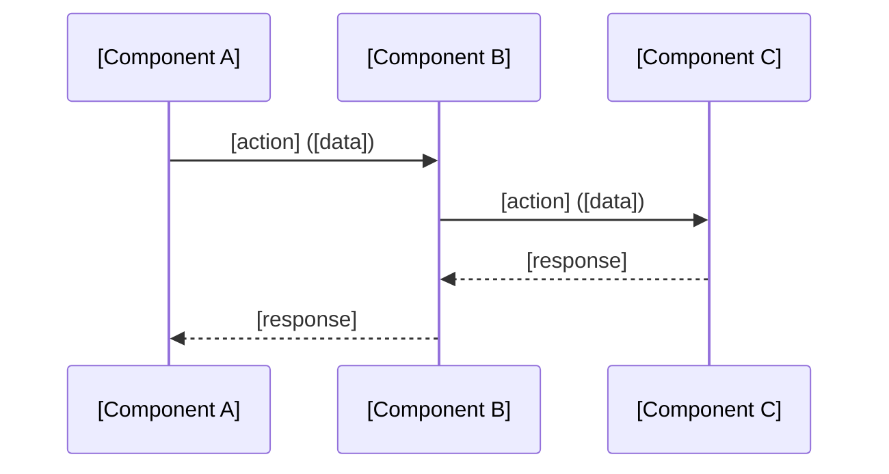

# Trace — End-to-End Flow Tracing

> Reference: Read after `/code-explore trace "topic"` is invoked.

## Purpose

Trace a specific flow through the codebase at the source level, producing a documented trace with call chains, Mermaid diagrams, entity observations, API observations, business rules, and open questions.

---

## Prerequisites

- `specs/explore/orientation.md` must exist. If not, prompt:
  ```
  ⚠️ No orientation found. Run /code-explore [path] first to generate
  an architecture map before tracing specific flows.
  ```

---

## Tracing Process

### Step 1 — Topic Parsing

Parse the topic from `$ARGUMENTS`:
- `trace "context management"` → topic = "context management"
- `trace "how does auth work"` → topic = "how does auth work"

Derive a slug for the filename: kebab-case, max 30 chars.
- "context management" → `context-management`
- "how does auth work" → `auth-flow`

### Step 2 — Domain-Guided Entry Point Discovery

Read `orientation.md` to identify relevant modules and **Detected Domain Profile** to prioritize search, then:

**Domain Profile guidance**: Before keyword searching, check the Detected Domain Profile from orientation.md. Use active interfaces and concerns to focus entry point discovery:

| Active Module | Priority search targets |
|---------------|----------------------|
| `gui` | Component files, event handlers, state management, routing |
| `http-api` | Route/endpoint definitions, request handlers, middleware chain |
| `cli` | Command definitions, argument parsing, subcommand dispatch |
| `async-state` | Store/reducer files, state machine definitions, subscription patterns |
| `auth` | Authentication middleware, token management, session handling |
| `realtime` | WebSocket/SSE handlers, streaming endpoints, event emitters |
| `ipc` | Message channels, process communication, event bridges |
| `external-sdk` | API client wrappers, provider abstractions, SDK initialization |

If the user's topic aligns with a detected module (e.g., "auth flow" and `auth` is detected), prioritize that module's typical file patterns. If the topic is cross-cutting, use multiple module patterns.

Then:

1. **Keyword search**: Grep the codebase for topic-related terms
2. **Import analysis**: Find files that import/are imported by matched files
3. **Entry point identification**: Find the most upstream starting point (where the flow begins — user action, API call, CLI command, event handler)

Present the identified entry point(s) to the user:
```
🔍 Topic: "[topic]"

Found entry point(s):
  1. [file:line] — [function/method name] — [why this is the entry point]
  2. [file:line] — [alternative entry point]

Start tracing from entry point 1?
```

AskUserQuestion:
- **"Start from 1"** → proceed with entry point 1
- **"Start from 2"** → proceed with entry point 2
- **"Different entry point"** → user specifies manually

**If response is empty → re-ask** (per MANDATORY RULE).

### Step 3 — Flow Tracing

From the entry point, trace the execution flow by:

1. **Read the entry function**: Understand what it does
2. **Follow calls**: For each significant function call, read the target
3. **Track data transformations**: What goes in, what comes out
4. **Note branching**: Where does the flow split (conditions, error paths)
5. **Stop at boundaries**: External APIs, database operations, framework boundaries

**Depth control**: Trace deep enough to understand the full flow, but don't recurse into utility functions or framework internals. Rule of thumb: if a function is domain-specific (business logic), trace into it. If it's infrastructure (logging, serialization, HTTP handling), note it but don't recurse.

**During tracing, collect**:

| Category | What to collect | Format |
|----------|----------------|--------|
| **Flow steps** | Source location, action, data in/out | Table rows |
| **Entities** | Data structures with fields | Entity table |
| **APIs** | Endpoints, methods, contracts | API table |
| **Business rules** | Domain logic with source evidence | Rule table |
| **Observations** | Questions, patterns, concerns | Icon-prefixed notes |

### Step 4 — Generate Trace Document

Determine the next trace number by scanning `specs/explore/traces/`:
```bash
ls specs/explore/traces/ | sort -n | tail -1
# If empty → 001, otherwise increment
```

Write `specs/explore/traces/{NNN}-{slug}.md` using this structure:

```markdown
# Trace {NNN}: {Topic Title}

> Date: {timestamp}
> Entry point: {file:line}
> Related traces: {list of related trace numbers, or "none"}

## Summary

{2-3 sentence summary of what this flow does and why it matters}

## Architecture Context



## Flow

| Step | Source Location | Action | Data In → Out |
|------|----------------|--------|---------------|
| 1 | `file.go:23` | functionName() | input → output |
| 2 | `other.go:45` | processData() | raw → processed |
| ... | ... | ... | ... |

## Entities Observed

| Entity | Source Location | Fields Observed | Notes |
|--------|----------------|-----------------|-------|
| User | `models/user.go:12` | id, name, email, role | Core identity |
| Session | `session/session.go:5` | id, userId, token, expiresAt | Auth session |

## APIs Observed

| Method | Path | Source Location | Request | Response |
|--------|------|----------------|---------|----------|
| POST | /api/login | `handlers/auth.go:34` | {email, password} | {token, user} |

## Business Rules

| ID | Source Location | Rule Description |
|----|----------------|-----------------|
| BR-1 | `auth.go:56` | Token expires after 24h, refresh extends by 1h |
| BR-2 | `auth.go:78` | 3 failed attempts → 15min lockout |

## Observations

- 💡 [Pattern to adopt — what and why]
- ❓ [Open question to investigate later]
- ⚠️ [Concern or risk observed]
- 🔧 [Improvement idea for own implementation]
```

### Step 5 — Update Orientation

After writing the trace:

1. Update `orientation.md` Exploration Coverage (per orient.md § Post-Trace Auto-Update)
2. Add trace to Trace Index table
3. If new modules discovered during trace, add to Module Map

### Step 6 — Display Summary

Show the trace summary and nudge:

```
📝 Trace {NNN} saved: specs/explore/traces/{NNN}-{slug}.md
   Modules touched: [list]
   Entities found: [N]
   APIs found: [N]
   Business rules: [N]
   Observations: [N] (💡{n} ❓{n} ⚠️{n} 🔧{n})

📊 Total: {T} traces, Coverage: {X}%
```

If T ≥ 5 AND coverage ≥ 50% (and nudge not shown twice already):
```
💡 Exploration is progressing well. Run /code-explore synthesis
   to organize your understanding into Feature candidates.
```

### Step 7 — Next Action (HARD STOP)

AskUserQuestion:
- **"Trace another flow"** → Ask for the next topic
- **"Explore deeper into [specific part]"** → Start a new trace focused on the sub-flow. Add `Related: {current trace}` to the new trace.
- **"Update orientation"** → Run orient --update
- **"Done for now"** → End session

**If response is empty → re-ask** (per MANDATORY RULE).

---

## During-Trace Discovery

If during tracing the agent discovers something that should be in `orientation.md` but isn't:

1. Note the discovery inline in the trace (e.g., "Found undocumented `middleware/` package")
2. After trace completion, auto-add to orientation.md Module Map
3. Display: `🆕 Added to orientation: [module] — discovered during trace {NNN}`

If during tracing the agent finds a connection to a previous trace:

1. Add `Related: [{previous trace number}-{slug}](./{previous NNN}-{slug}.md)` to the current trace header
2. In the Observations section, note the connection: `💡 This connects to Trace {NNN} — [how they relate]`
