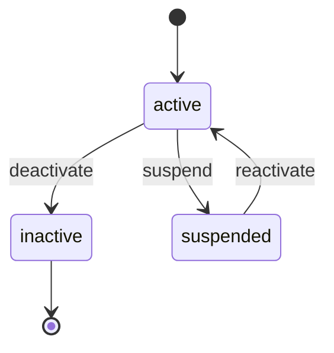

# Entity Registry

**Source**: [Original source path]
**Generated**: [DATE]
**Total Entities**: [N]

> Used as a preliminary reference when writing data-model.md during spec-kit /speckit.plan.
> When writing the plan for each Feature, directly reflect owned entities into data-model.md,
> and check schemas for referenced entities in this registry to ensure compatibility.

---

## Entity Index

| Entity | Owner Feature | Referencing Features | Fields | Relationships |
|--------|--------------|---------------------|--------|---------------|
| [EntityName] | F001-[name] | F002, F003 | [N] | [N] |

---

## [EntityName]

**Owner Feature**: F001-[feature-name]
**Original Source**: `[file path]:[line number]`
**Referencing Features**: F002-[name], F003-[name]

### Fields

| Field Name | Type | Constraints | Description |
|------------|------|------------|-------------|
| id | UUID / Integer | PK, Auto-generated | Primary key |
| name | String(255) | NOT NULL | [Description] |
| email | String(255) | NOT NULL, UNIQUE | [Description] |
| status | Enum(active, inactive, suspended) | NOT NULL, DEFAULT 'active' | [Description] |
| created_at | DateTime | NOT NULL, DEFAULT NOW | Creation timestamp |
| updated_at | DateTime | NOT NULL, ON UPDATE NOW | Last modified timestamp |

### Relationships

| Relationship Type | Target Entity | Cardinality | FK/Join | Description |
|-------------------|--------------|-------------|---------|-------------|
| belongs_to | [Entity] | N:1 | [FK field name] | [Description] |
| has_many | [Entity] | 1:N | [FK field name] | [Description] |
| many_to_many | [Entity] | M:N | [Join table name] | [Description] |

### Validation Rules

| Rule ID | Field | Rule | Description |
|---------|-------|------|-------------|
| VR-001 | email | Email format validation | RFC 5322 compliant |
| VR-002 | password | Min 8 chars, upper+lower+digits+special chars | Security policy |

### State Transitions

> Only include if a state machine exists

| Current State | Next State | Trigger | Condition | Side Effects |
|---------------|-----------|---------|-----------|-------------|
| active | inactive | deactivate | [Condition] | [Effect] |

### Indexes

| Index Name | Fields | Type | Description |
|------------|--------|------|-------------|
| idx_user_email | email | UNIQUE | Unique email lookup |
| idx_user_status | status | INDEX | Status-based filtering |

---

<!-- Repeat the above format for each entity -->
