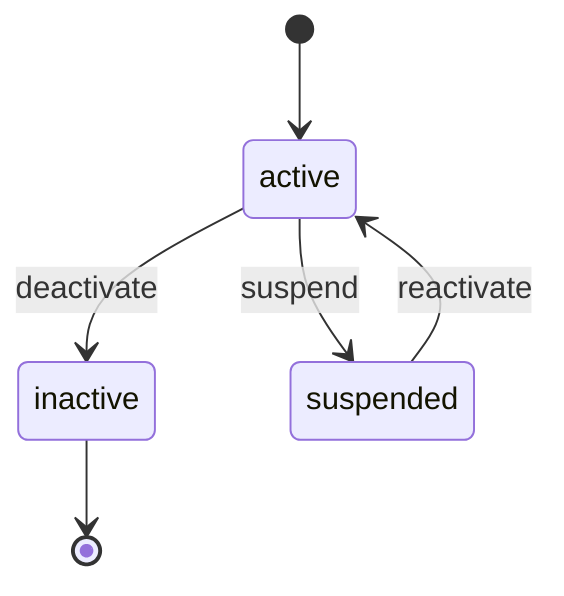

# Entity Registry

**Source**: [원본 소스 경로]
**Generated**: [DATE]
**Total Entities**: [N]개

> spec-kit /speckit.plan 시 data-model.md 작성의 선행 참조로 사용됩니다.
> 각 Feature의 plan 작성 시, 소유 엔티티는 data-model.md에 그대로 반영하고,
> 참조 엔티티는 이 레지스트리에서 스키마를 확인하여 호환성을 보장하세요.

---

## Entity Index

| Entity | 소유 Feature | 참조 Feature | 필드 수 | 관계 수 |
|--------|-------------|-------------|---------|---------|
| [EntityName] | F001-[name] | F002, F003 | [N] | [N] |

---

## [EntityName]

**소유 Feature**: F001-[feature-name]
**원본 소스**: `[파일 경로]:[라인 번호]`
**참조 Feature**: F002-[name], F003-[name]

### Fields

| 필드명 | 타입 | 제약조건 | 설명 |
|--------|------|---------|------|
| id | UUID / Integer | PK, Auto-generated | 기본 키 |
| name | String(255) | NOT NULL | [설명] |
| email | String(255) | NOT NULL, UNIQUE | [설명] |
| status | Enum(active, inactive, suspended) | NOT NULL, DEFAULT 'active' | [설명] |
| created_at | DateTime | NOT NULL, DEFAULT NOW | 생성 일시 |
| updated_at | DateTime | NOT NULL, ON UPDATE NOW | 수정 일시 |

### Relationships

| 관계 타입 | 대상 엔티티 | Cardinality | FK/Join | 설명 |
|-----------|-----------|-------------|---------|------|
| belongs_to | [Entity] | N:1 | [FK 필드명] | [설명] |
| has_many | [Entity] | 1:N | [FK 필드명] | [설명] |
| many_to_many | [Entity] | M:N | [조인 테이블명] | [설명] |

### Validation Rules

| 규칙 ID | 필드 | 규칙 | 설명 |
|---------|------|------|------|
| VR-001 | email | 이메일 형식 검증 | RFC 5322 준수 |
| VR-002 | password | 최소 8자, 대소문자+숫자+특수문자 포함 | 보안 정책 |

### State Transitions

> 상태 머신이 있는 경우에만 작성

| 현재 상태 | 다음 상태 | 트리거 | 조건 | 부수 효과 |
|-----------|----------|--------|------|-----------|
| active | inactive | deactivate | [조건] | [효과] |

### Indexes

| 인덱스명 | 필드 | 타입 | 설명 |
|----------|------|------|------|
| idx_user_email | email | UNIQUE | 이메일 유니크 검색 |
| idx_user_status | status | INDEX | 상태별 필터링 |

---

<!-- 위 형식을 각 엔티티마다 반복 -->
