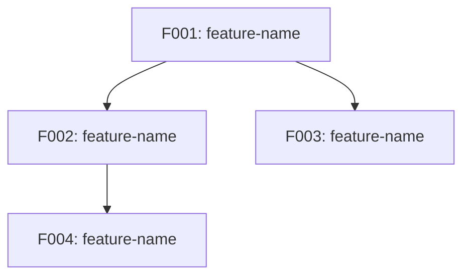

# Project Roadmap: [PROJECT_NAME]

**Source**: [원본 소스 경로]
**Generated**: [DATE]
**Strategy**: Scope: [core|full] | Stack: [same|new]

---

## Project Overview

### 기존 프로젝트 요약
- **프로젝트 설명**: [프로젝트가 해결하는 문제, 대상 사용자]
- **도메인**: [e-commerce, SaaS, CMS, 교육 플랫폼, 금융 서비스 등]
- **아키텍처 타입**: [모놀리식, 마이크로서비스, 서버리스, MVC 등]

### 기술 스택
| 영역 | 기술 | 버전 |
|------|------|------|
| 언어 | [언어] | [버전] |
| 프레임워크 | [프레임워크] | [버전] |
| DB/스토리지 | [DB] | [버전] |
| 테스트 | [테스트 프레임워크] | [버전] |
| 빌드/배포 | [도구] | [버전] |

### 프로젝트 규모
- 소스 파일 수: [N]개
- 엔티티 수: [N]개
- API 엔드포인트 수: [N]개
- 식별된 Feature 수: [N]개

---

## Rebuild Strategy

### 구현 범위: [Core / Full]
- [Core인 경우] Tier 1 Feature만 재개발. 학습/프로토타이핑 목적.
- [Full인 경우] 기존과 동일한 전체 기능을 재개발.

### 기술 스택 전략: [Same / New]
- [Same인 경우] 기존과 동일한 기술 스택을 사용. 구현 패턴 재활용 가능.
- [New인 경우] 최적의 현대적 기술 스택으로 전환. `specs/reverse-spec/stack-migration.md` 참조.

---

## Feature Catalog

### Tier 1 — 필수
> 프로젝트의 근간. 이것 없이는 시스템이 성립하지 않음.

| ID | Feature | 설명 | 추천 이유 |
|----|---------|------|-----------|
| F001 | [feature-name] | [1-2문장 설명] | [구체적 분류 이유] |

### Tier 2 — 권장
> 핵심 사용자 경험을 완성하는 기능. 없어도 동작하지만 핵심 가치가 크게 저하됨.

| ID | Feature | 설명 | 추천 이유 |
|----|---------|------|-----------|
| F00N | [feature-name] | [1-2문장 설명] | [구체적 분류 이유] |

### Tier 3 — 선택
> 부가 기능, 관리 도구, 편의 기능. 이후 단계에서 추가 가능.

| ID | Feature | 설명 | 추천 이유 |
|----|---------|------|-----------|
| F00N | [feature-name] | [1-2문장 설명] | [구체적 분류 이유] |

---

## Dependency Graph

### 시각화

### 의존성 테이블

| Feature | 의존 대상 | 의존 유형 | 의존 내용 |
|---------|-----------|-----------|-----------|
| F002 | F001 | 엔티티 참조 | User 엔티티를 FK로 참조 |
| F003 | F001 | API 호출 | 인증 미들웨어 사용 |

---

## Release Groups

Feature를 의존성 순서에 따라 릴리즈 그룹으로 묶는다. 선행 그룹이 완료되어야 후행 그룹을 시작할 수 있다.

### Release 1: Foundation
> [설명: 다른 모든 Feature의 기반이 되는 핵심 인프라]

| 순서 | Feature | Tier | 비고 |
|------|---------|------|------|
| 1 | F001-[name] | Tier 1 | [비고] |

### Release 2: Core Business
> [설명: 핵심 비즈니스 로직]

| 순서 | Feature | Tier | 비고 |
|------|---------|------|------|
| 2 | F00N-[name] | Tier 1 | [비고] |

### Release 3: Enhancement
> [설명: 사용자 경험 완성]

| 순서 | Feature | Tier | 비고 |
|------|---------|------|------|
| 3 | F00N-[name] | Tier 2 | [비고] |

---

## Cross-Feature Entity Dependencies

Feature 간 공유되는 엔티티를 매핑한다. spec-kit /speckit.plan 시 data-model.md 작성의 교차 참조로 사용된다.

| Entity | 소유 Feature | 참조 Feature | 참조 방식 |
|--------|-------------|-------------|-----------|
| User | F001-auth | F002-product, F003-order | FK 참조 |
| Product | F002-product | F003-order, F005-cart | FK 참조 |

---

## Cross-Feature API Dependencies

Feature 간 API 호출 관계를 매핑한다. spec-kit /speckit.plan 시 contracts/ 작성의 교차 참조로 사용된다.

| API | Provider Feature | Consumer Feature | 호출 목적 |
|-----|-----------------|------------------|-----------|
| `POST /auth/verify` | F001-auth | F002-product, F003-order | 토큰 검증 |
| `GET /products/:id` | F002-product | F003-order | 상품 정보 조회 |
