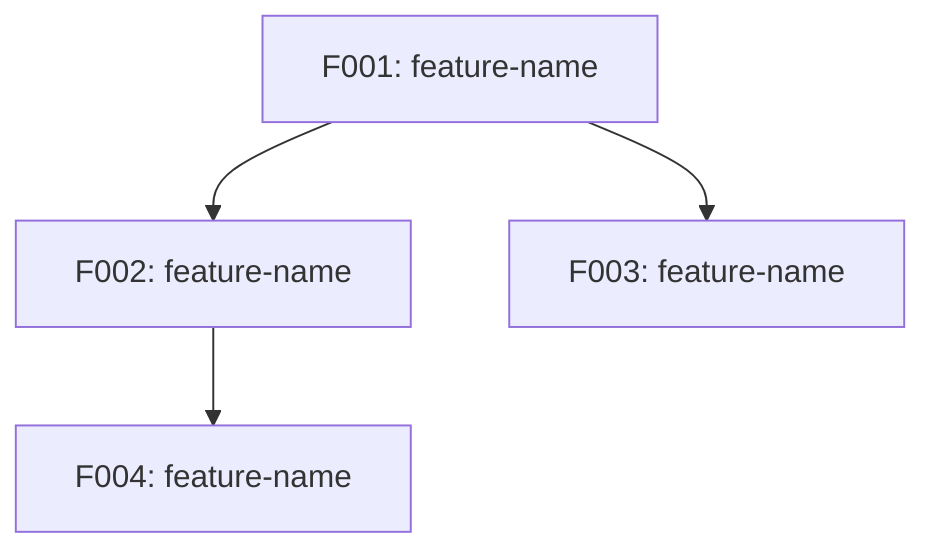

# Project Roadmap: [PROJECT_NAME]

**Source**: [Original source path]
**Generated**: [DATE]
**Strategy**: Scope: [core|full] | Stack: [same|new] | Change: [change_scope] | Preservation: [preservation_level] | Source: [source_available] | Migration: [migration_strategy]

---

## Project Overview

### Existing Project Summary
- **Project Description**: [Problem the project solves, target users]
- **Domain**: [e-commerce, SaaS, CMS, education platform, financial service, etc.]
- **Architecture Type**: [Monolithic, microservice, serverless, MVC, etc.]

### Tech Stack
| Area | Technology | Version |
|------|-----------|---------|
| Language | [Language] | [Version] |
| Framework | [Framework] | [Version] |
| DB/Storage | [DB] | [Version] |
| Testing | [Test framework] | [Version] |
| Build/Deploy | [Tool] | [Version] |

### Project Scale
- Source files: [N]
- Entities: [N]
- API endpoints: [N]
- Identified Features: [N]

---

## Rebuild Strategy

### Implementation Scope: [Core / Full]
- [If Core] Features are classified into Tiers (Tier 1/2/3). Pipeline initially processes only Tier 1 Features. Tier 2/3 Features are generated but deferred in `sdd-state.md`. Use `/smart-sdd expand` to activate additional Tiers when ready.
- [If Full] All Features are processed without Tier classification. Ordering is based purely on dependency topology.

### Tech Stack Strategy: [Same / New]
- [If Same] Use the same tech stack as existing. Implementation patterns can be reused.
- [If New] Migrate to an optimal modern tech stack. See `specs/reverse-spec/stack-migration.md`.

---

## Feature Catalog

<!-- Use the section matching your Scope -->

### [Core Scope] Feature Catalog by Tier

#### Tier 0 — Platform Foundation
> Framework infrastructure decisions that must be established before business Features. Auto-generated from Foundation categories when a framework is detected. See `domains/foundations/_foundation-core.md` § F3 for grouping rules.

| ID | Feature | Foundation Categories | Description |
|----|---------|----------------------|-------------|
| F000 | [foundation-slug] | [CAT1 + CAT2] | [Foundation scope description] |

> **Note**: T0 Features use `F000-{slug}` prefix. All T0 Features must complete before T1 begins. If no framework detected or Framework = "custom", omit this section.

#### Tier 1 — Essential
> Foundation of the project. The system cannot function without these.

| ID | Feature | Description | Rationale |
|----|---------|-------------|-----------|
| F001 | [feature-name] | [1-2 sentence description] | [Tier classification rationale] |

#### Tier 2 — Recommended
> Features that complete the core user experience. System works without them but core value is significantly diminished.

| ID | Feature | Description | Rationale |
|----|---------|-------------|-----------|
| F00N | [feature-name] | [1-2 sentence description] | [Tier classification rationale] |

#### Tier 3 — Optional
> Supplementary features, admin tools, convenience features. Can be added in later phases.

| ID | Feature | Description | Rationale |
|----|---------|-------------|-----------|
| F00N | [feature-name] | [1-2 sentence description] | [Tier classification rationale] |

### [Full Scope] Feature Catalog

> All Features listed in dependency-based implementation order. No Tier classification.

| ID | Feature | Description | Dependencies |
|----|---------|-------------|--------------|
| F001 | [feature-name] | [1-2 sentence description] | — |
| F002 | [feature-name] | [1-2 sentence description] | F001 |
| F003 | [feature-name] | [1-2 sentence description] | F001, F002 |

---

## Dependency Graph

### Visualization

### Dependency Table

> Dependency Types: `Entity reference`, `API call`, `Event dependency`, `Platform constraint` (window config, CSS requirements, runtime environment setup that downstream Features must respect).

| Feature | Depends On | Dependency Type | Dependency Details |
|---------|------------|-----------------|-------------------|
| F002 | F001 | Entity reference | References User entity via FK |
| F003 | F001 | API call | Uses authentication middleware |
| F005 | F001 | Platform constraint | frame:false requires custom titlebar with -webkit-app-region: drag |

---

## Release Groups

Features are grouped into release groups based on dependency order. A preceding group must be completed before the subsequent group can begin.

<!-- Use the table format matching your Scope -->

### Release 1: Foundation
> [Description: Core infrastructure that all other Features are built upon]

<!-- Core Scope: -->
| Order | Feature | Tier | Notes |
|-------|---------|------|-------|
| 1 | F001-[name] | Tier 1 | [Notes] |

<!-- Full Scope: -->
| Order | Feature | Dependencies | Notes |
|-------|---------|--------------|-------|
| 1 | F001-[name] | — | [Notes] |

### Release 2: Core Business
> [Description: Core business logic]

<!-- Core Scope: -->
| Order | Feature | Tier | Notes |
|-------|---------|------|-------|
| 2 | F00N-[name] | Tier 1 | [Notes] |

<!-- Full Scope: -->
| Order | Feature | Dependencies | Notes |
|-------|---------|--------------|-------|
| 2 | F00N-[name] | F001 | [Notes] |

### Release 3: Enhancement
> [Description: User experience completion]

<!-- Core Scope: -->
| Order | Feature | Tier | Notes |
|-------|---------|------|-------|
| 3 | F00N-[name] | Tier 2 | [Notes] |

<!-- Full Scope: -->
| Order | Feature | Dependencies | Notes |
|-------|---------|--------------|-------|
| 3 | F00N-[name] | F001, F002 | [Notes] |

---

## Demo Groups

> Demo Groups define user-facing scenarios that span multiple Features. Each group represents an end-to-end user journey that can be demonstrated when all constituent Features are verified.
> Defined during `/reverse-spec` Phase 3-1c based on Feature dependencies and business scenarios.

### DG-01: [Scenario Name]
- **Scenario**: [End-to-end user journey description — e.g., "User browses products, adds to cart, and completes purchase"]
- **Features**: F001-xxx, F002-yyy, F003-zzz
- **SBI Coverage**: B001–B010, B015–B020
- **Integration Demo**: When all Features in this group reach `completed` or `adopted` status, an Integration Demo is triggered to verify the end-to-end scenario.

### DG-02: [Scenario Name]
- **Scenario**: [End-to-end user journey description]
- **Features**: F004-xxx, F005-yyy
- **SBI Coverage**: B011–B014, B021–B025
- **Integration Demo**: [Same trigger rule]

> **Notes**:
> - Each Feature should belong to at least one Demo Group (except infrastructure/cross-cutting Features).
> - SBI Coverage lists the B### IDs from the constituent Features' Source Behavior Inventories.
> - Demo Group progress is tracked in `sdd-state.md` → Demo Group Progress section.

---

## Cross-Feature Entity Dependencies

Maps entities shared across Features. Used as a cross-reference when writing data-model.md during spec-kit /speckit.plan.

| Entity | Owner Feature | Referencing Features | Reference Type |
|--------|--------------|---------------------|----------------|
| User | F001-auth | F002-product, F003-order | FK reference |
| Product | F002-product | F003-order, F005-cart | FK reference |

---

## Cross-Feature API Dependencies

Maps API call relationships between Features. Used as a cross-reference when writing contracts/ during spec-kit /speckit.plan.

| API | Provider Feature | Consumer Features | Call Purpose |
|-----|-----------------|-------------------|-------------|
| `POST /auth/verify` | F001-auth | F002-product, F003-order | Token verification |
| `GET /products/:id` | F002-product | F003-order | Product info lookup |
