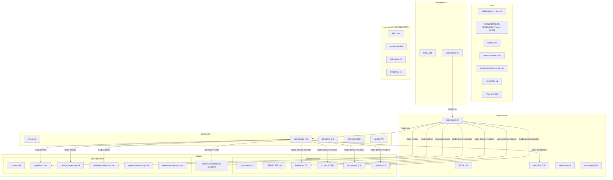
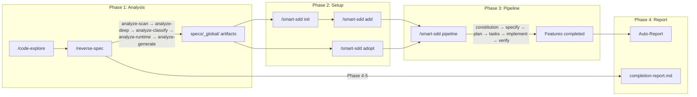

# File Map — spec-kit-skills

> Complete file inventory + relationship diagrams for the spec-kit-skills project.
> **257 files** (250 .md + 7 .sh) across 4 skills + 1 shared module.

---

## 1. Architecture Overview



---

## 2. Pipeline Execution Flow



### Per-Feature Pipeline Detail

```
pipeline F00X
  │
  ├── 1. constitution ──→ injection/constitution.md ──→ .specify/memory/constitution.md
  ├── 2. specify ───────→ injection/specify.md ──────→ specs/{FID}/spec.md
  ├── 3. plan ──────────→ injection/plan.md ─────────→ specs/{FID}/plan.md
  ├── 4. tasks ─────────→ injection/tasks.md ────────→ specs/{FID}/tasks.md
  ├── 5. implement ─────→ injection/implement.md ────→ source code
  └── 6. verify ────────→ injection/verify.md ───────→ verify-phases.md → sub-phases
                                                        ├── verify-preflight.md
                                                        ├── verify-build-test.md
                                                        ├── verify-sc-verification.md
                                                        ├── verify-sc-rebuild.md
                                                        ├── verify-cross-feature.md
                                                        └── verify-evidence-update.md
```

---

## 3. Domain Module Hierarchy

```mermaid
graph TB
    DP["Domain Profile<br/>(5 axes + 1 modifier)"]

    DP --> A1["Axis 1: Interface"]
    DP --> A2["Axis 2: Concern"]
    DP --> A3["Axis 3: Archetype"]
    DP --> A4["Axis 4: Foundation"]
    DP --> A5["Axis 5: Scenario"]
    DP --> M1["Modifier: Scale"]

    A1 --> I1["gui"] & I2["http-api"] & I3["cli"] & I4["data-io"] & I5["tui"] & I6["mobile"] & I7["library"] & I8["embedded"] & I9["grpc"]

    A2 --> C_GRP1["Core: auth, authorization, async-state, i18n, ipc, realtime, graceful-lifecycle, observability"]
    A2 --> C_GRP2["Integration: external-sdk, message-queue, task-worker, plugin-system, connection-pool"]
    A2 --> C_GRP3["Code: codegen, polyglot, multi-tenancy, infra-as-code"]
    A2 --> C_GRP4["Protocol: protocol-integration, llm-agents, hardware-io, webrtc, tls-management, schema-registry, cryptography, udp-transport"]
    A2 --> C_GRP5["Domain: cqrs, distributed-consensus, dag-orchestration, ecs, wire-protocol, k8s-operator, gpu-compute, resilience"]

    A3 --> AR1["ai-assistant"] & AR2["public-api"] & AR3["microservice"] & AR4["sdk-framework"]
    A3 --> AR5["database-engine"] & AR6["network-server"] & AR7["message-broker"]
    A3 --> AR8["game-engine"] & AR9["browser-extension"] & AR10["infra-tool"]
    A3 --> AR11["cache-server"] & AR12["compiler"] & AR13["inference-server"] & AR14["media-server"] & AR15["workflow-engine"]

    A4 --> F_GRP["36 Foundation files<br/>(framework-specific rules)"]

    A5 --> S1["greenfield"] & S2["rebuild"] & S3["incremental"] & S4["adoption"]

    subgraph "Change Contexts"
        CX["contexts/migration.md<br/>(M0-M4 framework)"]
    end
```



### Module File Distribution

```
shared/domains/           ← Signal keywords (S0/A0) + Code patterns (R1)
  interfaces/ (9)           gui, http-api, cli, data-io, tui, mobile, library, embedded, grpc
  concerns/ (33)            auth, async-state, i18n, ... webrtc, cryptography, udp-transport
  archetypes/ (15)          ai-assistant, public-api, ... inference-server, workflow-engine
  contexts/ (1)             migration
  _taxonomy.md              Single source of truth for all modules

reverse-spec/domains/     ← Analysis rules (R3-R5)
  interfaces/ (9)           R3 analysis axes per interface
  concerns/ (33)            R3 Feature boundary + R4 data flow rules
  archetypes/ (15)          R3 extraction patterns
  contexts/ (1)             R3 migration Feature boundary + R5 scope estimation
  foundations/ (36+2)       Framework-specific detection stubs (F0-F9)
  _core.md                  R2 project types, R5 Feature boundary heuristics

smart-sdd/domains/        ← Pipeline rules (S1/S5/S7)
  interfaces/ (9)           SC rules, elaboration probes, bug prevention
  concerns/ (33)            SC rules, elaboration probes, bug prevention
  archetypes/ (15)          Domain philosophy, elaboration probes
  profiles/ (16)            Pre-configured axis combinations
  scenarios/ (4)            greenfield, rebuild, incremental, adoption
  _resolver.md              7-step module loading order
```

---

## 4. File Inventory

### Root Files

| File | Purpose |
|------|---------|
| `README.md` | English project introduction, Scenario Guide (S1-S9), architecture overview |
| `README.ko.md` | Korean mirror of README.md |
| `ARCHITECTURE-EXTENSIBILITY.md` | Detailed extensibility guide, cross-reference map |
| `ARCHITECTURE-EXTENSIBILITY.ko.md` | Korean mirror |
| `FILE-MAP.md` | This file — complete file inventory and relationship diagrams |
| `CLAUDE.md` | Project rules, design principles, review protocol |
| `history.md` | Design decision history |
| `lessons-learned.md` | Failure patterns and countermeasures |
| `PLAYWRIGHT-GUIDE.md` | Playwright setup guide for UI verification |
| `install.sh` | Symlink installer for skills → ~/.claude/skills/ |

### reverse-spec (96 files)

| Category | Files | Description |
|----------|-------|-------------|
| **Entry** | `SKILL.md` | Skill router — argument parsing, phase dispatch |
| **Commands** | | |
| `commands/analyze.md` | Phase orchestrator — routes to sub-phases |
| `commands/analyze-scan.md` | Phase 1: File extension scan, language detection |
| `commands/analyze-deep.md` | Phase 2: Deep analysis, SBI extraction, multi-language table |
| `commands/analyze-classify.md` | Phase 3: Feature boundary detection, Tier classification |
| `commands/analyze-runtime.md` | Phase 1.5: Runtime exploration (Playwright), UI flow capture |
| `commands/analyze-generate.md` | Phase 4-5: Artifact generation, completion report |
| **Domains — Core** | | |
| `domains/_core.md` | R2 project types, R5 Feature boundary heuristics |
| `domains/_schema.md` | Module file format specification |
| `domains/app.md` | Domain Profile for analysis (reverse-spec-specific) |
| `domains/data-science.md` | Data science domain extensions (TODO scaffolding) |
| **Domains — Interfaces** (9) | `domains/interfaces/{gui,http-api,cli,data-io,tui,mobile,library,embedded,grpc}.md` | R3 analysis axes per interface type |
| **Domains — Concerns** (33) | `domains/concerns/*.md` | R3 Feature boundary + R4 data flow per concern |
| **Domains — Archetypes** (15) | `domains/archetypes/*.md` | R3 extraction patterns |
| **Domains — Contexts** (1) | `domains/contexts/migration.md` | R3-R5 migration impact analysis |
| **Domains — Foundations** (39+2) | `domains/foundations/*.md` | Framework-specific F0-F9 detection rules |
| ↳ Full frameworks | `electron, nextjs, vite-react, django, flask, fastapi, express, nestjs, hono, bun, rails, laravel, phoenix, spring-boot, spring-framework, actix-web, go-chi, svelte, solidjs, tauri, react-native, flutter, dotnet, chrome-extension, rust-cargo` | Comprehensive F1-F9 rules |
| ↳ Detection stubs | `python, go, swift-spm, erlang-otp, nuxt, angular, remix, qt, gtk, symfony, wordpress, android-native, cmake, makefile` | F0 detection + Architecture Notes |
| ↳ Meta | `_foundation-core.md, _TEMPLATE.md` | Core detection signals, contributor template |
| **Reference** (1) | `reference/speckit-compatibility.md` | reverse-spec → spec-kit command mapping |
| **Templates** (10) | `templates/*.md` | Artifact templates: roadmap, constitution-seed, entity/api/business-logic registries, coverage-baseline, pre-context, spec-draft, speckit-prompt, stack-migration |

### smart-sdd (104 files)

| Category | Files | Description |
|----------|-------|-------------|
| **Entry** | `SKILL.md` | Skill router — command dispatch, MANDATORY RULES |
| **Commands** | | |
| `commands/init.md` | Project initialization, Domain Profile setup |
| `commands/add.md` | Feature addition, 6-Phase Briefing |
| `commands/adopt.md` | SDD adoption of existing code, 4-step workflow |
| `commands/pipeline.md` | Pipeline orchestrator — 6-step Feature execution |
| `commands/status.md` | Pipeline status display |
| `commands/coverage.md` | SBI coverage analysis |
| `commands/parity.md` | Structural/logic parity check |
| `commands/expand.md` | Feature expansion (split/merge) |
| `commands/reset.md` | Pipeline state reset |
| **Verify Sub-commands** (7) | | |
| `commands/verify-phases.md` | Verify phase orchestrator (Phase 0-4) |
| `commands/verify-preflight.md` | Phase 0: Playwright availability check |
| `commands/verify-build-test.md` | Phase 1: Build + TypeScript + Lint |
| `commands/verify-sc-verification.md` | Phase 2: SC verification against running app |
| `commands/verify-sc-rebuild.md` | Phase 3: Rebuild-specific SC verification |
| `commands/verify-cross-feature.md` | Phase 3e: Cross-Feature interface verification |
| `commands/verify-evidence-update.md` | Phase 4: Evidence collection + state update |
| **Domains — Core** | | |
| `domains/_core.md` | smart-sdd-specific core rules |
| `domains/_resolver.md` | 7-step module loading order |
| `domains/_schema.md` | Module file format specification |
| `domains/app.md` | Domain Profile for execution (smart-sdd-specific) |
| `domains/data-science.md` | Data science domain extensions (TODO scaffolding) |
| **Domains — Interfaces** (9) | `domains/interfaces/{gui,http-api,cli,data-io,tui,mobile,library,embedded,grpc}.md` | SC rules, elaboration probes, bug prevention |
| **Domains — Concerns** (33) | `domains/concerns/*.md` | SC rules, elaboration probes, bug prevention |
| **Domains — Archetypes** (15) | `domains/archetypes/*.md` | Domain philosophy (A1), SC extensions (A2), probes (A3), constitution (A4), brief criteria (A5) |
| **Domains — Profiles** (15) | `domains/profiles/*.md` | Pre-configured axis combinations |
| **Domains — Scenarios** (4) | `domains/scenarios/{greenfield,rebuild,incremental,adoption}.md` | Scenario-specific pipeline rules |
| **Reference** | | |
| `reference/context-injection-rules.md` | Master injection rules — loading order, Scale/Cross-Concern enforcement |
| `reference/context-injection-degradation.md` | Missing/Sparse artifact handling table (lazy-loaded) |
| `reference/context-injection-budget.md` | Context budget protocol — priority tiers, overflow, heuristics (lazy-loaded) |
| `reference/pipeline-integrity-guards.md` | 7 guards (G1-G7) for pipeline safety |
| `reference/state-schema.md` | sdd-state.md schema definition |
| `reference/cascading-update.md` | Cross-Feature cascading update rules |
| `reference/clarity-index.md` | Spec clarity scoring system |
| `reference/demo-standard.md` | Demo-ready delivery standards |
| `reference/branch-management.md` | Git branch management for Features |
| `reference/restructure-guide.md` | Feature split/merge procedures |
| `reference/runtime-verification.md` | Runtime verification procedures |
| `reference/ui-flow-spec.md` | UI Flow Specification format |
| `reference/ui-testing-integration.md` | UI testing integration guide |
| `reference/user-cooperation-protocol.md` | User cooperation protocol |
| `reference/feature-elaboration-framework.md` | 6-perspective Feature evaluation |
| `reference/archetype-verify-strategies.md` | Per-archetype verify extensions (start pre-conditions, health checks, SC categories) |
| `reference/known-limitations.md` | Known limitations (L1-L7) with recovery paths |
| **Injection Files** (11) | | |
| `reference/injection/constitution.md` | Constitution step context injection |
| `reference/injection/specify.md` | Specify step context injection |
| `reference/injection/plan.md` | Plan step context injection |
| `reference/injection/tasks.md` | Tasks step context injection |
| `reference/injection/implement.md` | Implement step context injection |
| `reference/injection/verify.md` | Verify step context injection |
| `reference/injection/analyze.md` | Analyze step context injection |
| `reference/injection/adopt-specify.md` | Adoption specify injection |
| `reference/injection/adopt-plan.md` | Adoption plan injection |
| `reference/injection/adopt-verify.md` | Adoption verify injection |
| `reference/injection/parity.md` | Parity check injection |
| **Scripts** (7) | | |
| `scripts/context-summary.sh` | Context window usage summary |
| `scripts/sbi-coverage.sh` | SBI coverage calculator |
| `scripts/demo-status.sh` | Demo group progress tracker |
| `scripts/pipeline-status.sh` | Pipeline progress display |
| `scripts/validate.sh` | Artifact validation |
| `scripts/semantic-stub-check.sh` | Semantic stub detector (Math.random, placeholder text) |
| `scripts/wiring-check.sh` | Wiring integrity checker (IPC/API audit) |

### shared (48 files)

| Category | Files | Description |
|----------|-------|-------------|
| **Domains — Taxonomy** | `domains/_taxonomy.md` | Single source of truth for all module listings |
| **Domains — Template** | `domains/_TEMPLATE.md` | Contributor template for new modules |
| **Domains — Interfaces** (9) | `domains/interfaces/{gui,http-api,cli,data-io,tui,mobile,library,embedded,grpc}.md` | S0 keywords + R1 code patterns |
| **Domains — Concerns** (33) | `domains/concerns/*.md` | S0 keywords + R1 code patterns |
| **Domains — Archetypes** (15) | `domains/archetypes/*.md` | A0 semantic + code patterns |
| **Domains — Contexts** (1) | `domains/contexts/migration.md` | M0-M4 migration framework |
| **Runtime** (6) | `runtime/*.md` | Cross-skill runtime modules |
| **Reference** (1) | `reference/completion-report.md` | Auto-Report template (3 modes, 10 sections) |

### code-explore (5 files)

| File | Description |
|------|-------------|
| `SKILL.md` | Skill router — interactive exploration dispatch |
| `commands/orient.md` | Codebase orientation — entry points, architecture |
| `commands/trace.md` | Feature flow tracing with Mermaid diagrams |
| `commands/synthesis.md` | Understanding synthesis — architecture map, Feature candidates |
| `commands/status.md` | Exploration progress display |

### case-study (DEPRECATED) (4 files)

| File | Description |
|------|-------------|
| `SKILL.md` | Deprecated — points to Auto-Report system |
| `commands/generate.md` | Legacy report generation |
| `reference/recording-protocol.md` | Legacy recording protocol |
| `templates/case-study-log-template.md` | Legacy log template |

---

## 5. Cross-Skill Dependencies

```
shared/domains/          ← Read by both reverse-spec and smart-sdd
  ├── S0/A0 keywords     ← smart-sdd init (inference)
  └── R1 code patterns   ← reverse-spec analyze (source scan)

reverse-spec/domains/    ← Read by smart-sdd for Foundation data
  └── foundations/*.md   ← smart-sdd _resolver.md Step 4b (F2+F3 rules)

shared/runtime/          ← Read by both skills for app lifecycle
  ├── playwright-detection.md  ← verify-preflight.md
  ├── app-launch.md            ← verify-phases.md, analyze-runtime.md
  └── data-storage-map.md      ← verify-sc-verification.md

shared/reference/        ← Read by pipeline endpoints
  └── completion-report.md  ← analyze-generate.md, pipeline.md, adopt.md

code-explore/ → reverse-spec/ → smart-sdd/  (data flows left to right)
  explore artifacts → reverse-spec artifacts → smart-sdd pipeline
```

---

## 6. Injection File Loading Order

When a Feature enters a pipeline step, `context-injection-rules.md` orchestrates loading:

```
Step: specify F001
  │
  ├── P0: Always load
  │   ├── roadmap.md
  │   ├── sdd-state.md
  │   └── constitution.md
  │
  ├── P1: Domain Profile modules
  │   ├── shared/domains/interfaces/{active}.md
  │   ├── shared/domains/concerns/{active}.md
  │   ├── shared/domains/archetypes/{active}.md
  │   └── reverse-spec/domains/foundations/{framework}.md
  │
  ├── P2: Feature context
  │   ├── pre-context.md (Feature-specific sections)
  │   ├── business-logic-map.md (relevant rules)
  │   ├── preceding Feature stubs/interaction-surfaces
  │   └── stack-migration.md (if rebuild+new-stack)
  │
  └── P3: Step-specific injection
      └── reference/injection/specify.md
```
