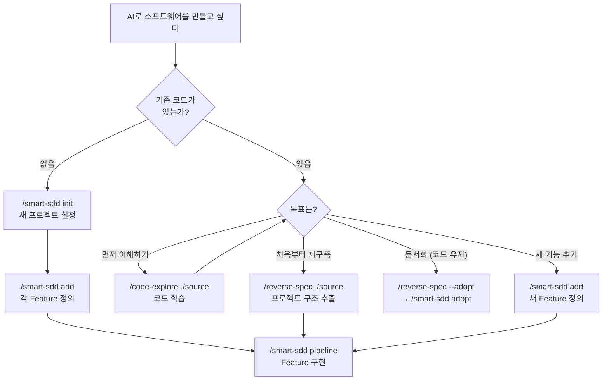
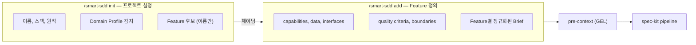
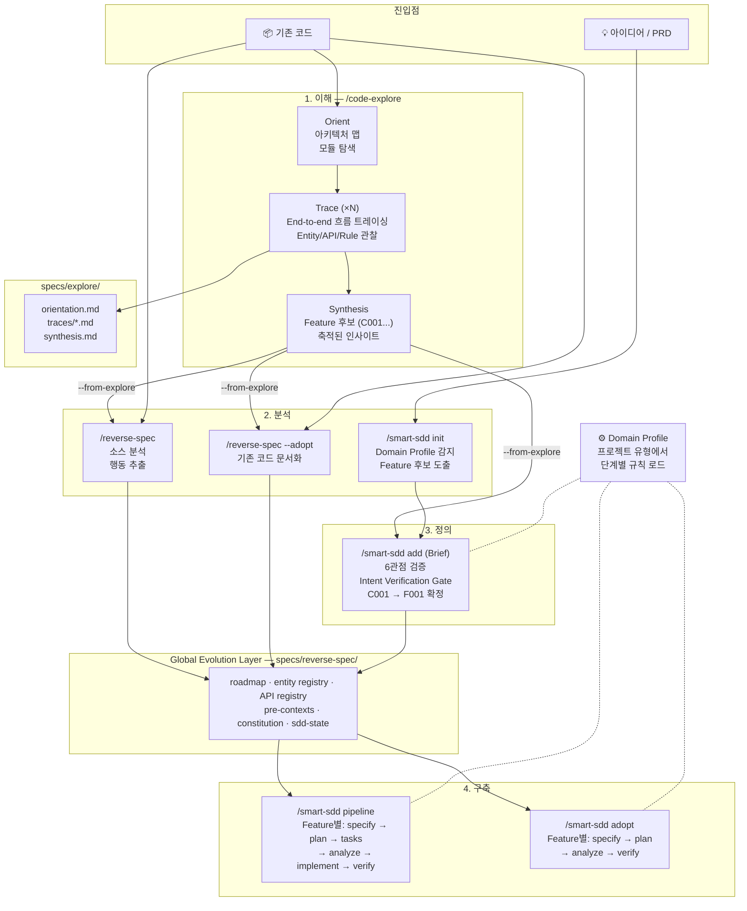
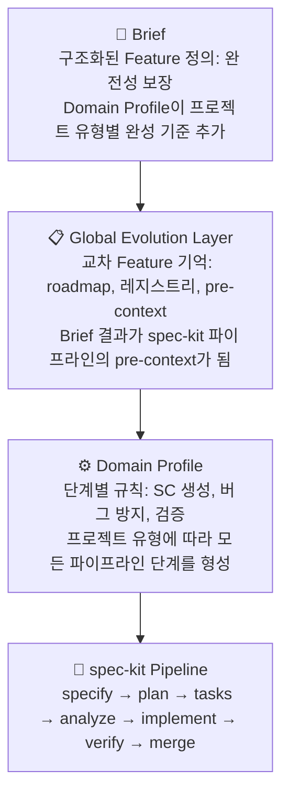
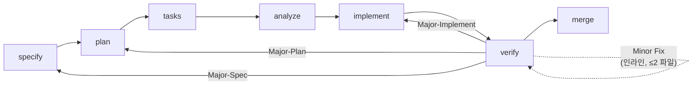
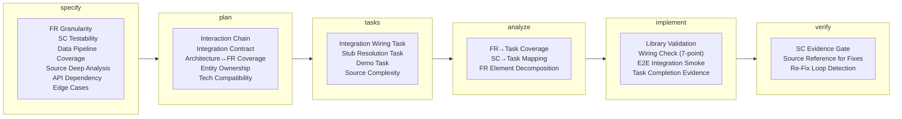
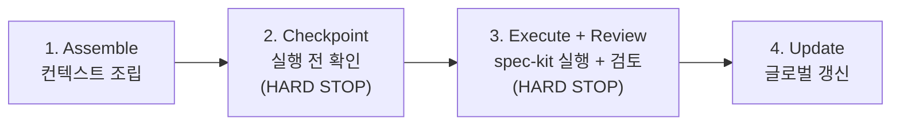

# spec-kit-skills

**Repository**: [coolhero/spec-kit-skills](https://github.com/coolhero/spec-kit-skills)

[English README](README.md) | [Playwright 설정 가이드](PLAYWRIGHT-GUIDE.md) | [Lessons Learned](lessons-learned.md) | Last updated: 2026-03-19 13:30 KST

**AI 코딩 에이전트를 신뢰할 수 있는 소프트웨어 엔지니어로 만드는 세 가지 개념: Feature 간 기억을 위한 [Global Evolution Layer](#global-evolution-layer), 프로젝트 유형별 전문성을 위한 [Domain Profile](#domain-profile), 구조화된 Feature 정의를 위한 [Brief](#brief) — [spec-kit](https://github.com/github/spec-kit) SDD 기반**

- **Code-Explore** — 기존 코드베이스를 인터랙티브하게 탐색하며 이해할 수 있게 도와줍니다. 프로젝트를 스캔하여 아키텍처 맵을 얻고, 특정 흐름을 소스 레벨에서 end-to-end로 트레이싱합니다. 각 탐색 세션은 호출 체인, 엔티티 맵, 흐름도가 포함된 trace를 생성합니다. 충분히 이해했으면, trace들을 Feature 후보로 합성하여 SDD 파이프라인에 직접 연결합니다. *(개발 중)*
- **Reverse-Spec** — 기존 코드베이스를 분석하여 SDD 파이프라인에 필요한 모든 정보를 추출합니다: 앱이 무엇을 하는지, 어떻게 구조화되어 있는지, 어떤 데이터 모델과 API가 존재하는지. 기존 앱을 처음부터 재구축하거나, 이미 작성된 코드에 SDD 문서를 추가할 때 사용합니다. smart-sdd 없이 spec-kit만 사용할 수 있는 독립 프롬프트(`speckit-prompt.md`)도 함께 생성합니다.
- **Smart-SDD** — 각 spec-kit 명령에 프로젝트 전체 맥락을 자동으로 주입합니다. Feature 3에 대해 `/speckit-plan`을 실행하면, Feature 1의 데이터 모델과 Feature 2의 API 계약이 자동으로 전달되어 — 가정이 아닌 실제 존재하는 것에 기반하여 계획을 세울 수 있습니다.

## 목차

- [빠른 시작](#빠른-시작)
- [해결하는 문제](#해결하는-문제)
- [스킬](#스킬)
- [사용자 여정](#사용자-여정)
- [빠른 예시](#빠른-예시)
- [아키텍처](#아키텍처)
- [도메인 모듈 시스템](#도메인-모듈-시스템)
- [확장성 & 커스터마이징](#확장성--커스터마이징)
- [세션 복원력 & 에이전트 거버넌스](#세션-복원력--에이전트-거버넌스)
- [상세 레퍼런스](#상세-레퍼런스)
- [/reverse-spec — 상세 워크플로우](#reverse-spec--상세-워크플로우)
- [smart-sdd 없이 spec-kit 사용하기](#smart-sdd-없이-spec-kit-사용하기)
- [/smart-sdd — 상세 워크플로우](#smart-sdd--상세-워크플로우)
- [레퍼런스](#레퍼런스)
- [파일 맵](#파일-맵)

---

## 빠른 시작

### 핵심 용어

이 문서에서 사용되는 주요 용어:

| 용어 | 의미 |
|------|------|
| **Feature** | 독립적으로 정의·구현·검증 가능한 기능 단위 (예: 인증, TO-DO CRUD, 대시보드 UI). 각 Feature는 하나의 spec과 하나의 파이프라인 실행을 가짐 |
| **Spec** | Feature가 *무엇을 하는지* 정의하는 문서 — 기능 요구사항(FR), 성공 기준(SC), 데이터 모델. 코드 작성 전에 작성됨 |
| **Pipeline** | specify → plan → tasks → analyze → implement → verify 순서. 각 단계가 다음 단계에 입력되는 아티펙트를 생산 |
| **HARD STOP** | 에이전트가 결과를 표시하고 사용자 승인을 기다리는 필수 정지점. 승인, 수정 요청, 또는 직접 편집 가능. 자동 건너뛰기 불가 (`--auto`는 배치 실행 전용) |
| **GEL** | Global Evolution Layer — 프로젝트 전체 아티펙트(roadmap, registry, pre-context)로 모든 Feature에 프로젝트 전체 가시성 제공 |
| **Domain Profile** | 프로젝트의 유형 서명 (5축 + 1 modifier). 어떤 규칙이 로드될지 결정 |
| **Brief** | `/smart-sdd add`가 생산하는 정규화된, 사용자 검증 완료 Feature 정의. PRD가 아님 — 입력 프로세스의 *출력* |

### 사전 요구사항

- [Claude Code](https://claude.ai/claude-code) CLI — 이 스킬을 실행하는 AI 코딩 에이전트
- [spec-kit](https://github.com/github/spec-kit) 스킬 — SDD 파이프라인 엔진 (`/smart-sdd`에 필요, `/reverse-spec` 단독 사용 시 불필요)
- [Playwright](https://playwright.dev) — `verify` 단계의 런타임 검증용. 설치: `npm install -D @playwright/test && npx playwright install`. 선택: [Playwright MCP](https://github.com/microsoft/playwright-mcp) 인터랙티브 가속 — [Playwright 설정 가이드](PLAYWRIGHT-GUIDE.md) 참고

### 설치

```bash
git clone https://github.com/coolhero/spec-kit-skills.git
cd spec-kit-skills
./install.sh      # ~/.claude/skills/에 심링크 생성
# ./uninstall.sh  # 심링크 제거 (제거 시)
```

설치 스크립트는 `~/.claude/skills/`에서 이 레포지토리로 심링크를 생성합니다. 스킬 업데이트는 `git pull`로 적용 — 재설치 불필요.

### 어떤 커맨드를 사용해야 하나?



### 설치 확인

```bash
# Claude Code에서 입력:
/reverse-spec --help     # 커맨드 도움말 표시
/smart-sdd status        # 상태 표시 또는 초기화 안내
```

---

## 해결하는 문제

### 배경: Spec-Driven Development

Spec-driven development에서는 AI 에이전트에게 "TO-DO 앱 만들어줘"라고 하지 않습니다. 앱을 **Feature** (독립적으로 정의, 구현, 검증 가능한 기능 단위 — 예: 인증, TO-DO CRUD, 대시보드 UI) 단위로 나눕니다. 각 Feature는 정확히 하나의 **spec**을 갖고, 이 spec이 에이전트가 코드를 쓰기 *전에* 해당 Feature가 *무엇을 하는지* (기능 요구사항, 성공 기준, 데이터 모델)를 정의합니다. 에이전트는 이 spec에 맞춰 구조화된 파이프라인을 따릅니다: specify → plan → tasks → analyze → implement → verify.

이 접근법을 제공하는 것이 [spec-kit](https://github.com/github/spec-kit)입니다. Feature 하나, spec 하나, 파이프라인 한 번 — 잘 동작합니다.

### 문제: Spec끼리 대화하지 않는다

문제는 **실제 소프트웨어가 Feature 하나가 아니라는 것**입니다. 간단한 TO-DO 앱조차 인증, TO-DO 관리, UI — 세 개의 Feature, 세 개의 spec, 세 번의 별도 파이프라인 실행이 있습니다. 그리고 각 spec은 독립적으로 작성됩니다.

Feature 2를 만드는 에이전트가 Feature 1의 결정을 스스로 파악*할 수도* 있지만 — 그건 에이전트의 역량과 컨텍스트 윈도우에 달린 것이지, 체계적으로 보장되는 것이 아닙니다. 같은 `User` 엔티티를 다른 필드명으로 정의하거나, 이미 선택된 인증 패턴을 모른 채 API를 설계할 수 있습니다. 단일 spec 안에서도 사용자가 처한 환경에 대한 이해가 부족할 수 있습니다 — 같은 "인증 추가해줘"라도 멀티테넌트 SaaS 플랫폼과 사내 관리 도구는 설계가 완전히 다릅니다. 그리고 "프로필 관리 추가해줘"처럼 모호한 설명을 받으면, 그것이 실제로 무엇을 의미하는지 묻지 않고 수용할 수 있습니다.

각 spec은 내부적으로 탄탄하지만, 이 gap들 — Feature 간 기억 부재, 프로젝트 맥락에 대한 이해 부족, 사용자 의도 검증 부재 — 은 단일 spec 워크플로우로는 해결할 수 없습니다. spec-kit-skills는 이를 메우기 위해 세 가지 개념을 추가합니다:

#### Global Evolution Layer

**Gap**: 에이전트마다 컨텍스트 관리 방식이 다르고, 어느 것도 Feature 간 관계를 체계적으로 추적하지 않는다.

**해결**: spec-kit의 Feature별 범위 위에 위치하는 프로젝트 수준 아티펙트 — 어떤 에이전트나 세션에서든 전체 프로젝트의 맥락을 알고 Feature를 구축할 수 있게 합니다.

| 아티펙트 | 추적하는 것 |
|----------|------------|
| **Roadmap** | Feature 의존성 그래프 + 실행 순서 |
| **Entity Registry** | Feature 간 공유 데이터 모델 |
| **API Registry** | Feature 간 API 계약 및 엔드포인트 |
| **Feature별 Pre-context** | 각 Feature가 프로젝트에 대해 알아야 할 것 |
| **Source Behavior Inventory** | 함수 수준 커버리지 추적 (기존 코드베이스용) |
| **Constitution** | 프로젝트 전역 원칙 및 아키텍처 결정 |

이 아티펙트는 프로젝트 디렉토리에 위치합니다:

```
my-project/
├── specs/
│   ├── reverse-spec/              ← GEL (프로젝트 전체)
│   │   ├── roadmap.md             ← Feature 의존성 그래프
│   │   ├── entity-registry.md     ← 공유 데이터 모델
│   │   ├── api-registry.md        ← Feature 간 API 계약
│   │   ├── sdd-state.md           ← 파이프라인 상태 + Domain Profile
│   │   └── features/
│   │       └── F001-auth/
│   │           └── pre-context.md ← F001이 알아야 할 것
│   ├── 001-auth/                  ← spec-kit 출력 (Feature별)
│   │   ├── spec.md
│   │   ├── plan.md
│   │   └── tasks.md
│   └── 002-task-crud/
│       └── ...
└── .specify/
    └── memory/
        └── constitution.md        ← 프로젝트 전역 원칙
```

각 파이프라인 단계 전에 관련 아티펙트가 에이전트의 컨텍스트에 자동 주입됩니다. 단계가 완료되면 자동 일관성 검증과 함께 아티펙트가 갱신됩니다 — entity registry와 API registry가 실제 구현과 교차 검증되어 drift를 감지합니다. 선행 Feature의 dependency stub은 추적되어 구현 시작 전 blocking gate로 강제됩니다. 에이전트가 기억할 필요 없이, 아티펙트가 기억하고, gate가 기록된 것과 실제 구현이 일치하는지 보장합니다.

#### Domain Profile

**Gap**: 에이전트가 프로젝트 유형에 관계없이 동일한 범용 접근을 적용한다. 프로젝트마다, 조직마다 고유한 conventions, 제약, 품질 기준이 있지만 에이전트는 이를 알지 못한다.

**해결**: 프로젝트 유형을 감지하고 관련 규칙만 로드하는 합성형 규칙 시스템 — REST API는 엔드포인트 검증을, 데스크톱 앱은 윈도우 관리 안전 규칙을, AI 챗봇은 Streaming-First 설계 원칙을 적용합니다. 조직 수준 convention을 프로젝트 간 공유할 수 있고, 프로젝트별 규칙이 양쪽을 오버라이드할 수 있습니다.

Domain Profile은 규칙을 생산하는 **5개 축**과 규칙의 깊이를 조절하는 **1개 modifier**로 구성됩니다:

| | 구성요소 | 결정하는 것 | 예시 |
|-|---------|-----------|------|
| 축 1 | **Interface** | 앱이 사용자에게 노출하는 것 | GUI, HTTP API, CLI, TUI |
| 축 2 | **Concern** | Feature를 횡단하는 공통 패턴 | auth, async-state, IPC, realtime, i18n |
| 축 3 | **Archetype** | 도메인 철학 — *왜* 특정 결정이 중요한지 | AI assistant, microservice, public API |
| 축 4 | **Foundation** | 프레임워크별 제약과 도구 체인 | React, Electron, Next.js (21개 프레임워크) |
| 축 5 | **Scenario** | 프로젝트 생애주기 맥락 | greenfield, rebuild, adoption |
| Modifier | **Scale** | 얼마나 엄격하게 적용할지 | prototype / mvp / production × solo / small-team / large-team |

각 축이 규칙(SC 품질 기준, 버그 방지 패턴, 검증 전략)을 기여합니다. Scale modifier는 규칙을 추가하지 않고 적용 강도를 조절합니다: prototype은 기능적 SC만 요구하고 테스트는 선택이지만, production은 엣지 케이스까지 완전한 커버리지와 필수 observability를 요구합니다.

여러 Concern이 동시에 활성화되면 **Cross-Concern Integration Rules**가 발동합니다 — 예를 들어 `gui` + `realtime` 조합은 어느 모듈도 단독으로 생산하지 않는 optimistic update와 reconnection UI 규칙을 활성화합니다.

Domain Profile은 **first-class citizen**입니다 — 한번 설정하고 잊는 구성이 아니라, 모든 스킬의 모든 단계에서 적극적으로 동작하는 살아 있는 컨텍스트입니다:

- **code-explore**: orientation에서 소스 프로젝트의 프로파일(5개 축 + Scale)을 감지하고, 탐색할 흐름을 가이드하며, synthesis에서 사용자의 타겟 프로파일을 도출합니다
- **init**: 텍스트 설명에서 프로파일을 추론하거나 code-explore에서 상속받아 프로젝트 상태에 기록합니다
- **add**: 프로파일 규칙으로 Feature 정의의 "완전성"을 결정합니다 (API 프로젝트는 엔드포인트 정의 필수; GUI 프로젝트는 인터랙션 명시 필수)
- **specify → plan → implement → verify**: 각 단계가 프로파일 고유 규칙을 로드하고 Scale이 필터링합니다 — production 데스크톱 앱의 IPC는 프로세스 경계 안전 검사가 필수이지만, MVP 마이크로서비스의 dead-letter 처리는 권장(비차단) 패턴이 됩니다

상세는 [도메인 모듈 시스템](#도메인-모듈-시스템) 참고.

#### Brief

**Gap**: 에이전트가 받은 Feature 설명을 그대로 수용하며, Feature 정의에 대한 품질 gate가 없다. 에이전트는 사용자의 의도를 정확히 파악했는지 검증하지 않는다 — 입력을 받아 해석하고 확인 없이 진행한다.

**해결**: `/smart-sdd add`에서 구현되는 구조화된 Feature 정의 프로세스 — 어떤 입력이든 일관된 수준의 완전성을 갖춘 Feature 정의로 정규화한 후, **에이전트의 이해가 사용자의 실제 의도와 일치하는지 확인**하고 나서 spec-kit 파이프라인에 진입합니다.

Brief는 PRD와 같은 것이 **아닙니다**. PRD는 Brief 프로세스의 가능한 *입력* 중 하나이고, 캐주얼한 대화나 gap 분석 결과도 동일하게 유효한 입력입니다. Brief는 *출력* — **완전성**(모든 핵심 차원이 커버됨)과 **정확성**(에이전트의 해석이 사용자의 명시적 승인으로 확인됨) 모두 검증된, 정규화된 Feature 정의입니다.



`init`은 PRD를 받아 *프로젝트*를 파악할 수 있습니다 — 스택 힌트, Domain Profile 신호, 대략적인 Feature 목록을 추출합니다. 하지만 Feature *이름*까지만 진행합니다. 실제 Feature *정의* — 각 Feature의 capabilities, data requirements, interface contracts가 완전한지 확인하는 것 — 는 `add`에서 Brief 프로세스를 통해 일어납니다.

Domain Profile 규칙이 프로젝트 유형별 완성 기준을 추가합니다 — API 프로젝트의 Brief는 엔드포인트 계약을 정의해야 하고, GUI 프로젝트의 Brief는 사용자 인터랙션을 명시해야 합니다. 불완전한 입력은 gap을 안고 진행하는 대신 타겟 질문을 트리거합니다.

완전성 기준이 충족되면, 에이전트는 자신의 해석을 보여주는 **Brief Summary**를 제시합니다. 사용자가 명시적으로 승인하거나 오해를 수정합니다 — 해석 오류가 파이프라인을 통해 전파되기 전에 잡는 **Intent Verification Gate**입니다. `specify` 단계에서의 **Brief↔Spec Alignment Check**가 생성된 spec이 승인된 Brief를 충실히 반영하는지 2차 검증합니다.

기존 코드베이스(`/smart-sdd adopt`)의 경우, Feature는 소스 코드에서 자동 추출됩니다 — 하지만 동일한 의도 검증 원칙이 적용됩니다. 각 Feature는 adoption 시작 전에 scope 확인 게이트를 거치며, 코드 분석에서 추론된 내용을 사용자가 검증합니다.

결과: 잘 구성되고 사용자가 검증한 Brief에서 생성된 spec은 더 완전하고, 더 테스트 가능하며, 구현 중 수정이 적습니다.

---

## 스킬

### `/reverse-spec` — 기존 소스 → SDD-Ready 아티펙트

기존 소스코드를 읽고 SDD에 필요한 기반을 생성합니다: Feature 분해, 엔티티/API 레지스트리, Feature별 pre-context, 소스 커버리지 베이스라인.

```bash
/reverse-spec [target-directory] [--scope core|full] [--stack same|new] [--name new-project-name]
```

**워크플로우**: Phase 0 (전략) → Phase 1 (프로젝트 스캔) → Phase 1.5 (Playwright 런타임 탐색) → Phase 2 (심층 분석) → Phase 3 (Feature 분류) → Phase 4 (아티펙트 생성)

### `/smart-sdd` — 교차 Feature 컨텍스트를 갖춘 spec-kit

모든 spec-kit 커맨드를 **4단계 프로토콜**로 래핑합니다: 컨텍스트 조립 → 체크포인트 → 실행 + 검토 → 레지스트리 갱신. Feature 3의 `/speckit-plan`이 Feature 1의 `User` 엔티티와 Feature 2의 API 계약을 자동으로 알게 됩니다.

```bash
/smart-sdd init                          # 새 프로젝트 설정
/smart-sdd add                           # 새 Feature 정의
/smart-sdd pipeline                      # 전체 SDD 파이프라인 실행
/smart-sdd adopt                         # 기존 코드 SDD 문서화
/smart-sdd status                        # 진행 상태 확인
```

**다섯 가지 모드**: 그린필드 (`init`), 점진적 추가 (`add`), 재구축 (`reverse-spec` 후 `pipeline`), 도입 (`adopt`), 범위 확장 (`expand`)

### 스킬 간 연결



다이어그램은 전체 생명주기를 보여줍니다: code-explore로 기존 코드를 **이해**하고, reverse-spec으로 **분석**하거나 init으로 새로 시작하고, Brief 프로세스를 통해 Feature를 **정의**한 다음, spec-kit 파이프라인을 통해 **구축**합니다. 각 단계는 다음 단계에 공급되는 아티펙트를 생성합니다 — explore trace가 Feature 후보가 되고, 후보가 GEL 아티펙트가 되고, GEL 아티펙트가 파이프라인을 구동합니다.

---

## 사용자 여정

```
── 아이디어에서 시작 (Proposal Mode) ─────────────────────────────
/smart-sdd init "AI로 웹 페이지를 요약하는 Chrome 확장..."
  Domain Profile 감지 → 자동 연결:
  /smart-sdd add (Brief) → /smart-sdd pipeline (GEL + Domain Profile)

── 신규 프로젝트 (표준) ──────────────────────────────────────────
/smart-sdd init           →  /smart-sdd add        →  /smart-sdd pipeline
(Domain Profile 설정)        (Feature별 Brief)        (GEL + Domain Profile)

── SDD 도입 ──────────────────────────────────────────────────────
/reverse-spec --adopt     →  GEL 아티펙트          →  /smart-sdd adopt
(Domain Profile 자동)        (roadmap, registries)     (기존 코드 문서화)

── 재구축 ────────────────────────────────────────────────────────
/reverse-spec             →  GEL 아티펙트          →  /smart-sdd pipeline
(Domain Profile 자동)        (pre-context에            (GEL + Domain Profile
                              Brief Summary 포함)       단계별 적용)

── 점진적 추가 ───────────────────────────────────────────────────
/smart-sdd add            →  갱신된 GEL            →  /smart-sdd pipeline
(새 Feature Brief)           (pre-context 추가)        (GEL + Domain Profile)
```

모든 여정은 **점진적 추가 모드**로 수렴합니다. 모든 여정에서 세 가지 핵심 개념이 참여합니다: **Brief**는 Feature 정의의 완전성을 보장하고, **GEL**은 Feature 간 컨텍스트를 제공하며, **Domain Profile**은 각 파이프라인 단계의 동작을 조정합니다.

### End-to-End 워크플로우 예시

### 시나리오 1: 아이디어에서 시작 (Proposal Mode)

```
1. /smart-sdd init "칸반 보드와 팀 워크스페이스가 있는 태스크 관리 앱 만들기"
   ┌─ Domain Profile ─────────────────────────────────────────────────┐
   │ 신호 추출: "태스크 관리" → Core Purpose,                         │
   │   "칸반 보드" → gui, "팀 워크스페이스" → auth + async-state      │
   │ Clarity Index: 58% (Medium) → 2개 타겟 질문                     │
   │ 결과: [gui, http-api] + [auth, async-state]                     │
   └──────────────────────────────────────────────────────────────────┘
   +-- Proposal: 5개 Feature → 사용자 승인 → 자동 연결

2. /smart-sdd add (자동 연결) ← Brief
   ┌─ Briefing ───────────────────────────────────────────────────────┐
   │ 각 Feature를 6개 관점으로 검증                                   │
   │ + 도메인별 S9 기준 (gui: 화면, http-api: 엔드포인트)             │
   │ → 정규화된 Brief → Feature별 pre-context                        │
   └──────────────────────────────────────────────────────────────────┘

3. /smart-sdd pipeline ← GEL + Domain Profile
   +-- Phase 0: Constitution 확정
   +-- Feature별 (specify → plan → tasks → analyze → implement → verify):
   |   ┌─ GEL ─────────────────────────────────────────────────────────┐
   |   │ 각 단계에서 Feature 간 컨텍스트 주입: entity registry,        │
   |   │ API 계약, 선행 Feature의 결정                                 │
   |   └───────────────────────────────────────────────────────────────┘
   |   ┌─ Domain Profile ──────────────────────────────────────────────┐
   |   │ S1이 SC 형성, S7이 버그 방지, S8이 검증 수행                  │
   |   └───────────────────────────────────────────────────────────────┘
   +-- F001-auth → F002-workspace → F003-task → F004-board → F005-notif
```

### 시나리오 1b: 그린필드 — 표준 Q&A

```
1. /smart-sdd init
   +-- 프로젝트 정의: "TaskFlow", TypeScript + Next.js + Prisma
   +-- Domain Profile 감지: [gui, http-api] + [auth, async-state]
   +-- Constitution seed + 6 Best Practices
   +-- /smart-sdd add 체이닝...

2. /smart-sdd add ← Brief
   +-- Briefing: F001-auth, F002-workspace, F003-task, F004-board, F005-notif
   +-- 각 Feature 검증: capabilities, data, interfaces 완전성 확인
   +-- S9 체크: gui Brief는 화면 필요, http-api Brief는 엔드포인트 필요
   +-- 데모 그룹 할당 → Feature별 pre-context (GEL) 생성

3. /smart-sdd pipeline ← GEL + Domain Profile
   +-- Phase 0: Constitution 확정 (Domain Profile A4 원칙 주입)
   +-- Release 1 (Foundation):
   |   F001-auth → specify → plan → tasks → analyze → implement → verify
   |   GEL 갱신: User, Session 엔티티 → entity-registry
   +-- Release 2 (Core):
   |   F002-workspace (GEL이 F001의 User 엔티티를 컨텍스트로 주입)
   |   F003-task ...
   +-- Release 3 (Enhancement): F004-board, F005-notification
```

### 시나리오 2: 브라운필드 재구축 — 레거시 이커머스를 React + FastAPI로

```
1. /reverse-spec ./legacy-ecommerce --scope core --stack new
   ┌─ Domain Profile ─────────────────────────────────────────────────┐
   │ 자동 감지: [http-api, gui] + [auth, async-state]                │
   │ Archetype: none (표준 이커머스)                                   │
   └──────────────────────────────────────────────────────────────────┘
   +-- Phase 1: Django + jQuery 스택 감지
   +-- Phase 2: 12 엔티티, 45 API, 78 비즈니스 규칙 추출
   +-- Phase 3: 8 Feature (T1: Auth, Product, Order | T2: Cart, Payment, Search | T3: Review, Notif)
   +-- Phase 4: GEL 아티펙트 생성 (roadmap, registries, Brief Summary 포함 pre-context)

2. /smart-sdd pipeline ← GEL + Domain Profile
   +-- Scope: Core (Tier 1만)
   +-- Feature별: specify → plan → tasks → analyze → implement → verify
   +-- F001-auth → F002-product → F003-order
   +-- Tier 2/3은 deferred 상태 유지

3. /smart-sdd expand T2     → Cart, Payment, Search 활성화
4. /smart-sdd expand full   → Review, Notification 활성화
```

### 시나리오 3: 점진적 추가 — 기존 프로젝트에 알림 추가

```
1. /smart-sdd add ← Brief
   +-- "태스크 업데이트를 위한 실시간 알림이 필요합니다"
   ┌─ Briefing ───────────────────────────────────────────────────────┐
   │ 6-관점 검증:                                                     │
   │  ✅ User & Purpose: 사용자가 태스크 업데이트 알림 수신            │
   │  ✅ Capabilities: 실시간 푸시, 이메일 다이제스트, 환경설정        │
   │  ✅ Data: Notification 엔티티 (소유), User (참조)                │
   │  ✅ Interfaces: WebSocket 채널 + /api/notifications              │
   │ S9 (http-api): 엔드포인트 정의 ✅  S9 (realtime): WS 유형 ✅    │
   └──────────────────────────────────────────────────────────────────┘
   +-- 중복 검사: 기존 Feature와 충돌 없음
   +-- ⚠️ Constitution 영향: WebSocket (새 기술)
   +-- F005-notification은 F001-auth, F003-task에 의존
   +-- Brief → pre-context GEL에 저장

2. /smart-sdd pipeline ← GEL + Domain Profile
   +-- 완료된 Feature 건너뜀
   +-- F005-notification: specify → plan → tasks → analyze → implement → verify
   +-- GEL 갱신: Notification 엔티티 → entity-registry
   +-- Domain Profile: S1이 SC 형성 (realtime: 재연결 SC 필수)
```

---

## 빠른 예시

**기존 앱 재구축**:
```
/reverse-spec ./legacy-app --scope core --stack new
/smart-sdd pipeline
```

**그린필드 프로젝트**:
```
/smart-sdd init
/smart-sdd add        # Feature를 대화형으로 정의
/smart-sdd pipeline   # specify → plan → tasks → analyze → implement → verify
```

**기존 프로젝트에 Feature 추가**:
```
/smart-sdd add        # "실시간 알림 기능이 필요합니다"
/smart-sdd pipeline   # 새로운/대기 중인 Feature만 처리
```

---

## 아키텍처

### 세 가지 개념의 협동 방식

세 가지 개념은 독립된 기능이 아니라, 각 개념이 다음 개념을 먹여 살리는 계층 시스템입니다:



**Brief**가 완전한 Feature 정의를 생성 → **GEL**에 pre-context로 저장 → **spec-kit 파이프라인**에 주입 → **Domain Profile** 규칙이 각 단계의 동작을 형성.

### 구현: Pipeline Integrity Guards

세 가지 개념은 7개의 Pipeline Integrity Guard를 통해 강제됩니다 — 실제 프로젝트 실패에서 추출한 보호 패턴입니다. 각 Guard가 하나의 문제 유형을 커버하며, 명확한 트리거 조건과 강제 규칙을 갖습니다. 새로운 실패가 발견되면 독립 규칙이 아니라 기존 Guard의 확장으로 처리됩니다. [`pipeline-integrity-guards.md`](.claude/skills/smart-sdd/reference/pipeline-integrity-guards.md) 참조.

이 Guard들은 세 가지 강제 메커니즘을 구현합니다:

| 메커니즘 | 하는 일 | 어떤 개념을 지원하는가 |
|----------|---------|----------------------|
| **Context Injection** | 각 단계에 필요한 지식을 주입 — 다른 Feature에서 뭘 결정했는지, 기존 앱이 어떻게 동작하는지, 어떤 규칙이 적용되는지 | Global Evolution Layer |
| **Gate Enforcement** | 결과가 기준을 충족하지 못하면 파이프라인을 멈추는 checkpoint — "확인해야 함"이 아니라 "진행 불가" | Brief (입력 gate) + GEL (검토 gate) |
| **Behavioral Fidelity** | *무엇을* 만들지뿐 아니라 *어떻게 동작해야 하는지*를 캡처 — 사용자가 어떻게 조작하고, 데이터가 어떻게 흐르고, 앱이 어떻게 반응하는지 | Domain Profile (도메인 인식 검증) |

### 설계 철학

다섯 가지 원칙이 모든 설계 결정을 형성합니다:

1. **구조화된 입력이 더 나은 출력을 만든다** (Brief) — 모호한 Feature 설명을 수용하는 대신, spec 시작 전에 모든 Feature가 완전히 정의되도록 합니다. 빠진 차원은 가정이 아닌 질문을 트리거합니다.

2. **각 단계에 필요한 컨텍스트만 제공한다** (GEL) — 각 파이프라인 단계 전에 관련 교차 Feature 지식이 자동 주입됩니다 — 데이터 모델, API 계약, 프로젝트 규칙. 에이전트는 정확히 필요한 것만 봅니다.

3. **관련 규칙만 로드한다** (Domain Profile) — REST API 프로젝트에 GUI 테스트 규칙은 필요 없습니다. AI 챗 앱에 CRUD 검증 규칙은 필요 없습니다. 프로젝트 유형을 자동 감지하여 해당 모듈만 로드합니다.

4. **돌이킬 수 없는 시점에서 사람이 확인** — 에이전트가 스스로 많은 일을 처리하지만, 중요한 결정(스펙 확정, 계획 승인 등)은 사용자가 직접 확인합니다.

5. **점진적 세부 캡처** — 분석은 넓은 범위에서 시작하여(기술 스택, 프로젝트 구조) 점점 세밀한 수준으로 진행합니다(함수 → UI 컴포넌트 → 마이크로 인터랙션). 줌 아웃에서 줌 인으로.

### 파이프라인 동작 방식

파이프라인은 세 단계로 실행됩니다. 먼저 프로젝트를 분석(또는 처음부터 정의)합니다. 그 다음, 각 Feature를 하나씩 6단계 주기로 구축합니다. 마지막으로, 각 단계의 결과를 검증한 후 다음으로 넘어갑니다.

```
1. 분석 (reverse-spec 또는 init):
   소스 코드 → 기술 스택 감지 → 프레임워크 식별 →
   Foundation 추출 → Feature 추출 →
   Global Evolution 아티펙트 (roadmap, 레지스트리, pre-context)

2. 개발 (smart-sdd pipeline):
   각 Feature별 (T0 → T1 → T2 → T3):
   컨텍스트 조립 → 체크포인트 (HARD STOP) →
   spec-kit 실행 → 검토 (HARD STOP) → 상태 갱신

3. 검증 (verify phases):
   빌드 → 테스트 → 린트 → 교차 Feature 일관성 →
   런타임 SC 검증 → Demo-Ready 확인 → Foundation 준수성
```

각 Feature는 **6단계 생명주기**를 거칩니다. verify에서 버그를 발견하면 조용히 패치하지 않고 적절한 단계로 되돌립니다:



verify에서 버그를 발견하면 4단계 심각도로 분류합니다. Minor 이슈만 인라인으로 수정하고, Major 이슈는 해당 파이프라인 단계로 되돌립니다.

### 프로젝트 모드

상황에 맞는 모드를 선택하세요:

| 모드 | 진입점 | 사용 사례 |
|------|--------|----------|
| 그린필드 | `/smart-sdd init` → `add` → `pipeline` | 처음부터 새 프로젝트 |
| 점진적 추가 | `/smart-sdd add` → `pipeline` | 기존 smart-sdd 프로젝트에 Feature 추가 |
| 재구축 | `/reverse-spec` → `/smart-sdd pipeline` | 기존 코드베이스를 SDD로 재구축 |
| 도입 | `/reverse-spec --adopt` → `/smart-sdd adopt` | 기존 코드에 SDD 문서 래핑 |

기존 소프트웨어를 재구축할 때(스택 마이그레이션, 프레임워크 업그레이드 등), reverse-spec Phase 0에서 네 가지 구성 파라미터를 수집합니다:

| 파라미터 | 제어 대상 | 예시 |
|----------|----------|------|
| Change scope | 정교화 프로브, 버그 방지 규칙 | `framework` (Express → Fastify) |
| Preservation level | SC 깊이 요구사항, 검증 엄격도 | `equivalent` (동일 데이터, 포맷 차이 허용) |
| Source available | Side-by-side 비교 전략 | `running` (원본 앱 접근 가능) |
| Migration strategy | 회귀 게이트 범위, 머지 정책 | `incremental` (Feature별) |

이 값들은 `sdd-state.md`에 저장되며 관련 파이프라인 단계에서 자동으로 읽힙니다 — 전체 소비 매트릭스는 `domains/scenarios/rebuild.md` 참고.

### 주요 아티펙트

파이프라인이 생성하고 유지하는 공유 아티펙트 — Feature 3이 Feature 1의 결정을 아는 방법입니다:

| 아티펙트 | 위치 | 목적 |
|----------|------|------|
| Roadmap | `specs/reverse-spec/roadmap.md` | Feature 카탈로그, 의존성 그래프, 릴리스 그룹 |
| Entity Registry | `specs/reverse-spec/entity-registry.md` | 공유 데이터 모델 정의 |
| API Registry | `specs/reverse-spec/api-registry.md` | API 계약 명세 |
| Business Logic Map | `specs/reverse-spec/business-logic-map.md` | 교차 Feature 비즈니스 규칙 |
| Pre-context | `specs/reverse-spec/features/F00N-*/pre-context.md` | Feature별 spec-kit 컨텍스트 |
| Constitution | `.specify/memory/constitution.md` | 프로젝트 전역 원칙 및 Best Practices |
| State | `specs/reverse-spec/sdd-state.md` | 파이프라인 진행, 툴체인, Foundation 결정 |

---

## 도메인 모듈 시스템

**Domain Profile** 개념이 어떻게 구현되는지 — 시스템이 어떤 규칙을 로드할지 선택하고, 그 규칙이 파이프라인을 어떻게 형성하는지 설명합니다.

### 프로젝트에 맞는 규칙 선택 방법

프로젝트마다 필요한 검사 규칙이 다릅니다 — REST API는 상태 코드 검사, 데스크톱 앱은 IPC 안전성 검사, AI 앱은 스트리밍 검증이 필요합니다. 모든 규칙을 하나의 파일에 넣는 대신, **5개 축 + 1 modifier**로 분해하여 프로젝트에 맞는 조합만 로드합니다:

```
Axis 1: Interface       Axis 2: Concern              Axis 3: Archetype       Axis 4: Foundation
(앱이 노출하는 것)       (횡단 관심사)                  (도메인 철학)             (프레임워크 제약)
├── http-api            ├── async-state               ├── ai-assistant        ├── electron
├── gui                 ├── auth                      ├── public-api          ├── nextjs
├── cli                 ├── authorization             ├── microservice        ├── express
├── data-io             ├── codegen                   └── sdk-framework       ├── django
└── tui                 ├── external-sdk                                      ├── spring-boot
                        ├── i18n                                              └── ... (21개)
                        ├── infra-as-code
                        ├── ipc                       Axis 5: Scenario        Modifier: Scale
                        ├── llm-agents                (프로젝트 수명주기)       (엄격도 수준)
                        ├── message-queue             ├── greenfield          ├── prototype
                        ├── multi-tenancy             ├── rebuild             ├── mvp
                        ├── plugin-system             ├── incremental         └── production
                        ├── polyglot                  └── adoption            × solo / small-team
                        ├── protocol-integration                                / large-team
                        ├── realtime
                        └── task-worker
```

각 축은 다른 질문에 답하고, modifier는 enforcement 깊이를 조절합니다:
- **Interface** (Axis 1): 앱이 _어떤 표면_을 노출하는가? (HTTP 엔드포인트, GUI 윈도우, CLI 명령)
- **Concern** (Axis 2): _어떤 내부 패턴_이 Feature를 횡단하는가? (인증 흐름, 상태 관리, IPC, LLM 에이전트)
- **Archetype** (Axis 3): _어떤 도메인 철학_이 아키텍처 결정을 안내하는가? (AI의 스트리밍 우선, 퍼블릭 API의 계약 안정성)
- **Foundation** (Axis 4): _어떤 프레임워크 제약_이 적용되는가? (Electron의 프로세스 모델, Next.js 렌더링 전략, Django의 미들웨어 체인)
- **Scenario** (Axis 5): 이 프로젝트를 _왜_ 만드는가? (처음부터 새로, 기존 재구축, 기존 코드 채택)
- **Scale** (Modifier): _어느 정도의 엄격함_을 적용할 것인가? (prototype은 기능 SC만, production은 엣지 케이스 + observability까지)

**Domain Profile** = 5축 (Interface + Concern + Archetype + Foundation + Scenario) + Scale modifier. 예: `[gui] + [async-state, ipc] + ai-assistant + electron + rebuild` at `mvp × solo`. 에이전트는 프로젝트에 관련된 모듈만 로드합니다 — API 전용 프로젝트에 GUI 테스트 규칙이 로드되지 않고, AI 프로젝트에는 CRUD 앱에 불필요한 스트리밍 검증이 포함되며, prototype은 production 프로젝트에 필요한 observability 규칙이 적용되지 않습니다.

여러 Concern이 동시에 활성화되면 **Cross-Concern Integration Rules**이 emergent 패턴을 활성화합니다 — 예를 들어 `gui` + `realtime`은 낙관적 업데이트와 재연결 UI 규칙을 트리거하는데, 이는 각 모듈 단독으로는 생성하지 않는 규칙입니다.

Convention은 3단계로 커스텀할 수 있습니다: **Skill-level** (기본 모듈 규칙), **Org-level** (`org-convention.md`를 통해 프로젝트 간 공유), **Project-level** (`domain-custom.md`를 통해 프로젝트별 설정). 나중 레벨이 앞선 레벨을 오버라이드합니다 — 조직이 "모든 API는 표준 에러 envelope을 사용해야 한다"를 전 프로젝트에 적용하고, 개별 프로젝트는 그 위에 프로젝트 고유 규칙을 추가할 수 있습니다.

### Domain Profile 결정 방법

Domain Profile을 구축하는 방식은 새 프로젝트인지, 기존 코드에서 시작하는지에 따라 다릅니다:

**그린필드** (`/smart-sdd init`): **설명하는 내용**에서 프로필을 추론합니다. `init "AI로 REST API를 제공하는 feature store"`를 실행하면, 시스템이 각 모듈의 시그널 키워드를 설명과 대조합니다. "AI"는 `ai-assistant` 아키타입, "REST API"는 `http-api` 인터페이스, "feature store"는 `data-io` 인터페이스와 `plugin-system` 관심사에 매칭됩니다. 결과는 **Clarity Index (CI)**로 채점됩니다 — 7개 차원(목적, 기능, 유형, 스택, 사용자, 규모, 제약조건)에 걸쳐 구체성을 측정하는 백분율입니다. CI가 높으면(70%+) Proposal을 바로 생성하고, 낮으면 타겟 질문으로 갭을 채웁니다. Proposal은 시작 전에 추론된 프로필을 보여주어 승인을 받습니다. 생성된 Proposal은 승인 전에 섹션별 수정이 가능합니다 — 목적 관련 질문을 다시 받지 않고 기술 스택만 변경하거나, 아키텍처에 영향 없이 Feature만 조정할 수 있습니다. CI는 파이프라인으로 전파됩니다 — 초기 CI가 낮을수록 specify와 plan에서 더 많은 검증 체크포인트가 적용되어, 모호한 아이디어가 불완전한 스펙을 생성하지 않도록 합니다. 전체 모델은 `reference/clarity-index.md` 참고.

**브라운필드** (`/reverse-spec`): **코드에 포함된 내용**에서 프로필을 감지합니다. 소스 파일의 코드 패턴을 스캔합니다 — `socket.io` 임포트는 `realtime`을, `@Entity` 데코레이터는 `http-api`를, `Cargo.toml`과 `pyproject.toml` 공존은 `polyglot`을 활성화합니다. 프레임워크별 패턴(Express 미들웨어, FastAPI 데코레이터)으로 Foundation을 식별합니다. 감지된 프로필은 자동 기록되어 파이프라인 실행 시 사용됩니다.

두 경우 모두 `sdd-state.md`에 동일한 형식으로 저장됩니다 — 파이프라인은 프로필이 _어떻게_ 결정되었는지가 아니라 _무엇인지_만 중요합니다.

### 모듈 내부 구조 — Section 시스템

각 모듈은 단순히 "이 프로젝트는 auth를 사용한다"는 태그가 아닙니다. **번호가 매겨진 섹션**을 포함하는 파일이며, 각 섹션은 특정 파이프라인 단계에 입력됩니다. 네 가지 섹션 패밀리가 있으며, 각각 다른 스킬을 지원합니다:

**S-sections** (smart-sdd — 파이프라인 실행):

| 섹션 | 제공하는 것 | 사용하는 파이프라인 단계 |
|------|-----------|----------------------|
| **S0** | 자동 감지용 시그널 키워드 | `init` (프로필 추론) |
| **S1** | Success Criteria 규칙 및 안티패턴 | `specify` (이 모듈의 "완료" 정의) |
| **S3** | 검증 단계 및 게이트 | `verify` (무엇을 검사하고 무엇이 진행을 차단하는지) |
| **S4** | 데이터 무결성 원칙 (데이터 권위, 빈 입력 처리, 파이프라인 추적) | 모든 단계 (보편적 공학 원칙) |
| **S5** | 상담 질문 | `clarify` / `add` (이 모듈에 대해 사용자에게 물을 것) |
| **S7** | 감지 + 수정이 포함된 버그 방지 규칙 | `plan` / `implement` / `verify` (알려진 실패 패턴) |

**A-sections** (아키타입 — 도메인 철학):

| 섹션 | 제공하는 것 | 사용하는 파이프라인 단계 |
|------|-----------|----------------------|
| **A0** | 아키타입 감지용 시그널 키워드 | `init` (아키타입 추론) |
| **A1** | 핵심 철학 원칙 | 모든 단계를 안내 (예: "Streaming-First"가 모든 결정에 영향) |
| **A2** | SC 생성 확장 | `specify` (아키타입별 Success Criteria) |
| **A3** | 도메인별 상담 질문 | `clarify` / `add` (예: "단일 vs 다중 LLM 프로바이더?") |
| **A4** | Constitution 주입 | `constitution` (프로젝트 기반에 원칙 포함) |

**R-sections** (reverse-spec — 소스 분석):

| 섹션 | 제공하는 것 | 사용하는 파이프라인 단계 |
|------|-----------|----------------------|
| **R1** | 감지용 코드 패턴 | `analyze` Phase 1 (어떤 모듈이 적용되는지 자동 감지) |
| **R3** | 추출 축 | `analyze` Phase 2 (이 모듈에서 코드의 무엇을 추출하는지) |

**F-sections** (Foundation — 프레임워크 인프라):

| 섹션 | 제공하는 것 | 사용하는 파이프라인 단계 |
|------|-----------|----------------------|
| **F0** | 프레임워크 감지 시그널 | `analyze` Phase 1 / `init` (프레임워크 식별) |
| **F2** | 인프라 체크리스트 항목 | `init` (코딩 전 결정) / `analyze` (기존 결정 추출) |
| **F7** | 프레임워크 철학 원칙 | `constitution` (프레임워크가 권장하는 패턴) |

모듈이 로드되면 섹션은 **추가 병합(merge by append)**됩니다 — `http-api` 프로젝트에 `auth` 관심사와 `ai-assistant` 아키타입이 있으면, 세 모듈의 S1 규칙, S5 프로브, A4 원칙이 모두 누적됩니다. 에이전트는 하나의 통합된 규칙셋을 받으며, 세 개의 개별 파일을 관리할 필요가 없습니다. 구체적인 before/after 예시가 포함된 전체 워크스루는 [ARCHITECTURE-EXTENSIBILITY.ko.md § 2b](ARCHITECTURE-EXTENSIBILITY.ko.md#2b-합성된-모듈이-파이프라인을-구동하는-방식) 참고.

**모듈 로딩 순서**: `_core.md` (항상) → 활성 Interface → 활성 Concern → 활성 Archetype → Org Convention (지정된 경우) → Scenario → 프로젝트 커스텀 (`domain-custom.md`).

### 플랫폼 파운데이션 & Tier 시스템

특정 프레임워크(Electron, Express, Next.js 등)로 구축하는 프로젝트에는 비즈니스 Feature 이전에 확립해야 할 인프라 결정이 있습니다 — 싱글 인스턴스 잠금, IPC 아키텍처, 미들웨어 체인, 렌더링 전략 등. 플랫폼 파운데이션 레이어는 이러한 결정을 명시적으로 캡처합니다:

```
Profile (desktop-app, web-api, fullstack-web, cli-tool, ml-platform, sdk-library)
   │
   ├── Interface 모듈 (gui, http-api, cli, data-io, tui)
   ├── Concern 모듈 (15: auth, async-state, codegen, ipc, i18n, infra-as-code, ...)
   ├── Archetype 모듈 (ai-assistant, public-api, microservice, sdk-framework)
   ├── Scenario (greenfield, rebuild, incremental, adoption)
   ├── Foundation (electron, express, nextjs, tauri, vite-react, ...)
   │     └── F7 Philosophy: 프레임워크 고유 가이드 원칙 (F0–F6 체크리스트와 구별)
   ├── Org Convention (조직 수준 공유 규칙)
   └── Project Custom (프로젝트별 오버라이드)
```

**Foundation 파일**(`reverse-spec/domains/foundations/`)은 프레임워크별 인프라 결정의 포괄적 체크리스트를 제공합니다. 각 항목은 우선순위(Critical / Important / Optional)로 분류되고 카테고리(Window Management, Security, IPC, Middleware, Routing 등)로 그룹핑됩니다. F7 Philosophy는 프레임워크가 권장하는 원칙(예: Electron의 "Process Crash Isolation", Express의 "Middleware Composition")을 캡처합니다 — _무엇을_ 설정할지가 아니라 _왜_ 특정 패턴이 선호되는지를 정의합니다.

**재구축 모드** (`/reverse-spec`): 기존 코드에서 Foundation 결정을 추출하여 pre-context에 문서화합니다.
**그린필드 모드** (`/smart-sdd init`): Critical Foundation 항목을 사용자에게 제시하여 파이프라인 시작 전에 명시적 결정을 받습니다.

Foundation 레이어는 프레임워크 마이그레이션(예: Express → NestJS)을 4단계 분류 시스템으로 지원합니다: carry-over, equivalent, irrelevant, new — 스택 변경 시 인프라 결정을 보존합니다. 전체 프로토콜, 케이스 매트릭스, 교차 프레임워크 이전 맵은 `domains/foundations/_foundation-core.md` 참고.

Foundation 결정은 **Tier 시스템**으로 이어져 Feature 처리 순서를 결정합니다:

| Tier | 목적 | 처리 시점 |
|------|------|----------|
| **T0** | **플랫폼 파운데이션** — 인프라 결정 (프레임워크 고유) | 가장 먼저 (비즈니스 Feature 이전) |
| **T1** | 필수 — 시스템이 이것 없이는 기능할 수 없음 | T0 이후 |
| **T2** | 권장 — 핵심 사용자 경험 완성 | T1 이후 |
| **T3** | 선택 — 보조적, 관리 도구, 편의 기능 | T2 이후 |

T0 Feature는 코드가 필요한 Critical 항목이 있는 Foundation 카테고리에서 자동 생성됩니다. T1이 시작되기 전에 완료되어야 하며, Foundation Gate가 이를 강제합니다.

---

## Pipeline Quality Gates

각 파이프라인 단계에는 문제가 하류로 전파되기 **전에** 잡는 내장 검증 게이트가 있습니다. 별도 설정 없이 자동으로 작동합니다.



**핵심 원칙**: 문제는 발생 지점에서 수정하는 것이 가장 저렴합니다. specify에서 빠진 FR을 추가하는 데는 몇 분이면 되지만, 같은 gap을 verify에서 발견하면 몇 시간의 재작업이 필요합니다. 게이트는 감지를 **왼쪽으로** — 가능한 가장 이른 파이프라인 단계로 이동시킵니다.

| 단계 | 게이트가 잡는 것 | 예시 |
|------|----------------|------|
| **specify** | 모호하거나 불완전한 요구사항 | "파일 임베딩" → 5개 파이프라인 단계 FR로 분할 |
| **plan** | 아키텍처 gap, 누락된 컴포넌트 | FR은 citation 표시 요구하는데 plan에 CitationBlock 없음 |
| **tasks** | 누락된 구현 작업 | cross-boundary Feature인데 wiring task 없음 |
| **analyze** | spec↔plan↔tasks 간 커버리지 구멍 | SC가 동작을 기술하지만 이를 구현하는 task 없음 |
| **implement** | 깨진 의존성, 연결되지 않은 모듈 | 라이브러리 import 런타임 실패; IPC handler 있지만 preload 누락 |
| **verify** | 런타임 검증 증거 없음 | 에이전트가 "12/12 SC ✅" 주장하지만 코드만 읽고 앱 실행 안 함 |

---

## 확장성 & 커스터마이징

세 가지 핵심 개념은 각각 독립적으로 확장할 수 있습니다. 기본값에서 시작하여 점진적으로 커스터마이즈할 수 있도록 설계되었습니다:

**레벨 0 — 기본 설정**: 세 가지 개념이 모두 자동으로 작동합니다. Domain Profile은 자동 감지되고, Brief 완성 기준은 기본 내장값을 사용하며, GEL 아티펙트는 별도 설정 없이 생성·주입됩니다. 대부분의 프로젝트에서 즉시 작동합니다.

**레벨 1 — Domain Profile 조정**: `sdd-state.md`를 편집하여 활성 Interface와 Concern을 추가/제거합니다. `auth`를 로드하면 인증 관련 SC 규칙과 Brief 완성 기준이 추가되고, `i18n`을 제거하면 국제화 검사를 건너뜁니다.

**레벨 2 — 프로젝트 고유 규칙**: 프로젝트에 `specs/reverse-spec/domain-custom.md`를 생성합니다. 동일한 S1/S5/S7 스키마로 규칙을 추가합니다 (예: "모든 결제 엔드포인트에 멱등성 SC 필수", "다크 모드 verify에서 반드시 테스트"). 이 파일은 최우선 순위로 마지막에 로드됩니다 — 스킬 파일 수정 불필요.

**레벨 3 — 새 Domain Profile 모듈**: 커스텀 Interface 또는 Concern 파일을 생성합니다 (예: `domains/interfaces/grpc.md`, `domains/concerns/caching.md`). 모듈 형식은 `domains/_schema.md` 참고. 기본 제공 모듈과 자동으로 합성됩니다.

**레벨 4 — 새 Foundation 체크리스트**: 아직 지원되지 않는 프레임워크용 `reverse-spec/domains/foundations/{framework}.md`를 생성합니다. 없어도 정상 동작하지만(Case B: 범용 카테고리 + 에이전트 프로브), 전용 체크리스트가 있으면 누락이 없습니다.

**레벨 5 — 파이프라인 동작 수정**: 참조 파일을 통해 verify 심각도 임계값, 파이프라인 단계 순서, HARD STOP 동작, 컨텍스트 주입 규칙을 오버라이드합니다. 자동화 속도와 검토 철저함 사이의 균형을 고급 사용자가 조정할 수 있습니다.

모든 커스터마이징 레벨은 하위 호환 — 레벨 2 프로젝트는 스킬 파일이 업데이트되어도 깨지지 않습니다. `domain-custom.md`가 스킬 저장소가 아닌 사용자 프로젝트 디렉토리에 있기 때문입니다.

각 모듈은 통일된 스키마(`S1`: SC 생성 규칙, `S5`: 정교화 프로브, `S7`: 버그 방지)를 따르는 독립 파일입니다. 각 인터페이스 모듈은 **S8 런타임 검증 전략**도 선언합니다 — 해당 인터페이스 타입을 런타임에서 어떻게 시작, 검증, 종료하는지 정의합니다.

**새 인터페이스 추가** (예: 프로젝트가 기본 제공되지 않는 gRPC를 사용하는 경우):
1. `domains/interfaces/grpc.md` 생성 — SC 규칙("모든 RPC 메서드에 request/response proto shape 필수"), 프로브("스트리밍 vs 단방향?"), 버그 방지 규칙 추가
2. sdd-state.md에 등록: `**Interfaces**: http-api, grpc`
3. 에이전트가 `_core.md` + `http-api.md` + `grpc.md` + 활성 concern을 로드 — 모든 규칙이 자동 병합

**새 관심사 추가** (예: 프로젝트에 캐싱 패턴 검사가 필요한 경우):
1. `domains/concerns/caching.md` 생성 — SC 규칙("cache hit/miss/stale 생애주기"), 프로브("TTL? 무효화 전략?") 추가
2. 활성 관심사에 추가: `**Concerns**: async-state, auth, caching`

**새 Archetype 추가** (예: 프로젝트가 멀티테넌시 패턴을 가진 SaaS 플랫폼인 경우):
1. 양쪽 스킬 모두에 `domains/archetypes/saas-platform.md` 생성 — A0 신호 키워드("multi-tenant", "subscription"), A1 철학 원칙("Tenant Isolation", "Subscription Lifecycle"), A2-A4 섹션(SC 규칙, 프로브, constitution 주입) 정의
2. sdd-state.md에 설정: `**Archetype**: saas-platform`
3. 에이전트가 archetype 전용 원칙을 로드하여 모든 파이프라인 단계를 안내 — SC에 테넌트 격리 필수, 프로브가 구독 과금 질문, constitution에 멀티테넌시 규칙 추가

**새 Foundation 추가** (예: 팀이 기본 Foundation 파일이 없는 Remix를 사용하는 경우):
1. `_foundation-core.md`의 F0-F7 형식에 따라 `reverse-spec/domains/foundations/remix.md` 생성
2. 감지 신호(F0), 카테고리(F1), 항목(F2), 추출 규칙(F3), T0 그룹핑(F4) 정의, 선택적으로 F7 철학 추가
3. 시스템이 F0 신호를 통해 자동으로 Remix를 감지하고 전체 Foundation 흐름을 로드
4. 커스텀 Foundation 파일 없이도 동작 — Case B(범용 카테고리 + 에이전트 프로브)로 폴백

**프로젝트별 커스터마이징** — 스킬 파일을 수정하지 않고:
1. 프로젝트 디렉토리에 `specs/reverse-spec/domain-custom.md` 생성
2. 동일한 S1/S5/S7 스키마로 프로젝트 고유 규칙 추가 (예: "결제 엔드포인트에 멱등성 SC 필수")
3. 이 파일은 가장 마지막에 최우선 순위로 로드되어 다른 모든 모듈을 확장

**워크플로우 적응** — 모든 체크포인트와 게이트를 조정할 수 있습니다:
- **Scope**: `core` 스코프는 T1만 활성화(가장 빠른 경로); `full`은 모두 처리
- **Preservation**: `equivalent`는 동작 패리티 요구; `similar`는 외관적 차이 허용
- **파이프라인 단계**: sdd-state.md 플래그를 통해 특정 spec-kit 단계 건너뛰기
- **심각도 임계값**: `domain-custom.md`를 통해 어떤 verify 버그가 루프백 vs 인라인 수정할지 조정

단계별 확장 가이드와 5단계 정교화 모델의 상세 내용은 [ARCHITECTURE-EXTENSIBILITY.ko.md](ARCHITECTURE-EXTENSIBILITY.ko.md) 참고. 모듈 스키마는 `domains/_schema.md`, 로딩 프로토콜은 `domains/_resolver.md`, 다중 백엔드 런타임 검증 아키텍처는 `reference/runtime-verification.md` 참고.

---

## 세션 복원력 & 에이전트 거버넌스

장시간 파이프라인 세션은 두 가지 구조적 위험에 직면합니다: **컨텍스트 윈도우 손실**(에이전트가 세션 중간에 진행 상황을 잊음)과 **비제어 편집**(에이전트가 분류 없이 코드를 패치함). 시스템은 두 문제를 모두 해결합니다:

**압축 복원 가능 상태(Compaction-Resilient State)** — Verify 진행 상황, 프로세스 규칙, Minor Fix 누적기가 모든 Phase 경계에서 `sdd-state.md`에 기록됩니다. verify 도중 컨텍스트 윈도우가 압축되면, 재개 프로토콜이 저장된 상태를 읽고 정확한 Phase부터 재개합니다 — 반복 작업 없이, 분류 손실 없이. 이를 통해 수 시간에 걸친 파이프라인 세션이 생존 가능합니다.

**소스 수정 게이트(Source Modification Gate)** — verify 중 모든 소스 편집은 코드 수정 *전에* 반드시 분류(Minor / Major-Implement / Major-Plan / Major-Spec)되어야 합니다. 분류 결과에 따라 수정이 인라인으로 이루어지거나 올바른 파이프라인 단계로 되돌아갑니다. Minor Fix 누적기가 Feature별 인라인 수정 횟수를 추적하며 — 3회에 도달하면 자동으로 Major로 에스컬레이션하여, 사소한 패치로 위장된 구조적 드리프트를 방지합니다.

**Pipeline Integrity Guards** — 7개 Guard가 세 가지 개념을 런타임에서 강제합니다. 각 Guard가 특정 실패 유형을 커버합니다: G1 Guideline→Gate 승격, G2 Static≠Runtime 5단계 검증, G3 Cross-Stage Trust Breaker, G4 Granularity Alignment, G5 Environment Parity(dual-mode), G6 Cross-Feature Interface 검증, G7 Rebuild Fidelity Chain(Component Tree + Data Lifecycle → Source Mapping → Source-First gate). 새로운 실패는 기존 Guard를 확장하며, 독립 규칙을 생성하지 않습니다.

**컨텍스트 윈도우 관리** — 스킬 파일은 지연 로딩 단위로 분해됩니다: `SKILL.md`(항상 로드, ~60줄)가 `commands/{cmd}.md`(명령별 로드)로 라우팅하고, 이는 `injection/{cmd}.md`(파이프라인 단계별 로드)와 `domains/{module}.md`(프로젝트 프로필별 로드)를 참조합니다. 데스크톱 Electron 재구축은 ~3,200 토큰의 도메인 규칙을 로드하고, CLI 그린필드는 ~800 토큰만 로드합니다. 사용하지 않는 모듈은 컨텍스트에 진입하지 않습니다.

**컨텍스트 버짓 프로토콜** — 파이프라인 단계의 조립된 주입 컨텍스트가 컨텍스트 윈도우 한계에 근접하면, 3단계 우선순위 시스템으로 트리아지합니다: **P1**(필수 주입 — spec.md, tasks.md, Pattern Constraints), **P2**(≤30%로 요약 가능 — business-logic-map, 참조 엔티티, 이전 Feature 결과), **P3**(생략 가능 — 네이밍 리매핑, CSS 값 맵, 비주얼 참조). 오버플로 프로토콜: P2 요약 → P3 생략 → 분할(병렬 태스크 배치 축소). 각 Checkpoint에 버짓 인디케이터를 표시하여 사용자가 어떤 컨텍스트가 축소되었는지 확인할 수 있습니다.

---

## 상세 레퍼런스

### 작동 방식 — 공통 프로토콜

모든 spec-kit 커맨드 실행은 이 4단계 프로토콜을 따릅니다:



| 단계 | 설명 |
|------|------|
| **Assemble** | `specs/reverse-spec/`에서 해당 커맨드에 필요한 파일/섹션을 읽고, 커맨드별 주입 규칙에 따라 필터링하여 조립. 소스 파일이 없거나 플레이스홀더만 있으면 건너뜀 |
| **Checkpoint** | 조립된 컨텍스트를 사용자에게 보여주고 실행 전 승인/수정 기회 제공 |
| **Execute+Review** | spec-kit 커맨드를 실행하고 즉시 생성된 산출물을 검토용으로 제시. **HARD STOP** |
| **Update** | 실행 결과를 반영하여 Global Evolution Layer 파일 갱신. `sdd-state.md`에 진행 상태 기록 |

### 각 명령이 프로젝트에 대해 아는 것

각 spec-kit 명령은 관련 프로젝트 컨텍스트를 자동으로 받습니다 — Feature 간에 수동으로 복사·붙여넣기할 필요가 없습니다.

| 명령 | 자동으로 아는 것 | 왜 중요한가 |
|------|----------------|------------|
| `constitution` | 분석에서 추출된 아키텍처 원칙, Best Practices | 프로젝트 전역 규칙이 처음부터 일관됨 |
| `specify` | Feature 요약, 비즈니스 규칙, 엣지 케이스, 소스 참조 | 스펙 초안이 추측이 아닌 실제 동작에 기반 |
| `plan` | 의존성, 다른 Feature의 엔티티/API 스키마, 통합 계약 | 계획이 다른 Feature에 대한 가정이 아닌 실제 데이터 형태를 참조 |
| `tasks` | 승인된 plan | plan에서 태스크가 자동 생성 |
| `analyze` | spec + plan + tasks 교차 검사 | spec↔plan↔task 불일치를 구현 전에 포착 |
| `implement` | 태스크, 인터랙션 체인, UX 행동 계약, API 호환성 | 구현이 검증된 계약을 따르고, 런타임 에러를 즉시 포착 |
| `verify` | 전체 교차 Feature 계약, SC 검증 매트릭스, 통합 계약 | 프로젝트 나머지와의 정합성을 확인하지 않고는 배포되지 않음 |

**선행 Feature 결과 우선 적용**: 의존하는 선행 Feature의 plan이 완료되었으면, 레지스트리 초안 대신 확정된 `data-model.md`와 `contracts/`를 우선 참조합니다.

#### 명령별 주입 소스

| 명령 | 주입 소스 |
|------|----------|
| `constitution` | `constitution-seed.md` |
| `specify` | `pre-context.md` + `business-logic-map.md` |
| `plan` | `pre-context.md` + `entity-registry.md` + `api-registry.md` |
| `tasks` | `plan.md` |
| `analyze` | `spec.md` + `plan.md` + `tasks.md` |
| `implement` | `tasks.md` + `plan.md` + `pre-context.md` |
| `verify` | `pre-context.md` + registries + `plan.md` |

## /reverse-spec — 상세 워크플로우

### 사용법

```bash
/reverse-spec [target-directory] [--scope core|full] [--stack same|new] [--name new-project-name]
```

| 옵션 | 설명 |
|------|------|
| `--scope core` | 핵심 Feature만 (Tier 분류 활성) |
| `--scope full` | 전체 Feature (순수 의존성 순서) |
| `--stack same` | 기존과 동일한 기술 스택 |
| `--stack new` | 새 기술 스택으로 마이그레이션 |
| `--name <name>` | 프로젝트 이름 변경 (예: "Cherry Studio" → "Angdu Studio") |

### Phase 0 — 전략 질문

**구현 범위**: Core (기반 기능, 학습/프로토타이핑용) vs Full (전체 기능 세트)

**기술 스택 전략**: Same Stack (기존 구현 패턴 재사용) vs New Stack (로직만 추출, 새 스택의 관용 패턴 사용)

**프로젝트 아이덴티티** (재구축만): 이름 접두사 매핑

### Phase 1 — 프로젝트 스캔

- 디렉토리 구조 탐색: `**/*.{py,js,ts,jsx,tsx,java,go,rs,...}`
- 설정 파일에서 기술 스택 자동 감지
- 프로젝트 타입 분류: backend, frontend, fullstack, mobile, library
- 모듈/패키지 경계 식별

### Phase 1.5 — 런타임 탐색 (선택)

Playwright(CLI 기본, MCP 선택)를 통해 원본 앱을 실제로 실행하고 탐색. UI 레이아웃, 사용자 흐름, 실제 상태를 관찰. Electron 앱은 CLI의 `_electron.launch()` 사용 (CDP 불필요) — [Playwright 설정 가이드](PLAYWRIGHT-GUIDE.md) 참고.

### Phase 2 — 심층 분석

코드베이스에서 데이터 모델, API 엔드포인트, 비즈니스 로직, 모듈 간 의존성, Source Behavior Inventory, UI 컴포넌트 Feature를 자동 추출합니다.

**지원 프레임워크** (자동 감지): Django, FastAPI/SQLAlchemy, Express/Fastify, Spring, Next.js/Nuxt, Rails, Go (Gin/Echo), TypeORM/Prisma, JPA/Hibernate, Mongoose 등.

#### 프레임워크별 스캔 대상

**데이터 모델 추출**:

| 기술 | 스캔 대상 |
|------|----------|
| Django | `models.py`, migrations |
| SQLAlchemy/FastAPI | Model 클래스, Alembic migrations |
| TypeORM/Prisma | Entity 클래스, `schema.prisma` |
| JPA/Hibernate | `@Entity` 클래스 |
| Mongoose | Schema 정의 |
| Rails | `app/models/`, migrations |
| Go | Struct 정의 + DB 태그 (GORM, sqlx) |

**API 엔드포인트 추출**:

| 기술 | 스캔 대상 |
|------|----------|
| Express/Fastify | Router 파일, `router.get()` 등 |
| Django/DRF | `urls.py`, ViewSet, APIView |
| FastAPI | `@app.get()`, `@router.post()` 데코레이터 |
| Spring | `@RequestMapping`, `@GetMapping` 등 |
| Next.js/Nuxt | `pages/api/`, `app/api/` 디렉토리 |
| Rails | `config/routes.rb`, controllers |
| Go (net/http, Gin, Echo) | Router 등록, handler 함수 |

### Phase 3 — Feature 분류 및 중요도 분석

논리적 Feature 경계 식별 → 2-3개 세분화 옵션 제시 (Coarse/Standard/Fine).

**Tier 분류 (Core Scope만)** — 5축 평가:

| 축 | 기준 |
|----|------|
| 구조적 기반 | 이 Feature 없이 다른 Feature가 존재할 수 없는가? |
| 도메인 핵심 | 프로젝트 존재 이유와 직접 연관되는가? |
| 데이터 소유 | 핵심 엔티티를 정의하고 관리하는가? |
| 통합 허브 | 다른 Feature/외부 시스템과의 연결점인가? |
| 비즈니스 복잡도 | 핵심 비즈니스 규칙이 집중되어 있는가? |

결과: Tier 1 (필수), Tier 2 (권장), Tier 3 (선택) 분류.

### Phase 4 — 아티펙트 생성

생성물: `roadmap.md`, `constitution-seed.md`, `entity-registry.md`, `api-registry.md`, `business-logic-map.md`, Feature별 `pre-context.md` 파일.

**소스 커버리지 베이스라인** (재구축만): 원본 소스의 커버리지 측정. 매핑되지 않은 항목을 대화형으로 분류 — 기존 Feature에 할당, 새 Feature 생성, 교차 관심사 플래그, 의도적 제외.

### 아티펙트 상세

**프로젝트 수준**:

| 아티펙트 | 역할 |
|----------|------|
| `roadmap.md` | Feature 진화 맵: Tier 기반 카탈로그, 의존성 그래프, 릴리스 그룹 |
| `constitution-seed.md` | 아키텍처 원칙, 기술 제약, 코딩 규약, Best Practices |
| `entity-registry.md` | 전체 엔티티 목록, 필드, 관계, 교차 Feature 매핑 |
| `api-registry.md` | 전체 API 엔드포인트 인덱스, 상세 계약, 교차 Feature 의존성 |
| `business-logic-map.md` | Feature별 비즈니스 규칙, 검증, 워크플로우 |
| `speckit-prompt.md` | smart-sdd 없이 spec-kit만 사용하기 위한 독립 프롬프트 — 명령별 컨텍스트 가이드 |

**Feature 수준 — `pre-context.md`**:

| 섹션 | 대상 커맨드 | 내용 |
|------|-----------|------|
| Source Reference | 전체 | 관련 원본 파일 + 스택별 참조 전략 |
| Source Behavior Inventory | specify, verify | 함수 수준 동작 목록 (P1/P2/P3) |
| UI Component Features | specify, plan, parity | 서드파티 UI 라이브러리 기능 |
| Static Resources | 전체 | 비코드 파일 (이미지, 폰트, i18n) |
| Environment Variables | 전체 | 필요한 런타임 변수 |
| For /speckit.specify | specify | Feature 요약, FR/SC 초안, 엣지 케이스 |
| For /speckit.plan | plan | 의존성, 엔티티/API 스키마 초안, 기술 결정 |
| For /speckit.analyze | analyze | 교차 Feature 검증 포인트, 영향 범위 |

## smart-sdd 없이 spec-kit 사용하기

`/reverse-spec` 실행 후 smart-sdd 대신 순수 spec-kit만으로 개발할 수 있습니다. 생성된 `speckit-prompt.md`가 smart-sdd가 자동으로 주입하는 교차 Feature 컨텍스트를 수동 가이드로 제공합니다.

**설정 방법:**

1. `/reverse-spec`으로 코드베이스를 분석합니다 — `specs/reverse-spec/`에 산출물 생성
2. `specs/reverse-spec/speckit-prompt.md`를 프로젝트의 `CLAUDE.md`에 복사합니다 (또는 세션 시작 시 에이전트에 전달)
3. spec-kit 명령(`specify`, `plan` 등)을 직접 실행합니다 — 프롬프트가 각 명령 전에 어떤 산출물을 읽어야 하는지 안내합니다

**프롬프트가 제공하는 내용:**
- **Artifact Map** — reverse-spec이 생성한 파일 목록과 각 파일의 역할
- **명령별 컨텍스트** — spec-kit 명령(specify / plan / implement / verify)마다 읽어야 할 산출물과 실행 후 확인 사항
- **교차 Feature 규칙** — 엔티티나 API가 여러 Feature에서 공유될 때 정합성을 유지하는 방법

**smart-sdd를 사용해야 하는 경우:**
- 컨텍스트 주입을 완전 자동화하고 싶을 때 (수동 단계 없음)
- 고급 검증이 필요할 때: SBI 교차 검증, CSS Value Map, Pattern Compliance Scan, Runtime Error Zero Gate
- Feature 간 상태 추적이 필요할 때 (`sdd-state.md` 자동 관리)

---

## /smart-sdd — 상세 워크플로우

### 전체 커맨드 레퍼런스

```bash
# 그린필드
/smart-sdd init "칸반 보드가 있는 작업 관리 앱 만들기"  # Proposal Mode (아이디어에서)
/smart-sdd init --prd path/to/prd.md     # PRD 기반 설정 (PRD가 풍부하면 Proposal Mode)
/smart-sdd init                          # 표준 대화형 설정

# Feature 추가 (범용)
/smart-sdd add                           # 대화형 정의
/smart-sdd add --prd path/to/req.md      # 요구사항 문서에서 추출
/smart-sdd add --gap                     # 갭 기반: 미매핑 SBI/패리티 갭 커버

# 도입
/smart-sdd adopt                         # 도입 파이프라인: specify → plan → analyze → verify
/smart-sdd adopt --from ./path           # 지정 경로에서 아티펙트 읽기

# 파이프라인 (기본: Feature 하나씩)
/smart-sdd pipeline                      # 다음 단일 Feature (자동 선택)
/smart-sdd pipeline F003                 # F003 지정 처리
/smart-sdd pipeline --start verify       # 다음 Feature, verify부터 재실행
/smart-sdd pipeline F003 --start verify  # F003, verify부터 재실행
/smart-sdd pipeline --all                # 전체 Feature 일괄 처리 (배치)
/smart-sdd pipeline --from ./path        # 지정 경로에서 아티펙트 읽기

# Constitution (독립 실행)
/smart-sdd constitution                  # Constitution 확정

# 관리
/smart-sdd expand T2                     # Tier 2 Feature 활성화
/smart-sdd expand full                   # 나머지 모든 Feature 활성화
/smart-sdd reset F007                    # Feature 진행 초기화 (specify부터 재실행)
/smart-sdd reset F007 --from plan        # 특정 단계부터 초기화 (이전 결과 보존)
/smart-sdd reset                         # 전체 파이프라인 초기화
/smart-sdd reset --delete F007           # Feature 영구 삭제
/smart-sdd status                        # 진행 상태 개요
/smart-sdd coverage                      # SBI 커버리지 확인
/smart-sdd parity                        # 원본 소스 대비 패리티 확인
```

### 네 가지 프로젝트 모드

| 측면 | 그린필드 | 점진적 추가 | 재구축 | 도입 |
|------|---------|-----------|-------|------|
| 사용 사례 | 새 프로젝트 | 기존에 추가 | 재구현 (스택 교체, 프레임워크 전환 등) | 기존 코드 문서화 |
| 진입점 | `init` → `add` | `add` | `reverse-spec` → `pipeline` | `reverse-spec --adopt` → `adopt` |
| 엔티티/API 레지스트리 | 비어 있음 → 성장 | 이미 존재 | 미리 채워짐 | 미리 채워짐 |
| FR/SC 초안 | 처음부터 생성 | N/A | 코드에서 추출 | 코드에서 추출 |
| 파이프라인 | 전체 (specify→verify) | 대기 중인 Feature만 | 전체 | implement 단계 없음 |

### Feature 정의 흐름 (`add`)

6단계 구조화 컨설테이션:

```
Phase 1: Feature 정의      — 적응형 (문서 / 대화 / 갭 기반)
Phase 2: 중복 & 영향        — 기존 Feature + constitution 검사
Phase 3: 범위 협상          — 단일 vs 분할, Tier 할당
Phase 4: SBI 매칭 + 확장    — 소스 동작 매핑 (재구축/도입만)
Phase 5: 데모 그룹          — 데모 그룹 할당
Phase 6: 확정              — 아티펙트 생성, roadmap/sdd-state 갱신
```

**세 가지 진입 타입**: 문서 기반 (`--prd`), 대화형 (기본), 갭 기반 (`--gap`)

### 파이프라인 흐름

```
Phase 0: Constitution 확정
Foundation Gate (첫 번째 Feature만 — 프로젝트 인프라를 한 번 검증):
   - 빌드 검사 (차단), Toolchain Pre-flight (lint/test 도구 가용성),
     Build Plugins, 상태 관리, IPC 브릿지, 레이아웃 검증
   - 결과를 sdd-state.md에 캐시 — 이후 Feature에서는 건너뜀
Phase 1~N: Feature별 (Release Group 순서):
   0. pre-flight → main 브랜치 확인
   1. specify    → (pre-context + 비즈니스 로직 주입) → /speckit-specify → Pre-Approval Validation (BLOCK)
   2. clarify    → [NEEDS CLARIFICATION] 있을 때만
   3. plan       → (pre-context + 레지스트리 주입) → /speckit-plan → Pre-Approval Validation (BLOCK)
   4. tasks      → /speckit-tasks → Pre-Approval Validation (BLOCK)
   5. analyze    → /speckit-analyze (일관성 검사)
   6. implement  → 환경 변수 확인 (HARD STOP) → /speckit-implement → Smoke Launch → Completeness Gate (BLOCK) → 런타임 검증 + 수정 루프
   7. verify     → 4단계 검증 (+ Phase 3b 버그 예방)
   8. merge      → 체크포인트 (HARD STOP) → main에 머지
```

### 4단계 검증

merge 전에 verify가 잡아내는 것들:

| 항목 | 방지하는 문제 |
|------|-------------|
| 테스트, 빌드, 린트 통과 | 깨진 코드가 main에 합쳐지는 것 |
| Feature A↔B 데이터 형태 호환 확인 | 런타임 통합 실패 (예: Feature 간 필드명 불일치) |
| 모든 시나리오(SC) 분류 | 조용히 테스트되지 않은 시나리오 — 검증된 것과 스킵 사유가 투명하게 보임 |
| 런타임 동작 실제 확인 (다중 백엔드: Playwright, curl, CLI) | "빌드는 통과하지만 기능이 동작하지 않는" 문제 |
| verify 중 변경 사항 기록 | verify 중 숨겨진 소스 수정 — 모든 변경이 state에 투명하게 기록 |
| 컨텍스트 압축 복구 | 긴 세션 중 에이전트가 verify 진행을 잊는 것 |

```
Phase 1:  실행 검증 (테스트, 빌드, 린트, 빌드 출력 무결성) — 실패 시 차단
Phase 2:  교차 Feature 일관성 — 엔티티/API 호환, 인터랙션 체인,
          UX 행동 계약, API 호환성 매트릭스, 활성화 스모크 테스트,
          통합 계약 형태 검증 (Provider↔Consumer 형태 + 브리지)
Phase 3:  Demo-Ready — SC 검증 매트릭스 (커버리지 < 50% 시 경고),
          VERIFY_STEPS 기능 테스트, 비주얼 충실도 (재구축),
          내비게이션 전환 검사, 인터랙티브 런타임 검증
          (인터페이스별: GUI는 Playwright, API는 curl, CLI는 shell),
          소스 앱 비교 (재구축)
Phase 3b: 버그 예방 — 빈 상태 스모크 테스트 (데이터 존재 확인),
          스모크 런치 기준
Phase 4:  Global Evolution 갱신 (레지스트리, sdd-state)
```

### 단계 사이에 자동으로 일어나는 것

각 파이프라인 단계 후, smart-sdd가 안전 검사를 수행하고 글로벌 상태를 동기화합니다 — 수동으로 업데이트할 필요가 없습니다.

| 시점 | 일어나는 것 | 이유 |
|------|-----------|------|
| plan 후 | 엔티티·API 레지스트리 갱신 | 다음 Feature가 이 Feature의 데이터 모델을 인식 |
| implement 후 | 콘솔 에러 검사 — 에러 시 **차단** | 런타임 버그를 verify 전에 포착 |
| implement 후 | 후속 Feature pre-context 재평가 | 다음 Feature가 실제 구현 결과와 정렬 유지 |
| verify 후 | sdd-state.md + roadmap.md에 결과 기록 | 진행 대시보드가 최신 상태 유지 |
| verify 후 | 머지 확인 (**HARD STOP**) | main에 코드를 합칠지 사용자가 결정 |

### Source Behavior Coverage (SBI)

End-to-end 추적: `reverse-spec SBI (B###) → specify FR (FR-###) → implement → verify → coverage update`

### 패리티 확인 (재구축)

5단계 파이프라인 완료 후 확인: 구조적 패리티 → 로직 패리티 → 갭 리포트 → 개선 계획 → 완료 리포트

### 상태 추적 (`sdd-state.md`)

```
Feature         | Tier | specify | plan | tasks | analyze | implement | verify | merge | Status
----------------|------|---------|------|-------|---------|-----------|--------|-------|----------
F001-auth       | T1   |   ✅    |  ✅  |  ✅   |   ✅    |    ✅     |   ✅   |  ✅  | completed
F002-product    | T1   |   ✅    |  🔄  |       |         |           |        |      | in_progress
F003-order      | T2   |         |      |       |         |           |        |      | 🔒 deferred
```

### 프로젝트 상태 확인

`.claude/skills/smart-sdd/scripts/`의 셸 스크립트로 언제든 프로젝트 진행 상황을 확인할 수 있습니다:

| 알고 싶은 것 | 스크립트 |
|-------------|---------|
| 전체 파이프라인 진행률 | `pipeline-status.sh` |
| Feature / 엔티티 / API 요약 | `context-summary.sh` |
| 원본 동작 커버리지 현황 | `sbi-coverage.sh` |
| 데모 그룹 준비 상태 | `demo-status.sh` |
| 교차 파일 일관성 | `validate.sh` |

## 레퍼런스

### 설치 — 대안 방법

**프로젝트 로컬 설치**:

```bash
mkdir -p .claude/skills
cp -r /path/to/spec-kit-skills/.claude/skills/code-explore .claude/skills/
cp -r /path/to/spec-kit-skills/.claude/skills/reverse-spec .claude/skills/
cp -r /path/to/spec-kit-skills/.claude/skills/smart-sdd .claude/skills/
```

**수동 심링크**:

```bash
ln -s /path/to/spec-kit-skills/.claude/skills/code-explore ~/.claude/skills/code-explore
ln -s /path/to/spec-kit-skills/.claude/skills/reverse-spec ~/.claude/skills/reverse-spec
ln -s /path/to/spec-kit-skills/.claude/skills/smart-sdd ~/.claude/skills/smart-sdd
```

### 경로 규약

| 대상 | 경로 |
|------|------|
| reverse-spec 아티펙트 | `specs/reverse-spec/` |
| spec-kit Feature 아티펙트 | `specs/{NNN-feature}/` |
| spec-kit constitution | `.specify/memory/constitution.md` |
| smart-sdd 상태 파일 | `specs/reverse-spec/sdd-state.md` |
| 결정 이력 | `history.md` |
| 실패 패턴 & 대응책 | [`lessons-learned.md`](lessons-learned.md) — 19개 갭 패턴 + 38개 구체적 교훈. AI 에이전트 파이프라인을 설계하는 누구에게나 유용합니다. |

### Feature 네이밍 규약

| 시스템 | 형식 | 예시 |
|--------|------|------|
| smart-sdd (pre-context, roadmap, state) | `F{NNN}-{short-name}` | `F001-auth` |
| spec-kit (specs/ 디렉토리, git 브랜치) | `{NNN}-{short-name}` | `001-auth` |

### 아티펙트 구조

```
history.md
lessons-learned.md
specs/
└── reverse-spec/
    ├── roadmap.md
    ├── constitution-seed.md
    ├── entity-registry.md
    ├── api-registry.md
    ├── business-logic-map.md           # 재구축만
    ├── stack-migration.md              # 재구축 + 새 스택만
    ├── coverage-baseline.md            # 재구축만
    ├── parity-report.md                # 재구축만 (/smart-sdd parity)
    ├── sdd-state.md
    └── features/
        ├── F001-auth/pre-context.md
        ├── F002-product/pre-context.md
        └── ...
```

### Constitution Best Practices

| 원칙 | 핵심 |
|------|------|
| **I. Test-First** | 테스트를 먼저 작성. 테스트 없는 코드는 미완성 |
| **II. Think Before Coding** | 가정 금지. 불명확한 항목은 `[NEEDS CLARIFICATION]` 표시 |
| **III. Simplicity First** | 스펙에 있는 것만 구현 |
| **IV. Surgical Changes** | 인접 코드 "개선" 금지 |
| **V. Goal-Driven Execution** | 검증 가능한 완료 기준 필수 |
| **VI. Demo-Ready Delivery** | 각 Feature는 실행 가능한 데모 스크립트와 함께 제공 |

### spec-kit과의 관계

| 측면 | spec-kit | spec-kit-skills |
|------|----------|-----------------|
| 역할 | Feature 로컬 SDD 프레임워크 | Global Evolution Layer 보강 |
| 범위 | 개별 Feature 일관성 | 교차 Feature 의존성과 진화 |
| 관계 | 독립 | spec-kit을 래핑 (대체하지 않음) |
| 결합도 | spec-kit-skills 없이 동작 | spec-kit 필요 |

---

## 파일 맵

이 저장소의 모든 파일을 스킬별로 그룹핑한 전체 목록입니다.

### 디렉토리 구조 개요

각 스킬은 동일한 내부 디렉토리 규약을 따릅니다:

```
.claude/skills/
├── shared/                        스킬 간 공유 리소스
│   └── domains/                   시그널 키워드 (S0 + R1/A0) — 단일 진실 소스
│       ├── _taxonomy.md           모듈 레지스트리 (전체 인터페이스, 관심사, 아키타입)
│       ├── interfaces/            인터페이스별 시그널 키워드
│       ├── concerns/              관심사별 시그널 키워드
│       └── archetypes/            아키타입별 시그널 키워드
│
├── {skill}/                       스킬별 디렉토리 (code-explore, reverse-spec, smart-sdd)
│   ├── SKILL.md                   진입점 — 커맨드 라우팅 및 필수 규칙
│   ├── commands/                  사용자 커맨드 — 커맨드별 워크플로우 정의
│   ├── domains/                   스킬 고유 행동 규칙 (S1-S8 또는 R3-R7)
│   │   ├── interfaces/            인터페이스별 규칙 (S0/R1은 shared/ 참조)
│   │   ├── concerns/              관심사별 규칙 (S0/R1은 shared/ 참조)
│   │   ├── archetypes/            아키타입별 규칙 (A0은 shared/ 참조)
│   │   ├── scenarios/             프로젝트 컨텍스트 규칙 (smart-sdd 전용)
│   │   ├── profiles/              프리셋 조합 (smart-sdd 전용)
│   │   └── foundations/           프레임워크 체크리스트 (reverse-spec 전용)
│   ├── reference/                 파이프라인 메커니즘 — 프로토콜 및 표준
│   │   └── injection/             단계별 컨텍스트 주입 (smart-sdd 전용)
│   ├── templates/                 아티펙트 생성 템플릿 (reverse-spec 전용)
│   └── scripts/                   상태 대시보드 유틸리티 (smart-sdd 전용)
```

**핵심 구분**: `shared/`는 양 스킬이 모듈 활성화에 사용하는 시그널 키워드를 단일 소스로 관리합니다. `commands/`는 _무엇을 실행하는가_, `domains/`는 _어떤 규칙을 적용하는가_ (시그널 데이터는 shared/ 참조), `reference/`는 _파이프라인이 어떻게 작동하는가_를 정의합니다.

### 루트

| 파일 | 설명 |
|------|------|
| `ARCHITECTURE-EXTENSIBILITY.md` | 아키텍처 확장성 상세 가이드 (영문) — 모듈 시스템, 인터페이스/관심사/아키타입/Foundation 추가, 정교화 레벨 |
| `ARCHITECTURE-EXTENSIBILITY.ko.md` | 아키텍처 확장성 상세 가이드 (한국어) |
| `CLAUDE.md` | Claude Code 에이전트용 프로젝트 규칙 (불변 규칙, 규약, 리뷰 프로토콜) |
| `README.md` | 영문 문서 |
| `README.ko.md` | 한국어 문서 |
| `PLAYWRIGHT-GUIDE.md` | Playwright 설정 가이드 — 브라우저 자동화 및 Electron CDP 설정 |
| `history.md` | git 이력에서 추출한 설계 결정 이력 |
| `lessons-learned.md` | AI 에이전트 파이프라인 실패 패턴(G1–G19)과 구체적 교훈(L1–L38) — 에이전트 스킬 설계자를 위한 범용 takeaway |
| `install.sh` | 설치 스크립트 — `~/.claude/skills/`에 심링크 생성 |
| `uninstall.sh` | 제거 스크립트 — `~/.claude/skills/`에서 심링크 제거 |
| `samples/code-explore-opencode/` | code-explore 샘플 아티펙트 — 가상 opencode 탐색 결과 (orientation, trace 3개, synthesis)로 `--from-explore` 핸드오프 테스트용 |

### code-explore (`.claude/skills/code-explore/`)

| 파일 | 설명 |
|------|------|
| `SKILL.md` | 스킬 라우터 — code-explore 진입점 및 커맨드 라우팅 |
| `commands/orient.md` | 코드베이스 오리엔테이션 — 스캔 및 아키텍처 맵 생성 |
| `commands/trace.md` | End-to-end 흐름 트레이싱 — 소스 레벨 호출 체인 문서화 |
| `commands/synthesis.md` | Trace 합성 — Feature 후보 도출 및 spec-kit 핸드오프 |
| `commands/status.md` | 탐색 커버리지 — trace 인덱스 및 준비 상태 확인 |

### reverse-spec (`.claude/skills/reverse-spec/`)

| 파일 | 설명 |
|------|------|
| `SKILL.md` | 스킬 라우터 — reverse-spec 진입점 및 필수 규칙 |
| `commands/analyze.md` | 소스코드 분석 및 Global Evolution Layer 아티펙트 생성 다단계 워크플로우 |
| **Domains** | |
| `domains/_core.md` | 범용 분석 프레임워크 (R1–R7 분석 섹션, Foundation Detection Heuristics 포함) |
| `domains/_schema.md` | 도메인 프로필 스키마 템플릿 (Detection Signals, Analysis Axes, Feature Registry 등) |
| `domains/app.md` | 애플리케이션 도메인 프로필 — backend/frontend/fullstack/mobile/library 감지 및 분석 |
| `domains/data-science.md` | 데이터 사이언스 도메인 프로필 — 감지 신호, 프로젝트 유형 분류, 분석 축, 레지스트리, 티어 분류 |
| `domains/interfaces/gui.md` | GUI 인터페이스 — R3 UI 컴포넌트 추출, R4 마이크로 인터랙션 패턴 추출 (호버, 키보드, 애니메이션, DnD, 포커스, 컨텍스트 메뉴, 스크롤) |
| `domains/interfaces/http-api.md` | HTTP API 인터페이스 — 엔드포인트 탐색, 요청/응답 분석 |
| `domains/interfaces/cli.md` | CLI 인터페이스 — 커맨드 파싱, 인자 분석 |
| `domains/interfaces/data-io.md` | Data I/O 인터페이스 — 파이프라인 탐색, 데이터 플로우 분석 |
| `domains/interfaces/tui.md` | TUI 인터페이스 — 터미널 UI 컴포넌트 추출, PTY 기반 인터랙션 분석 |
| `domains/concerns/async-state.md` | Async state concern — 로딩/스트리밍/에러 상태 감지 |
| `domains/concerns/auth.md` | Authentication concern — 인증 플로우 감지 |
| `domains/concerns/external-sdk.md` | External SDK concern — 서드파티 API 통합 감지 |
| `domains/concerns/i18n.md` | Internationalization concern — 로케일 키 감지 |
| `domains/concerns/ipc.md` | IPC concern — 프로세스간 통신 감지 (Electron/Tauri) |
| `domains/concerns/realtime.md` | Realtime concern — WebSocket/SSE 감지 |
| `domains/concerns/protocol-integration.md` | Protocol integration concern — LSP/MCP/커스텀 프로토콜 감지 및 라이프사이클 분석 |
| `domains/concerns/plugin-system.md` | Plugin system concern — 플러그인 아키텍처, 격리, 라이프사이클 감지 |
| `domains/concerns/authorization.md` | Authorization concern — RBAC/ABAC/ACL 권한 모델 감지 |
| `domains/concerns/message-queue.md` | Message queue concern — 브로커 라이브러리 감지 (RabbitMQ, Kafka, BullMQ, Sidekiq, Celery), 설정 및 코드 패턴 시그널 |
| `domains/concerns/task-worker.md` | Task worker concern — 백그라운드 잡 라이브러리 감지 (Celery, Sidekiq, BullMQ, Oban, Hangfire), 스케줄링 패턴 시그널 |
| `domains/concerns/polyglot.md` | Polyglot concern — 다중 빌드 파일 감지, bridge 디렉토리 패턴, 생성 stub 코로케이션, R3 크로스 언어 bridge 추출 |
| `domains/concerns/codegen.md` | Codegen concern — 생성 마커 스캔, 반복 분석, 생성기 설정 감지, R3 생성 코드 추출 |
| `domains/concerns/multi-tenancy.md` | Multi-tenancy concern — 테넌트 식별 및 쿼리 필터링 감지 |
| `domains/concerns/infra-as-code.md` | Infra-as-Code concern — IaC 디렉토리 패턴, first-class 인프라 감지 |
| `domains/concerns/llm-agents.md` | LLM agents concern — LLM SDK 임포트, 프롬프트 템플릿 감지, 멀티 에이전트 조율 패턴 |
| `domains/concerns/_TEMPLATE.md` | 새로운 reverse-spec concern 모듈 추가를 위한 기여자 템플릿 (R1 감지 시그널) |
| **Archetypes** | |
| `domains/archetypes/ai-assistant.md` | AI assistant 아키타입 — A0 신호 키워드 (LLM SDK, 스트리밍), A1 철학 추출 (Streaming-First, Model Agnosticism, Token Awareness) |
| `domains/archetypes/public-api.md` | Public API 아키타입 — A0 신호 키워드 (OpenAPI, 속도 제한), A1 철학 추출 (Contract Stability, Rate Limit Transparency) |
| `domains/archetypes/microservice.md` | Microservice 아키타입 — A0 신호 키워드 (gRPC, Docker), A1 철학 추출 (Service Autonomy, Failure Isolation) |
| `domains/archetypes/sdk-framework.md` | SDK/Framework 아키타입 — A0 신호 키워드 (패키지 메타데이터, 공개 API), A1 철학 추출 (API Surface, Extension Model, Consumer Patterns) |
| **Foundations** | |
| `domains/foundations/_foundation-core.md` | Foundation 해석 프로토콜 — 감지 신호, 카테고리 분류, 케이스 매트릭스, T0 그룹핑, 교차 프레임워크 이전 맵 |
| `domains/foundations/_TEMPLATE.md` | 새로운 Foundation 파일 추가를 위한 기여자 템플릿 (F0-F9 구조) |
| `domains/foundations/electron.md` | Electron Foundation — 58개 항목, 13개 카테고리 (WIN, SEC, IPC, NAT, UPD, DLK, BLD, LOG, STR, ERR, DXP, BST, ENV) |
| `domains/foundations/tauri.md` | Tauri Foundation — 44개 항목, 12개 카테고리 |
| `domains/foundations/express.md` | Express.js Foundation — 43개 항목, 12개 카테고리 |
| `domains/foundations/nextjs.md` | Next.js Foundation — 44개 항목, 13개 카테고리 |
| `domains/foundations/vite-react.md` | Vite + React Foundation — 43개 항목, 12개 카테고리 |
| `domains/foundations/nestjs.md` | NestJS Foundation — F0 감지, 13개 카테고리, F7 Modular Architecture/Decorator-Driven 철학, F8 nest build/jest 툴체인 |
| `domains/foundations/fastapi.md` | FastAPI Foundation — F0 감지, 12개 카테고리, F7 Type-Driven/Async-First 철학, F8 pytest/ruff 툴체인 |
| `domains/foundations/react-native.md` | React Native Foundation — TODO 스캐폴드 (50개 항목, 14개 카테고리) |
| `domains/foundations/flutter.md` | Flutter Foundation — TODO 스캐폴드 (50개 항목, 14개 카테고리) |
| `domains/foundations/bun.md` | Bun Foundation — 런타임/툴체인 결정, F7 철학, F8 툴체인 커맨드, F9 스캔 대상 |
| `domains/foundations/solidjs.md` | Solid.js Foundation — 반응성 모델 결정, F7 파인 그레인 반응성 철학 |
| `domains/foundations/hono.md` | Hono Foundation — 웹 프레임워크 결정, F7 철학, F8 툴체인, F9 스캔 대상 |
| `domains/foundations/spring-boot.md` | Spring Boot Foundation — F0 감지, 13개 카테고리 (35+ 항목), F7 Convention over Configuration 철학, F8 Maven/Gradle 툴체인 |
| `domains/foundations/django.md` | Django Foundation — F0 감지, 12개 카테고리, F7 Batteries Included 철학, F8 pytest/collectstatic 툴체인 |
| `domains/foundations/rails.md` | Rails Foundation — F0 감지, 13개 카테고리, F7 Convention over Configuration/Rails Doctrine 철학, F8 rspec/rubocop 툴체인 |
| `domains/foundations/flask.md` | Flask Foundation — F0 감지, 12개 카테고리, F7 Micro-Framework/Extension Ecosystem 철학, F8 pytest 툴체인 |
| `domains/foundations/actix-web.md` | Actix Web Foundation — F0 감지, 12개 카테고리, F7 Type-Safe Extractors/Zero-Cost Abstractions 철학, F8 cargo 툴체인 |
| `domains/foundations/go-chi.md` | Go Chi/Gin Foundation — F0 감지, 12개 카테고리, F7 Simplicity/Explicit Error Handling 철학, F8 go build/golangci-lint 툴체인 |
| `domains/foundations/dotnet.md` | ASP.NET Core Foundation — F0 감지, 13개 카테고리, F7 DI First/Middleware Pipeline 철학, F8 dotnet build/test 툴체인 |
| `domains/foundations/laravel.md` | Laravel Foundation — F0 감지, 13개 카테고리, F7 Elegant Syntax/Service Container 철학, F8 artisan/phpstan 툴체인 |
| `domains/foundations/phoenix.md` | Phoenix Foundation — F0 감지, 12개 카테고리, F7 Let It Crash/Functional Core 철학, F8 mix compile/credo 툴체인 |
| `reference/speckit-compatibility.md` | reverse-spec 출력물을 spec-kit 커맨드에 매핑하는 호환성 가이드 |
| **Templates** | |
| `templates/roadmap-template.md` | 프로젝트 로드맵 아티펙트 템플릿 |
| `templates/constitution-seed-template.md` | 초기 constitution 문서 템플릿 |
| `templates/entity-registry-template.md` | 데이터 엔티티 레지스트리 템플릿 |
| `templates/api-registry-template.md` | API 엔드포인트 레지스트리 템플릿 |
| `templates/business-logic-map-template.md` | 비즈니스 규칙 문서 템플릿 |
| `templates/stack-migration-template.md` | 스택 마이그레이션 계획 템플릿 (재구축 + 새 스택) |
| `templates/coverage-baseline-template.md` | 소스 커버리지 메트릭 베이스라인 템플릿 |
| `templates/pre-context-template.md` | 런타임 탐색에서 추출한 Feature별 컨텍스트 템플릿 |
| `templates/speckit-prompt-template.md` | smart-sdd 없이 spec-kit 단독 사용을 위한 독립 프롬프트 템플릿 |

### smart-sdd (`.claude/skills/smart-sdd/`)

| 파일 | 설명 |
|------|------|
| **SKILL.md** | **스킬 라우터 — 진입점, 필수 규칙, 커맨드 라우팅 테이블** |
| **Commands** | |
| `commands/add.md` | 6단계 Feature 정의 프로세스 (문서 / 대화 / 갭 기반) |
| `commands/adopt.md` | SDD 도입 파이프라인 — 기존 코드를 재작성 없이 문서로 래핑 |
| `commands/coverage.md` | SBI 커버리지 체커 — 미매핑 동작 식별 및 갭 해소 |
| `commands/expand.md` | Tier 확장 — core scope 프로젝트에서 deferred Feature Tier 활성화 |
| `commands/init.md` | 그린필드 프로젝트 초기화 — 프로젝트 아이덴티티 및 개발 원칙 |
| `commands/parity.md` | 소스 패리티 체커 — 원본 코드 vs 구현 Feature 비교 |
| `commands/pipeline.md` | 파이프라인 실행기 — Common Protocol (Assemble → Checkpoint → Execute+Review → Update) |
| `commands/reset.md` | 파이프라인 상태 초기화 — reverse-spec 아티펙트 보존하며 클린 환경 복원 |
| `commands/status.md` | 상태 표시 — sdd-state.md에서 프로젝트 진행 상태 읽기 |
| `commands/verify-phases.md` | Verify 허브 — 공통 게이트 (Bug Fix Severity, Source Modification Gate) + Phase 라우팅 |
| `commands/verify-preflight.md` | Phase 0: 런타임 환경 준비 (Playwright 백엔드 감지) |
| `commands/verify-build-test.md` | Phase 1: Build/Test/Lint 실행 검증 (BLOCKING) |
| `commands/verify-cross-feature.md` | Phase 2: 교차 Feature 일관성 + 동작 완전성 |
| `commands/verify-sc-verification.md` | Phase 3: SC 검증 계획 + 런타임 실행 오케스트레이션 |
| `commands/verify-sc-rebuild.md` | Phase 3 rebuild 전용: Visual Fidelity + source app 비교 |
| `commands/verify-evidence-update.md` | SC Evidence Gate + Phase 4 (레지스트리 업데이트) + Phase 5 (통합 데모) |
| **Domains** | |
| `domains/_core.md` | 범용 규칙 (S1–S7) — demo-ready 딜리버리, 버그 방지 인덱스, 조건부 규칙 |
| `domains/_resolver.md` | 프로필 해석 프로토콜 — 프로필 확장, 하위 호환성, 모듈 로딩 순서 |
| `domains/_schema.md` | 도메인 프로필 스키마 — 데모 패턴, 패리티 차원, 검증 동작 |
| `domains/app.md` | 애플리케이션 도메인 프로필 — 데모 패턴, 린트 감지 규칙, UI 테스팅, 버그 방지 |
| `domains/data-science.md` | 데이터 사이언스 도메인 프로필 — 데모 패턴 (3 프로젝트 유형), 패리티 차원, 검증 단계 |
| `domains/interfaces/gui.md` | GUI 인터페이스 — CSS 렌더링 버그, UI 인터랙션 서피스 감사, 시각적 충실도, 마이크로 인터랙션 검증 |
| `domains/interfaces/http-api.md` | HTTP API 인터페이스 — API 호환성 매트릭스, 런타임 검증 |
| `domains/interfaces/cli.md` | CLI 인터페이스 — CLI 검증, 프로세스 러너 백엔드 |
| `domains/interfaces/data-io.md` | Data I/O 인터페이스 — 파이프라인 검증, 데이터 플로우 테스팅 |
| `domains/interfaces/tui.md` | TUI 인터페이스 — 터미널 UI SC 생성, PTY 기반 런타임 검증, 버그 방지 (TUI-001–006) |
| `domains/concerns/async-state.md` | Async state — 로딩/스트리밍 패턴, UX 동작 계약 |
| `domains/concerns/auth.md` | Authentication — 인증 플로우 패턴, 세션 관리 |
| `domains/concerns/external-sdk.md` | External SDK — 타입 신뢰 분류, API 계약 갭 감지 |
| `domains/concerns/i18n.md` | Internationalization — 완성도 검사, 로케일 키 커버리지 |
| `domains/concerns/ipc.md` | IPC — 경계 안전성, 반환값 방어 (Electron/Tauri) |
| `domains/concerns/realtime.md` | Realtime — WebSocket/SSE 연결 관리 |
| `domains/concerns/protocol-integration.md` | Protocol integration — LSP/MCP/커스텀 프로토콜 SC 생성, 기능 협상 검증 |
| `domains/concerns/plugin-system.md` | Plugin system — 플러그인 라이프사이클 SC 생성, 격리 보증, API 계약 검증 |
| `domains/concerns/authorization.md` | Authorization — RBAC/ABAC/ACL SC 생성, 권한 경계 검증 |
| `domains/concerns/message-queue.md` | Message queue — 발행/소비 라이프사이클 SC, 데드레터 처리, 멱등성, 버그 방지 (MQ-001–005) |
| `domains/concerns/task-worker.md` | Task worker — 디스패치/실행 라이프사이클 SC, 실패 처리, 스케줄링, 버그 방지 (TW-001–005) |
| `domains/concerns/polyglot.md` | Polyglot — 크로스 언어 bridge SC, 타입 매핑, 빌드 오케스트레이션, 버그 방지 (PLY-001–005) |
| `domains/concerns/codegen.md` | Codegen — 생성 코드 무결성 SC, source-of-truth 추적, Feature 경계 규칙, 버그 방지 (CGN-001–005) |
| `domains/concerns/multi-tenancy.md` | Multi-tenancy — 테넌트 격리 SC, 컨텍스트 전파, 캐시 격리, 버그 방지 (MTN-001–005) |
| `domains/concerns/infra-as-code.md` | Infra-as-Code — IaC 유효성 SC, 앱-인프라 동기화, 비밀 관리, 버그 방지 (IAC-001–005) |
| `domains/concerns/llm-agents.md` | LLM agents — 비결정적 출력 처리 SC, 멀티 에이전트 조율, 프롬프트 버전 관리, 토큰 예산 강제, 버그 방지 (LLM-001–005) |
| `domains/concerns/_TEMPLATE.md` | 새로운 smart-sdd concern 모듈 추가를 위한 기여자 템플릿 (S0/S1/S5/S7 구조) |
| `domains/archetypes/ai-assistant.md` | AI assistant 아키타입 — A0–A4: 신호 키워드, 철학 (Streaming-First, Model Agnosticism), SC 확장, 프로브, constitution 주입 |
| `domains/archetypes/public-api.md` | Public API 아키타입 — A0–A4: 신호 키워드, 철학 (Contract Stability, Rate Limit Transparency), SC 확장, 프로브, constitution 주입 |
| `domains/archetypes/microservice.md` | Microservice 아키타입 — A0–A4: 신호 키워드, 철학 (Service Autonomy, Failure Isolation), SC 확장, 프로브, constitution 주입 |
| `domains/archetypes/sdk-framework.md` | SDK/Framework 아키타입 — A0–A4: API Stability, Extension-First Design, Example-as-Contract, Documentation Parity, Backward Compatibility |
| `domains/profiles/fullstack-web.md` | 프리셋: [http-api, gui] + [async-state, auth, i18n] |
| `domains/profiles/web-api.md` | 프리셋: [http-api] + [auth] |
| `domains/profiles/desktop-app.md` | 프리셋: [gui] + [async-state, ipc] |
| `domains/profiles/cli-tool.md` | 프리셋: [cli] |
| `domains/profiles/ml-platform.md` | 프리셋: [http-api, cli, data-io] + [plugin-system, auth] |
| `domains/profiles/sdk-library.md` | 프리셋: [cli] + [plugin-system] + archetype: sdk-framework |
| `domains/scenarios/greenfield.md` | 신규 프로젝트 — 기존 코드 없이 처음부터 파이프라인 실행 |
| `domains/scenarios/rebuild.md` | 리빌드 — preservation_level, change_scope, migration_strategy 파라미터 |
| `domains/scenarios/incremental.md` | 점진적 추가 — 기존 SDD 프로젝트에 Feature 추가 |
| `domains/scenarios/adoption.md` | SDD 도입 — 기존 코드에 SDD 문서 래핑 |
| **Reference** | |
| `reference/branch-management.md` | Git 브랜치 워크플로우 — Feature 격리 및 머지 검증 |
| `reference/clarity-index.md` | 교차 참조 명확성 메트릭 및 시그널 추출 |
| `reference/context-injection-rules.md` | 공유 패턴 — HARD STOP 체크포인트, 누락 콘텐츠 처리, 출력 억제 |
| `reference/demo-standard.md` | Demo-ready 딜리버리 표준 — 스크립트 요구사항, VERIFY_STEPS 형식, 3-tier UI 액션 |
| `reference/feature-elaboration-framework.md` | 6 관점 Feature 평가 프레임워크 — 갭 식별용 |
| `reference/restructure-guide.md` | Feature 구조 변경 체크리스트 (분할, 병합, 이동, 순서 변경, 삭제) |
| `reference/runtime-verification.md` | 런타임 검증 백엔드 레지스트리 — Playwright CLI/MCP 감지, 백엔드 분류 |
| `reference/state-schema.md` | `sdd-state.md` 스키마 — Feature 상태, Toolchain, Demo Groups, Special Flags |
| `reference/ui-testing-integration.md` | Playwright MCP 통합 가이드 — UI 검증용 |
| `reference/user-cooperation-protocol.md` | HARD STOP 인터랙션을 위한 사용자 협력 패턴 |
| `reference/pipeline-integrity-guards.md` | 44건의 SKF 현장 실패에서 추출한 7가지 일반화된 가드 패턴 — 확장 가능한 파이프라인 보호 시스템 |
| **Context Injection** | |
| `reference/injection/adopt-plan.md` | Adopt plan 단계 — 기존 아키텍처를 있는 그대로 문서화 |
| `reference/injection/adopt-specify.md` | Adopt specify 단계 — 기존 코드의 SDD 문서 래핑 |
| `reference/injection/adopt-verify.md` | Adopt verify 단계 — 테스트 실패를 비차단 기존 이슈로 처리 |
| `reference/injection/analyze.md` | Analyze 단계 — implement 전 교차 아티펙트 일관성 검증 |
| `reference/injection/constitution.md` | Constitution 단계 — 시스템 원칙 및 아키텍처 결정 |
| `reference/injection/implement.md` | Implement 단계 — 소스 주입, 런타임 검증, auto-fix 루프, CSS 값 맵 |
| `reference/injection/parity.md` | Parity 커맨드 — 소스 비교를 위한 다단계 워크플로우 |
| `reference/injection/plan.md` | Plan 단계 — 인터랙션 체인, UX 동작 계약, API 호환성 매트릭스 |
| `reference/injection/specify.md` | Specify + clarify 단계 — 요구사항, SBI 교차 검증, 엣지 케이스 커버리지 |
| `reference/injection/tasks.md` | Tasks 단계 — 10개 주입 검사 (데모, 패턴 감사, 인터랙션 체인 등) |
| `reference/injection/verify.md` | Verify 단계 — 체크포인트/리뷰 표시, 파이프라인 회귀 처리 |
| **Scripts** | |
| `scripts/context-summary.sh` | 대시보드 — Feature/Entity/API/DemoGroup 요약 |
| `scripts/demo-status.sh` | 대시보드 — 데모 그룹 진행 상태 |
| `scripts/pipeline-status.sh` | 대시보드 — 파이프라인 진행 개요 |
| `scripts/sbi-coverage.sh` | 대시보드 — SBI 커버리지 매핑 |
| `scripts/validate.sh` | 교차 파일 일관성 검증기 (종료 코드로 pass/fail 표시) |

### shared (`.claude/skills/shared/`)

reverse-spec과 smart-sdd가 공유하는 시그널 키워드 및 모듈 메타데이터. 각 모듈 파일은 S0(시맨틱 키워드 — init 추론용)과 R1/A0(코드 패턴 — 소스 분석용)을 단일 소스로 통합합니다.

| 파일 | 설명 |
|------|------|
| `domains/_taxonomy.md` | 모듈 레지스트리 — 전체 인터페이스, 관심사, 아키타입 목록 + 메타데이터 |
| `domains/_TEMPLATE.md` | 새 shared 모듈 파일 추가를 위한 기여자 템플릿 |
| **Interfaces** | |
| `domains/interfaces/gui.md` | GUI — S0 키워드 (React, Vue, Electron, ...) |
| `domains/interfaces/http-api.md` | HTTP API — S0 키워드 (REST, GraphQL, Express, ...) |
| `domains/interfaces/cli.md` | CLI — S0 키워드 + R1 (bin/, CLI 프레임워크) |
| `domains/interfaces/data-io.md` | Data I/O — S0 키워드 + R1 (파이프라인 프레임워크) |
| `domains/interfaces/tui.md` | TUI — S0 키워드 + R1 (TUI 프레임워크 임포트) |
| **Concerns** | |
| `domains/concerns/async-state.md` | Async state — S0 + R1 (Zustand, Redux, MobX, 스토어 패턴) |
| `domains/concerns/auth.md` | Auth — S0 + R1 (passport, next-auth, JWT 패턴) |
| `domains/concerns/authorization.md` | Authorization — S0 + R1 (RBAC, ABAC, ACL, 권한 검사) |
| `domains/concerns/external-sdk.md` | External SDK — S0 + R1 (AI SDK, 결제 SDK, 클라우드 SDK) |
| `domains/concerns/i18n.md` | i18n — S0 + R1 (i18next, 로케일 파일, 번역 패턴) |
| `domains/concerns/ipc.md` | IPC — S0 + R1 (Electron IPC, Web Workers, child_process) |
| `domains/concerns/message-queue.md` | Message queue — S0 + R1 (RabbitMQ, Kafka, BullMQ, 브로커 패턴) |
| `domains/concerns/plugin-system.md` | Plugin system — S0 + R1 (동적 임포트, 확장점, 격리) |
| `domains/concerns/protocol-integration.md` | Protocol — S0 + R1 (LSP, MCP, JSON-RPC, 기능 협상) |
| `domains/concerns/realtime.md` | Realtime — S0 + R1 (Socket.io, WebSocket, SSE) |
| `domains/concerns/task-worker.md` | Task worker — S0 + R1 (Celery, Sidekiq, BullMQ, cron 패턴) |
| `domains/concerns/polyglot.md` | Polyglot — S0 + R1 (FFI bridge, Protobuf, WASM, 다중 빌드 파일 공존) |
| `domains/concerns/codegen.md` | Codegen — S0 + R1 (생성 마커, 템플릿 파일, 생성기 설정, 반복 파일 그룹) |
| `domains/concerns/multi-tenancy.md` | Multi-tenancy — S0 + R1 (tenant_id 패턴, RLS 정책, 테넌트 미들웨어) |
| `domains/concerns/infra-as-code.md` | Infra-as-Code — S0 + R1 (Terraform, Helm, K8s 매니페스트, Docker Compose, CI/CD, 오퍼레이터) |
| `domains/concerns/llm-agents.md` | LLM agents — S0 + R1 (LLM SDK, 프롬프트 템플릿, 에이전트 프레임워크, 멀티 에이전트 패턴) |
| **Archetypes** | |
| `domains/archetypes/ai-assistant.md` | AI assistant — A0 시맨틱 + 코드 패턴 (LLM SDK, 스트리밍, RAG) |
| `domains/archetypes/public-api.md` | Public API — A0 시맨틱 + 코드 패턴 (OpenAPI, 속도 제한, 버저닝) |
| `domains/archetypes/microservice.md` | Microservice — A0 시맨틱 + 코드 패턴 (gRPC, 서비스 메시, Docker) |
| `domains/archetypes/sdk-framework.md` | SDK/Framework — A0 의미적 + 코드 패턴 (패키지 메타데이터, 공개 API, 확장 포인트, 예제) |

