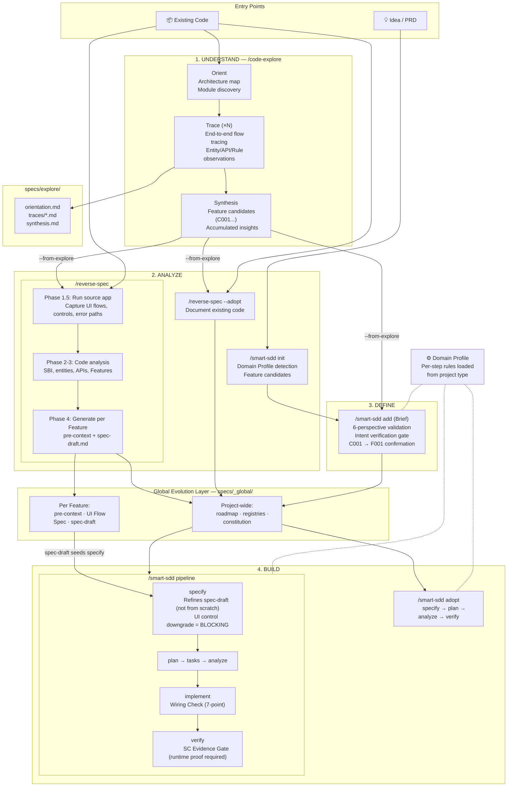
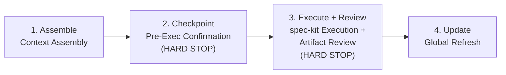

# spec-kit-skills

**Repository**: [coolhero/spec-kit-skills](https://github.com/coolhero/spec-kit-skills)

[한국어 README](README.ko.md) | [Playwright Setup Guide](PLAYWRIGHT-GUIDE.md) | [Lessons Learned](lessons-learned.md) | Last updated: 2026-03-22 06:38 KST

**Three concepts that turn AI coding agents into reliable software engineers: [Global Evolution Layer](#global-evolution-layer) for cross-Feature memory, [Domain Profile](#domain-profile) for project-type expertise, and [Brief](#brief) for structured Feature intake — built on [spec-kit](https://github.com/github/spec-kit) SDD**

- **Code-Explore** helps you understand an existing codebase through interactive, source-level exploration. Scan a project to get an architecture map, then trace specific flows end-to-end — each session produces documented traces with call chains, entity maps, and flow diagrams. When you've understood enough, synthesize your traces into Feature candidates that feed directly into the SDD pipeline. *(Under development)*
- **Reverse-Spec** analyzes an existing codebase and reverse-engineers the spec — from source code all the way to draft spec.md per Feature. It runs the source app to capture real UI flows (form fields, dropdowns, auto-fill, error paths), then converts those observations into detailed requirements. The pipeline receives specs that already describe exact interaction patterns, not vague one-liners that the agent has to guess. Use it when you want to rebuild an existing app from scratch, or when you want to add SDD documentation to code you already have.
- **Smart-SDD** wraps each spec-kit command with project-wide awareness. When you run `/speckit-plan` for Feature 3, it automatically feeds in Feature 1's data models and Feature 2's API contracts — so the plan is grounded in what actually exists, not assumptions.

---

## Table of Contents

- [Quick Start](#quick-start)
- [What It Solves](#what-it-solves)
- [Design Discipline](#design-discipline)
- [Skills](#skills)
- [Scenario Guide](#scenario-guide)
- [User Journeys](#user-journeys)
- [Quick Examples](#quick-examples)
- [Architecture](#architecture)
- [Domain Module System](#domain-module-system)
- [Extensibility & Customization](#extensibility--customization)
- [Session Resilience & Agent Governance](#session-resilience--agent-governance)
- [Detailed Reference](#detailed-reference)
- [/reverse-spec — Detailed Workflow](#reverse-spec--detailed-workflow)
- [Using spec-kit without smart-sdd](#using-spec-kit-without-smart-sdd)
- [/smart-sdd — Detailed Workflow](#smart-sdd--detailed-workflow)
- [Reference](#reference)
- [File Map](#file-map)

---

## Quick Start

### Prerequisites

- [Claude Code](https://claude.ai/claude-code) CLI — the AI coding agent that runs these skills
- [spec-kit](https://github.com/github/spec-kit) skill — the SDD pipeline engine (required for `/smart-sdd`, not needed for `/reverse-spec` alone)
- [Playwright](https://playwright.dev) — for runtime verification during `verify` step. Install: `npm install -D @playwright/test && npx playwright install`. Optional: [Playwright MCP](https://github.com/microsoft/playwright-mcp) for interactive acceleration — see [Playwright Setup Guide](PLAYWRIGHT-GUIDE.md)

### Installation

```bash
git clone https://github.com/coolhero/spec-kit-skills.git
cd spec-kit-skills
./install.sh      # creates symlinks → ~/.claude/skills/
# ./uninstall.sh  # removes symlinks (to uninstall)
```

The installer creates symlinks from `~/.claude/skills/` to this repository.

### Which Command Should I Use?

```
Have existing code?
  No  → /smart-sdd init → add → pipeline          (S8: New Project)
  Yes → What's your goal?
         Understand only    → /code-explore                          (S1: Explore)
         Document only      → /reverse-spec --adopt → adopt          (S2: Spec Only)
         Add features       → adopt → /smart-sdd add → pipeline     (S3: Extend)
         Rebuild (same)     → /reverse-spec → /smart-sdd pipeline   (S4: Rebuild)
         Rebuild (new stack)→ /reverse-spec --stack new → pipeline   (S5: Migrate)
         Modernize/migrate → adopt → add --gap → pipeline          (S6: Modernize)
         Rebuild then extend→ reverse-spec → pipeline → add         (S7: Rebuild+)
```

> **Every journey converges to incremental mode** (`/smart-sdd add → pipeline`) as the steady state. See [Scenario Guide](#scenario-guide) for detailed workflows.

### Verify Installation

```bash
# In Claude Code, type:
/reverse-spec --help     # Should show command help
/smart-sdd status        # Should show status or ask to initialize
```

---

## What It Solves

### Background: Spec-Driven Development

In spec-driven development, you don't ask an AI agent to "build a TO-DO app." You break the app into **Features** (a self-contained unit of functionality that is independently specifiable, implementable, and verifiable — e.g., authentication, task CRUD, dashboard UI). Each Feature gets exactly one **spec** that defines *what* it does (functional requirements, success criteria, data models) before the agent writes any code. The agent then implements that spec through a structured pipeline: specify → plan → tasks → analyze → implement → verify.

This is the approach that [spec-kit](https://github.com/github/spec-kit) provides. One Feature, one spec, one pipeline run — and it works well.

### The Problem: Specs Don't Talk to Each Other

The challenge is that **real software is never just one Feature.** Even a simple TO-DO app has auth, task management, and a UI — three Features, three specs, three separate pipeline runs. And each spec is written independently.

The agent building Feature 2 *might* figure out what Feature 1 decided — but that depends on the agent's capability and context window, not on any systematic guarantee. It may define the same `User` entity with different field names, or design APIs without knowing the auth pattern already chosen. Even within a single spec, the agent may lack sufficient understanding of the user's environment — the same "add authentication" means very different things for a multi-tenant SaaS platform versus an internal admin tool. And when the user's description is vague, like "add profile management," the agent may just accept it without asking what it actually means.

Each spec is internally solid, but these gaps — no memory across Features, insufficient understanding of the project's context, and no verification of user intent — are not things a single-spec workflow can address.

spec-kit-skills starts from a single belief: **the quality of an AI agent pipeline is determined not by the agent's capability, but by the quality of the structure you give it.** A smarter agent with no structure produces inconsistent results; a structured pipeline with clear context produces reliable results regardless of which agent runs it.

This belief leads to three core concepts:

#### Global Evolution Layer

> *Features are not islands — they are an ecosystem. Every Feature must be built with full knowledge of the whole project.*

**The gap**: Each agent manages context its own way, and none track cross-Feature relationships systematically.

**The solution**: A set of project-wide artifacts that sit above spec-kit's per-Feature scope — so every Feature is built with full knowledge of the whole project, regardless of which agent or session is running.

| Artifact | What it tracks |
|----------|---------------|
| **Roadmap** | Feature dependency graph with execution ordering |
| **Entity Registry** | Shared data models referenced across Features |
| **API Registry** | Inter-Feature API contracts and endpoints |
| **Per-Feature Pre-contexts** | What each Feature needs to know about the rest of the project |
| **Source Behavior Inventory** | Function-level coverage tracking (for existing codebases) |
| **Constitution** | Project-wide principles and architectural decisions |

Before each pipeline step, the relevant artifacts are automatically injected into the agent's context. When a step completes, the artifacts are updated with automatic consistency verification — entity registries and API registries are cross-checked against actual implementations to catch drift. Dependency stubs from preceding Features are tracked and enforced as blocking gates before implementation begins. The agent doesn't need to remember — the artifacts remember for it, and the gates ensure what's recorded matches what's built.

#### Domain Profile

> *Every project has a DNA. The same "add authentication" means completely different things for a desktop app, a REST API, and an AI assistant.*

**The gap**: Agents apply the same generic approach regardless of project type. Every project and every organization has its own conventions, constraints, and quality criteria that agents don't know about.

**The solution**: A composable rule system that detects your project type and loads only the relevant rules — so a REST API gets endpoint validation checks, a desktop app gets window management safety rules, and an AI chatbot gets streaming-first design principles. Organization-level conventions can be shared across projects, and project-specific rules can override both.

A Domain Profile consists of **5 axes** that produce rules and **1 modifier** that adjusts their depth:

| | Component | What it determines | Example |
|-|-----------|-------------------|---------|
| Axis 1 | **Interface** | What the app exposes to users | GUI, HTTP API, CLI, TUI |
| Axis 2 | **Concern** | Cross-cutting patterns that span Features | auth, async-state, IPC, realtime, i18n |
| Axis 3 | **Archetype** | Domain philosophy — *why* certain decisions matter | AI assistant, microservice, public API |
| Axis 4 | **Foundation** | Framework-specific constraints and toolchain | React, Electron, Next.js (21 frameworks) |
| Axis 5 | **Scenario** | Project lifecycle context | greenfield, rebuild, adoption |
| Modifier | **Scale** | How much rigor to apply | prototype / mvp / production × solo / small-team / large-team |

Each axis contributes rules (SC quality criteria, bug prevention patterns, verification strategies). The Scale modifier doesn't add rules — it adjusts their enforcement: a prototype gets functional-only SCs with optional tests, while a production project gets full edge-case coverage with mandatory observability.

When multiple concerns are active together, **Cross-Concern Integration Rules** activate emergent patterns — for example, `gui` + `realtime` triggers optimistic update and reconnection UI rules that neither module produces alone.

Domain Profile is a **first-class citizen** — not a configuration that's set once and forgotten, but a living context that actively influences every step of every skill:

- **code-explore**: detects the source project's profile (all 5 axes + Scale) during orientation, guides which flows to trace, and derives your target profile during synthesis
- **init**: infers your profile from a text description or inherits it from code-explore, writes it to project state
- **add**: uses profile rules to determine what makes a Feature definition "complete" (an API project must define endpoints; a GUI project must specify interactions)
- **specify → plan → implement → verify**: each step loads profile-specific rules, filtered by Scale — so a production desktop app with IPC gets mandatory process boundary safety checks, while an MVP microservice with message queues gets dead-letter handling as a recommended (not blocking) pattern

See [Domain Module System](#domain-module-system) for details.

#### Brief

> *Never trust that the agent understood. Verify understanding before it becomes code.*

**The gap**: Agents start coding from whatever description they receive, with no quality gate on Feature definitions. Agents don't verify that they understood the user's intent — they accept input, interpret it, and proceed without confirmation.

**The solution**: A structured Feature intake process — implemented in `/smart-sdd add` — that normalizes any input into a consistently complete Feature definition, then **verifies the agent's understanding matches the user's actual intent** before entering the spec-kit pipeline.

A Brief is **not** the same as a PRD. A PRD is one possible *input* to the Brief process; a casual conversation or a gap analysis result are equally valid inputs. The Brief is the *output* — a normalized, quality-checked Feature definition that has been validated for both **completeness** (all key dimensions covered) and **accuracy** (the agent's interpretation confirmed by the user through an explicit approval gate).

```
/smart-sdd init                      /smart-sdd add (= Briefing)
Sets up the PROJECT:                 Defines each FEATURE:
- name, stack, principles            - capabilities, data, interfaces
- Domain Profile detection           - quality criteria, boundaries
- Feature candidates (names only)    - normalized Brief per Feature
         │                                      │
         └──── chains into ────────→            │
                                                ▼
                                         pre-context (GEL)
                                                │
                                                ▼
                                         spec-kit pipeline
```

`init` may accept a PRD to understand the *project* — extracting stack hints, Domain Profile signals, and a rough Feature list. But it stops at Feature *names*. The actual Feature *definition* — ensuring each Feature has complete capabilities, data requirements, interface contracts — happens in `add` through the Brief process.

Domain Profile rules add project-type-specific completion criteria — an API project's Brief must define endpoint contracts; a GUI project's Brief must specify user interactions. Incomplete inputs trigger targeted questions rather than proceeding with gaps.

After completeness criteria are met, the agent presents a **Brief Summary** showing its interpretation. The user explicitly approves it or corrects misunderstandings — an **intent verification gate** that catches interpretation errors before they propagate through the pipeline. A second-layer **Brief↔Spec alignment check** during `specify` verifies that the generated spec faithfully reflects the approved Brief.

For existing codebases (`/smart-sdd adopt`), Features are auto-extracted from source code — but the same intent verification principle applies. Each Feature goes through a scope confirmation gate before adoption begins, ensuring the user validates what was inferred from code analysis.

The result: specs generated from a well-formed, user-verified Brief are more complete, more testable, and require fewer mid-implementation corrections.

#### Project Directory Structure

All artifacts live in your project directory, organized by scope:

```
my-project/
├── specs/
│   ├── _global/                   ← Project-wide (GEL)
│   │   ├── roadmap.md             ← Feature dependency graph
│   │   ├── entity-registry.md     ← Shared data models
│   │   ├── api-registry.md        ← Inter-Feature API contracts
│   │   └── sdd-state.md           ← Pipeline state + Domain Profile
│   ├── explore/                   ← Code-explore output (learning)
│   │   ├── orientation.md         ← Architecture map + module map
│   │   └── traces/                ← Per-topic flow traces
│   ├── 001-auth/                  ← Per-Feature (analysis + pipeline together)
│   │   ├── pre-context.md         ← What F001 needs to know (from reverse-spec)
│   │   ├── spec-draft.md          ← Initial spec (from reverse-spec)
│   │   ├── spec.md                ← Final spec (from speckit-specify)
│   │   ├── plan.md                ← Architecture (from speckit-plan)
│   │   └── tasks.md               ← Implementation tasks
│   └── 002-task-crud/
│       └── ...
└── .specify/
    └── memory/
        └── constitution.md        ← Project-wide principles
```

**Artifact Separation**: Project-wide artifacts (roadmap, registries, state) live in `specs/_global/`. Each Feature's artifacts — both analysis (pre-context, spec-draft from reverse-spec) and pipeline output (spec.md, plan.md, tasks.md from smart-sdd) — live together in `specs/NNN-feature/`. The pipeline artifacts contain **requirements only** — no source code references. When you read `spec.md`, you see "what we're building," not "where it came from." Source details stay in pre-context.md, keeping specs clean and reusable.

---

## Design Discipline

The three core concepts above (GEL, Domain Profile, Brief) define *what* spec-kit-skills builds. The three rules below define *how* it's built — the engineering discipline that ensures the concepts actually work when an AI agent executes them.

```
Core Concepts (WHAT we believe)        Design Rules (HOW we build)
├── GEL — ecosystem memory      ←───  P1. Context Continuity
├── Domain Profile — project DNA ←───  P2. Enforce, Don't Reference
└── Brief — intent verification  ←───  P3. File over Memory
```

**P1 — Context Continuity**: Information must flow without loss through every pipeline stage. Domain context, source fidelity, and cross-Feature memory must be systematically preserved. When any of these break, the agent makes decisions in a vacuum. *This is why GEL exists — to make continuity structural, not accidental.*

**P2 — Enforce, Don't Reference**: "See X.md for details" has zero behavioral force. Agents optimize for completion, not compliance. Every critical rule needs inline visibility, blocking power, and negative examples. *This is why Domain Profile rules are injected at every execution point, not stored in a config file.*

**P3 — File over Memory**: Agent memory is ephemeral — bounded by context windows, lost across sessions, unreliable under compaction. Every intermediate result and decision must be persisted to a file. *This is why Brief produces a file-based pre-context, not a conversation summary.*

Every gap pattern in [lessons-learned.md](lessons-learned.md) traces back to a violation of exactly one of these three rules.

---

## Skills

### `/reverse-spec` — Existing Source → SDD-Ready Artifacts

Reads your existing source code and produces the foundation that SDD needs: Feature decomposition, entity/API registries, per-Feature pre-contexts, and source coverage baseline.

```bash
/reverse-spec [target-directory] [--scope core|full] [--stack same|new] [--name new-project-name]
```

**Workflow**: Phase 0 (strategy) → Phase 1 (project scan) → Phase 1.5 (runtime exploration — runs the source app, captures UI flows) → Phase 2 (deep analysis) → Phase 3 (Feature classification) → Phase 4 (artifact + spec-draft generation)

In rebuild mode, Phase 1.5 is **required** — it runs the source app and records exactly how each UI flow works (what controls exist, what auto-fills, what error messages appear). Phase 4 then converts these observations into `spec-draft.md` per Feature with detailed FR/SC that preserve every UI detail. The pipeline's `specify` step refines this draft instead of generating from scratch.

### `/smart-sdd` — spec-kit with Cross-Feature Context

Wraps every spec-kit command with a **4-step protocol**: Assemble context → Checkpoint → Execute + Review → Update registries. This means `/speckit-plan` for Feature 3 automatically knows Feature 1's `User` entity and Feature 2's API contracts.

```bash
/smart-sdd init                          # New project setup
/smart-sdd add                           # Define new Feature(s)
/smart-sdd pipeline                      # Run full SDD pipeline
/smart-sdd adopt                         # Document existing code with SDD
/smart-sdd status                        # Check progress
```

**Five modes**: greenfield (`init`), incremental (`add`), rebuild (`pipeline` after `reverse-spec`), adoption (`adopt`), scope expansion (`expand`)

### How the Skills Connect



The diagram shows the full lifecycle: **understand** existing code with code-explore, **analyze** it with reverse-spec (which runs the source app and generates spec-drafts per Feature), **define** Features through the Brief process, then **build** through the spec-kit pipeline (where specify refines spec-drafts instead of generating from scratch). Source analysis artifacts live in `specs/_global/`, pipeline output lives in `specs/NNN-feature/` — clean separation.

---

## Scenario Guide

Every project falls into one of these scenarios. Find yours and follow the workflow.

| # | Scenario | When to Use | Modifies Code? |
|---|----------|-------------|---------------|
| **S1** | [Explore Only](#s1-explore-only) | Understand how a codebase works | No |
| **S2** | [Spec Only](#s2-spec-only-documentation) | Document existing code with SDD specs, no code changes | No |
| **S3** | [Extend](#s3-extend-existing-code) | Add new features to an existing, running codebase | New code only |
| **S4** | [Rebuild (Same Stack)](#s4-rebuild-same-stack) | Rewrite from scratch with the same technology | Full rewrite |
| **S5** | [Rebuild (New Stack)](#s5-rebuild-new-stack) | Rewrite from scratch with a different technology | Full rewrite |
| **S6** | [Modernization / Migration](#s6-modernization--migration) | Security hotfix, library patch, version upgrade, DB migration, framework swap, or platform move | Scale-dependent |
| **S7** | [Rebuild → Extend](#s7-rebuild--extend) | Rewrite first, then add new features beyond original scope | Full + new |
| **S8** | [New Project](#s8-new-project) | Start from scratch — no existing code | Full |
| **S9** | [Explore → Decide](#s9-explore--decide) | Study code first, then decide what to do | Depends on choice |

### S1: Explore Only

```
Goal: Understand the codebase. No modifications.
Output: Architecture map, flow traces, Feature candidates

/code-explore ./source          → Orient (architecture map)
/code-explore trace "auth flow" → Trace (detailed flow analysis)
/code-explore trace "payments"  → Trace (additional flows)
/code-explore synthesis         → Synthesis (Feature candidates + summary)
```

### S2: Spec Only (Documentation)

```
Goal: Wrap existing code with SDD documentation. Code stays as-is.
Output: roadmap, registries, constitution-seed, spec.md + plan.md per Feature

/smart-sdd adopt                → Auto-runs reverse-spec if needed, then
                                  Constitution → Feature-by-Feature: specify + plan + verify
                                  (no tasks/implement — code already exists)
```

### S3: Extend Existing Code

```
Goal: Add new features to a working codebase (keep existing code).
Output: Existing code documented + new Feature code + SDD docs
Prerequisite: Document existing code first (S2), then add.

Step 1 — Document existing code:
/smart-sdd adopt                → Auto-runs reverse-spec + Document existing Features

Step 2 — Add new features:
/smart-sdd add                  → Define + build new Feature(s)
                                  (Briefing → auto-chains to pipeline)
```

### S4: Rebuild (Same Stack)

```
Goal: Rewrite legacy code cleanly with the same technology.
Output: Brand new codebase + SDD docs

/reverse-spec ./old-source --stack same  → Analyze + extract GEL
/smart-sdd pipeline --all                → Constitution → Feature-by-Feature build
/smart-sdd parity --source ./old-source  → Verify behavioral parity
```

### S5: Rebuild (New Stack)

```
Goal: Migrate to a different technology (e.g., Django → Next.js).
Output: New codebase in new stack + stack-migration.md + SDD docs

/reverse-spec ./old-source --stack new   → Analyze + extract GEL + stack-migration
/smart-sdd pipeline --all                → Build with new stack
/smart-sdd parity --source ./old-source  → Verify behavioral parity
```

### S6: Modernization / Migration

S6 covers everything from emergency security patches to multi-quarter platform moves.
The workflow adapts based on two axes: **migration scale** and **SDD state**.

**Migration Scale:**

| Scale | Time Pressure | Examples | Pipeline Depth |
|-------|---------------|----------|----------------|
| Hotfix | Hours | log4j CVE, OpenSSL patch, prototype pollution fix | Impact analysis + targeted fix |
| Patch | Days | React 18.2→18.3, axios minor bump, TypeScript patch | Lightweight specify → implement → verify |
| Minor | Weeks | Next.js 14→15, Node 18→20, deprecation warnings | specify → plan → implement → verify |
| Major | Months | Vue 2→3, Python 2→3, MySQL→PostgreSQL, Sequelize→Prisma | Full pipeline |
| Platform | Quarters | Heroku→AWS, monolith→microservices, REST→GraphQL | Full pipeline + phased rollout |

**Decision Tree:**

```
Start: What needs to change?
  │
  ├─ Security vulnerability / CVE         → Scale: Hotfix
  ├─ Bug fix / patch version bump         → Scale: Patch
  ├─ Deprecation warning / minor upgrade  → Scale: Minor
  ├─ Major version / library swap         → Scale: Major
  └─ Platform / architecture change       → Scale: Platform

Do you already have SDD docs for this project?
  │
  ├─ YES (Case A) ─────────────────────────────────────────────────────────┐
  │   Hotfix/Patch: /smart-sdd add (auto-chains to pipeline)              │
  │   Minor/Major:  /smart-sdd add --gap (auto-chains to pipeline)       │
  │   Platform:     /smart-sdd add --gap (phased pipeline)               │
  │                                                                       │
  └─ NO (Case B) ──────────────────────────────────────────────────────────┐
      Hotfix: Targeted scan (affected component + callers) → fix → record │
      Patch:  Partial adopt (affected scope) → add                         │
      Minor:  Partial adopt (affected + adjacent) → add                   │
      Major:  /smart-sdd adopt → add                                      │
      Platform: /smart-sdd adopt → add                                    │
```

**Target Layers** (what is being changed — affects impact analysis depth):

| Layer | Key Concern | Data Migration? |
|-------|-------------|-----------------|
| Library/Package | Import paths, API calls | No |
| Framework | Component patterns, config | No |
| Language/Runtime | Syntax, stdlib, build chain | No |
| DB Engine | Query compatibility, schema | Same vendor: usually no / Vendor swap: yes |
| ORM/Query Layer | Repository code, model defs | Schema possible |
| Cache/Queue | Client code, serialization | State loss possible |
| Auth/Security | Token format, middleware | Token invalidation |
| Build/Tooling | Config files, CI scripts | No |
| Cloud/Infrastructure | SDK calls, deployment | Possible |

> See `shared/domains/contexts/migration.md` for the full M0-M4 framework (signal detection, scale classification, impact assessment, pipeline depth modifiers).

### S7: Rebuild → Extend

```
Goal: Rewrite first, then add features beyond the original scope.

Phase 1 — Rebuild:
/reverse-spec ./old-source → /smart-sdd pipeline --all → /smart-sdd parity

Phase 2 — Extend (now in incremental mode):
/smart-sdd add                  → Define + build new Feature(s)
```

> After rebuild completes, the project is in **incremental mode**. Use `/smart-sdd add` freely — it auto-chains to pipeline. Origin stays `rebuild` but `add` works transparently.

### S8: New Project

```
Goal: Build from scratch — no existing code.

/smart-sdd init                          → Project setup + Domain Profile
  or: /smart-sdd init "task management app with Kanban boards"
  or: /smart-sdd init --prd requirements.md
/smart-sdd add                           → Define + build Features
                                           (Briefing → auto-chains to pipeline)
```

### S9: Explore → Decide

```
Goal: Study code first, then choose your path.

/code-explore ./source                         → Understand the codebase
/code-explore synthesis                        → Synthesize understanding

Then choose:
  → Rebuild:  /reverse-spec --from-explore specs/explore/ → pipeline
  → Extend:   /reverse-spec --adopt --from-explore specs/explore/ → adopt → add
  → Spec only: /reverse-spec --adopt --from-explore specs/explore/ → adopt
```

### Scenario Convergence

All scenarios converge to **incremental mode** as the steady state:

```
S1 (Explore) ─────────────────────────────────── understanding only
S2 (Spec Only) ──────────── adopt ─────────────── docs complete
S3 (Extend) ─────────────── adopt → add ────┐
S4 (Rebuild Same) ────────── pipeline ──────┤
S5 (Rebuild New) ─────────── pipeline ──────┼──→ /smart-sdd add (repeat)
S6 (Modernize) ──────────── adopt → add ────┤     (auto-chains to pipeline)
S7 (Rebuild+) ──────────── pipeline → add ──┤
S8 (New Project) ─────────── init → add ────┤
S9 (Explore→Decide) ──────── (any above) ───┘
```

### Mid-Pipeline Navigation: Step-Back & Spec Revision

During pipeline execution, you can go back to any previous step at any Review approval point by selecting **"Go back to earlier step"**:

```
Currently at implement, need to fix the spec?
  → Review HARD STOP → "Go back to earlier step" → select "specify"
  → Modify spec.md (incremental, not from scratch)
  → Cross-Feature Impact Analysis auto-runs:
      🔴 BREAKING: User.email type changed → F002, F003 affected
      🟡 ADDITIVE: User.avatar added → F005 notified
  → Choose which downstream Features to re-run
  → Cascade: updated spec → plan → tasks → implement → verify

Already completed Feature needs spec revision?
  → /smart-sdd pipeline F005         (target the specific Feature)
  → Review HARD STOP → "Go back to earlier step" → "specify"
  → Same flow as above
```

**Two ways to step back**:

| Method | When to use |
|--------|------------|
| Review HARD STOP → "Go back to earlier step" | During pipeline execution — agent is already running |
| `/smart-sdd pipeline F005 --start specify` | Anytime — direct command, same result |

Both methods preserve existing artifacts, run Impact Analysis, and cascade changes incrementally.

**Step-back vs Reset**: Step-back **preserves** existing artifacts and modifies them incrementally (fix what's wrong). Reset **deletes** artifacts and starts fresh (redo from scratch). Use `reset` only when the existing artifact is fundamentally wrong.

```
Step-back: /smart-sdd pipeline F005 --start specify  → fix 2 FRs → cascade
Reset:     /smart-sdd reset F005 --from specify       → delete spec → regenerate all
```

---

## User Journeys

The Scenario Guide above shows **what to do**. This section shows **how it works internally** — how Brief, GEL, and Domain Profile participate in each step.

```
── From an Idea (Proposal Mode) ──────────────────────────────────
/smart-sdd init "Build a Chrome extension..."
  Domain Profile detected → auto-chain to:
  /smart-sdd add (Brief) → /smart-sdd pipeline (GEL + Domain Profile)

── New Project (Standard) ────────────────────────────────────────
/smart-sdd init         →  /smart-sdd add      →  /smart-sdd pipeline
(Domain Profile setup)     (Brief per Feature)    (GEL + Domain Profile)

── SDD Adoption ──────────────────────────────────────────────────
/smart-sdd adopt        →  reverse-spec auto   →  adopt pipeline
(auto-chains if needed)    (Domain Profile auto)   (document existing)

── Rebuild ───────────────────────────────────────────────────────
/reverse-spec           →  GEL artifacts       →  /smart-sdd pipeline
(Domain Profile auto)      (Brief Summary in      (GEL + Domain Profile
                            pre-contexts)           per step)

── Incremental ───────────────────────────────────────────────────
/smart-sdd add          →  updated GEL         →  /smart-sdd pipeline
(Brief for new Feature)    (pre-context added)    (GEL + Domain Profile)

── Learn & Build ─────────────────────────────────────────────────
/code-explore ./source  →  traces + synthesis  →  /smart-sdd init --from-explore
(orient + trace × N)       (C001... candidates)    (Domain Profile inherited)
                                                →  /smart-sdd add → pipeline
```

All journeys converge to **incremental mode** as the steady state. In every journey, the three core concepts participate: **Brief** ensures Feature definitions are complete, **GEL** provides cross-Feature context, and **Domain Profile** shapes each pipeline step's behavior.

### End-to-End Workflow Examples

### Scenario 1: Greenfield from an Idea (Proposal Mode)

```
1. /smart-sdd init "Build a task management app with Kanban boards and team workspaces"
   ┌─ Domain Profile ─────────────────────────────────────────────────┐
   │ Signal Extraction: "task management" → Core Purpose,            │
   │   "Kanban boards" → gui, "team workspaces" → auth + async-state │
   │ Clarity Index: 58% (Medium) → ask 2 targeted questions          │
   │ Result: [gui, http-api] + [auth, async-state]                   │
   └──────────────────────────────────────────────────────────────────┘
   +-- Proposal: 5 Features → User approves → auto-chain

2. /smart-sdd add (auto-chained) ← Brief
   ┌─ Briefing ───────────────────────────────────────────────────────┐
   │ Each Feature validated against 6 perspectives                    │
   │ + Domain-specific S9 criteria (gui: screens, http-api: endpoints)│
   │ → Normalized Brief → pre-context per Feature                     │
   └──────────────────────────────────────────────────────────────────┘

3. /smart-sdd pipeline ← GEL + Domain Profile
   +-- Phase 0: Constitution finalized
   +-- For each Feature (specify → plan → tasks → analyze → implement → verify):
   |   ┌─ GEL ─────────────────────────────────────────────────────────┐
   |   │ Each step gets cross-Feature context: entity registry,        │
   |   │ API contracts, preceding Features' decisions                   │
   |   └───────────────────────────────────────────────────────────────┘
   |   ┌─ Domain Profile ──────────────────────────────────────────────┐
   |   │ S1 shapes SCs, S7 prevents bugs, S8 drives verification      │
   |   └───────────────────────────────────────────────────────────────┘
   +-- F001-auth → F002-workspace → F003-task → F004-board → F005-notif
```

### Scenario 1b: Greenfield — Standard Q&A

```
1. /smart-sdd init
   +-- Define project: "TaskFlow", TypeScript + Next.js + Prisma
   +-- Domain Profile detected: [gui, http-api] + [auth, async-state]
   +-- Constitution seed with 6 Best Practices
   +-- Chain into /smart-sdd add...

2. /smart-sdd add ← Brief
   +-- Briefing: F001-auth, F002-workspace, F003-task, F004-board, F005-notif
   +-- Each Feature validated: capabilities, data, interfaces complete
   +-- S9 check: gui Brief requires screens, http-api Brief requires endpoints
   +-- Demo Group assignment → create pre-context (GEL) per Feature

3. /smart-sdd pipeline ← GEL + Domain Profile
   +-- Phase 0: Finalize constitution (Domain Profile A4 principles injected)
   +-- Release 1 (Foundation):
   |   F001-auth → specify → plan → tasks → analyze → implement → verify
   |   GEL Update: User, Session entities → entity-registry
   +-- Release 2 (Core):
   |   F002-workspace (GEL injects F001's User entity as context)
   |   F003-task ...
   +-- Release 3 (Enhancement): F004-board, F005-notification
```

### Scenario 2: Brownfield Rebuild — Legacy e-commerce to React + FastAPI

```
1. /reverse-spec ./legacy-ecommerce --scope core --stack new
   ┌─ Domain Profile ─────────────────────────────────────────────────┐
   │ Auto-detected: [http-api, gui] + [auth, async-state]            │
   │ Archetype: none (standard e-commerce)                            │
   └──────────────────────────────────────────────────────────────────┘
   +-- Phase 1: Detect Django + jQuery stack
   +-- Phase 2: Extract 12 entities, 45 APIs, 78 business rules
   +-- Phase 3: 8 Features (Tier 1: Auth, Product, Order | T2: Cart, Payment, Search | T3: Review, Notif)
   +-- Phase 4: Generate GEL artifacts (roadmap, registries, pre-contexts with Brief Summary)

2. /smart-sdd pipeline ← GEL + Domain Profile
   +-- Scope: Core (Tier 1 only)
   +-- Each Feature: specify → plan → tasks → analyze → implement → verify
   +-- F001-auth → F002-product → F003-order
   +-- Tier 2/3 remain deferred

3. /smart-sdd expand T2     → activates Cart, Payment, Search
4. /smart-sdd expand full   → activates Review, Notification
```

### Scenario 3: Incremental — Adding notifications to existing project

```
1. /smart-sdd add ← Brief
   +-- "I need real-time notifications for task updates"
   ┌─ Briefing ───────────────────────────────────────────────────────┐
   │ 6-perspective validation:                                        │
   │  ✅ User & Purpose: end users receive task update notifications  │
   │  ✅ Capabilities: real-time push, email digest, preferences      │
   │  ✅ Data: Notification entity (owned), User (referenced)         │
   │  ✅ Interfaces: WebSocket channel + /api/notifications           │
   │ S9 (http-api): endpoint defined ✅  S9 (realtime): WS type ✅   │
   └──────────────────────────────────────────────────────────────────┘
   +-- Overlap check: No conflicts with existing Features
   +-- ⚠️ Constitution Impact: WebSocket (new technology)
   +-- F005-notification depends on F001-auth, F003-task
   +-- Brief → pre-context stored in GEL

2. /smart-sdd pipeline ← GEL + Domain Profile
   +-- Skips completed Features
   +-- F005-notification: specify → plan → tasks → analyze → implement → verify
   +-- GEL Update: Notification entity → entity-registry
   +-- Domain Profile: S1 shapes SCs (realtime: reconnection SC required)
```

---

## Quick Examples

**Rebuild an existing app**:
```bash
/reverse-spec ./legacy-app --scope core --stack new
# → Scans source code, detects Domain Profile, extracts Features
# → Produces: roadmap.md, entity-registry.md, api-registry.md, pre-contexts
# → You review and approve the Feature list at a HARD STOP

/smart-sdd pipeline
# → Processes each Feature: specify → plan → tasks → analyze → implement → verify
# → HARD STOP at each Checkpoint (before) and Review (after)
# → Target app reproduces source app's UX patterns in the new stack
```

**Greenfield project**:
```bash
/smart-sdd init "Build a task management app with team workspaces"
# → Detects Domain Profile: [gui, http-api] + [auth, async-state]
# → Proposes 5 Features → you approve → chains into /smart-sdd add

/smart-sdd add
# → Briefing: 6-perspective validation per Feature
# → You approve each Brief Summary at a HARD STOP

/smart-sdd pipeline
# → Builds each Feature with cross-Feature context from GEL
```

**Add a Feature to an existing project**:
```bash
/smart-sdd add
# → "I need real-time notifications" → Briefing → Brief Summary → approval

/smart-sdd pipeline
# → Skips completed Features, processes only new/pending ones
```

**Study a codebase, then build your own version**:
```bash
cd ~/my-project

/code-explore ~/opencode
# → Orient: architecture map + module map + Domain Profile detection
# → Runtime: launches the app, captures screens, observes UI patterns
# → Trace: "How does context management work?" → source-level flow doc
# → Trace: "How does tool execution work?" → another flow doc
# → Synthesis: Feature candidates (C001-context-engine, C002-tool-runtime...)

/smart-sdd init --from-explore specs/explore/
# → Domain Profile inherited from source analysis
# → Feature candidates become the starting Feature list
```

---

## Architecture

### How the Three Concepts Work Together

The three concepts aren't independent features — they form a layered system where each concept feeds the next:

The three concepts chain: **Brief** produces a complete Feature definition → stored as **pre-context** in the **GEL** → injected into the **spec-kit pipeline** → where **Domain Profile** rules shape every step's behavior.

### Artifact Separation

Source analysis and pipeline output live in separate locations and never mix:

- **Source analysis** (pre-context.md, spec-draft.md) → lives in `specs/NNN-feature/` but generated by reverse-spec. Contains source app details: UI control types, interaction patterns, data flows.
- **Pipeline output** (spec.md, plan.md, tasks.md) → generated by smart-sdd. Contains **requirements only** — no source code references. When you read spec.md, you see "what we're building," not "where the idea came from."

This means specs are reusable — if you rebuild the same feature with a different source app, the spec stays valid.

### Cascading Updates

When you discover something mid-pipeline ("this spec needs a new FR"), changes flow **through the artifact hierarchy**, not directly to code:

```
User: "citation rendering is missing"
  → Agent: "No FR for citation in spec.md — this is a spec-level issue"
  → spec.md: append FR-008 + SC-008 (incremental, not full re-run)
  → plan.md: append CitationBlock component
  → tasks.md: append T012
  → implement: build T012 only
  → verify: check SC-008 only
```

This works at **every HARD STOP** — whether the user gives feedback during plan Review, implement Review, or verify Review. Direct file edits by the user are detected and cascade automatically.

### Shared Runtime

All three skills need to run apps (source app for analysis, target app for verification). Instead of duplicating this logic, `shared/runtime/` provides common protocols:

- **Playwright detection** — find available backend (CLI, MCP, CDP)
- **Data storage map** — detect where the app stores data + userData path
- **User-assisted setup** — guide API key configuration, classify as BLOCKING/OPTIONAL
- **App launch** — start the app with correct userData so user's settings are visible
- **Observation protocol** — structured per-Domain Profile axis (what to look for in GUI vs API vs CLI)

### Implementation: Pipeline Integrity Guards

The three concepts are enforced through 7 Pipeline Integrity Guards — protection patterns extracted from real-world failures. Each guard covers a class of problems with clear trigger conditions and enforcement rules. When new failures are discovered, they extend existing guards rather than pile up as one-off fixes. See [`pipeline-integrity-guards.md`](.claude/skills/smart-sdd/reference/pipeline-integrity-guards.md).

These guards implement three enforcement mechanisms:

| Mechanism | What It Does | Which Concept It Serves |
|-----------|-------------|------------------------|
| **Context Injection** | Feeds each step the knowledge it needs — what other Features decided, how the existing app works, what rules apply | Global Evolution Layer |
| **Gate Enforcement** | Checkpoints that stop the pipeline when output doesn't meet criteria — not "should check" but "cannot proceed" | Brief (intake gates) + GEL (review gates) |
| **Behavioral Fidelity** | Captures not just *what* to build but *how it should work* — how users interact, how data flows, how the app responds | Domain Profile (domain-aware verification) |

### Design Philosophy

Five principles shape every design decision:

1. **Structured input produces better output** (Brief) — Instead of accepting vague Feature descriptions, the system ensures every Feature is defined completely before specs begin. Missing dimensions trigger questions, not assumptions.

2. **Give each step only the context it needs** (GEL) — Before each pipeline step, the relevant cross-Feature knowledge is automatically injected — data models, API contracts, project rules. The agent sees exactly what it needs, no more, no less.

3. **Load only relevant rules** (Domain Profile) — A REST API project doesn't need GUI testing rules. An AI chat app doesn't need CRUD validation rules. The system auto-detects your project type and loads only the modules that apply.

4. **Humans approve before anything is final** — The agent runs autonomously through research, planning, and coding. But before specs are created and before code is accepted, you review and approve. The agent does the work; you make the decisions.

5. **Start broad, drill deep** — Analysis begins with tech stack and project structure, then progressively zooms into function signatures, UI components, micro-interactions, and edge cases. Each level builds on the one above.

### How the Pipeline Works

The pipeline runs in three phases. First, the project is analyzed (or defined from scratch). Then, each Feature is built one at a time through a 6-step cycle. Finally, each step is verified before moving on.

```
1. Analysis (reverse-spec or init):
   Source Code → Tech Stack Detection → Framework Identification →
   Foundation Extraction → Feature Extraction →
   Global Evolution Artifacts (roadmap, registries, pre-contexts)

2. Development (smart-sdd pipeline):
   For each Feature (T0 → T1 → T2 → T3):
   Assemble Context → Checkpoint (HARD STOP) →
   Execute spec-kit → Review (HARD STOP) → Update State

3. Verification (verify phases):
   Build → Test → Lint → Cross-Feature Consistency →
   Runtime SC Verification → Demo-Ready Check → Foundation Compliance
```

**What a HARD STOP looks like in practice**: At each Checkpoint and Review, the agent pauses and shows you a summary of what it assembled or produced, then asks for your decision:

```
📋 Checkpoint — Context for F002-task-crud specify:

  Entity context: User (from F001-auth), Session (from F001-auth)
  API context: POST /api/auth/login (from F001-auth)
  Domain Profile: [gui, http-api] + [auth, async-state] + mvp/solo

  Approve and proceed to specify?
  ├─ "Approve" — run speckit-specify with this context
  ├─ "Modify context" — adjust what's injected
  └─ "Skip Feature" — defer F002 and move to next
```

After spec-kit runs, a Review HARD STOP shows the output and asks you to approve before moving on. You always see what the agent produced and decide whether it's good enough.

Each Feature goes through a **6-step lifecycle**. If verify finds bugs, they loop back to the right step instead of being patched silently:

```
specify → plan → tasks → analyze → implement → verify → merge
                                                  │
                                    Minor fix ←────┘ (inline, ≤2 files)
                                    Major-Implement → back to implement
                                    Major-Plan → back to plan
                                    Major-Spec → back to specify
```

Verify discovers bugs and classifies them by severity. Only Minor issues are fixed inline; Major issues loop back to the appropriate pipeline step — with a **Spec Coverage Pre-check**: if no SC covers the broken behavior, it's Major-Spec (the spec was incomplete), not Major-Implement.

### Project Modes

Choose the mode that matches your situation:

| Mode | Entry Point | Use Case | Code Changes? |
|------|-------------|----------|--------------|
| Greenfield | `/smart-sdd init` → `add` → `pipeline` | New project from scratch | Yes — generates new code |
| Incremental | `/smart-sdd add` → `pipeline` | Add features to existing smart-sdd project | Yes — adds new code |
| Rebuild | `/reverse-spec` → `/smart-sdd pipeline` | Rebuild existing codebase with SDD | Yes — rewrites in new stack, targeting UX equivalence with the source app |
| Adoption | `/reverse-spec --adopt` → `/smart-sdd adopt` | Wrap existing code with SDD docs | **No** — documents existing code without rewriting. Skips `tasks` and `implement` |

> **Rebuild vs Adoption**: Rebuild re-implements the source app in a new stack — new code is written, and the target must match the source app's UX patterns. Adoption wraps your existing code with SDD specs and plans without touching the source — useful for onboarding an existing project into the SDD workflow so future changes follow the pipeline.

When rebuilding existing software (stack migration, framework upgrade, etc.), reverse-spec Phase 0 collects four configuration parameters:

| Parameter | What it controls | Example |
|-----------|-----------------|---------|
| Change scope | Elaboration probes, bug prevention rules | `framework` (Express → Fastify) |
| Preservation level | SC depth requirements, verification strictness | `equivalent` (same data, format may differ) |
| Source available | Side-by-side comparison strategy | `running` (original app accessible) |
| Migration strategy | Regression gate scope, merge policy | `incremental` (Feature-by-Feature) |

These are stored in `sdd-state.md` and automatically read by relevant pipeline steps — see `domains/scenarios/rebuild.md` for the full consumption matrix.

### Key Artifacts

The pipeline produces and maintains these shared artifacts — they're how Feature 3 knows what Feature 1 already decided:

| Artifact | Location | Purpose |
|----------|----------|---------|
| Roadmap | `specs/_global/roadmap.md` | Feature catalog, dependency graph, release groups |
| Entity Registry | `specs/_global/entity-registry.md` | Shared data model definitions |
| API Registry | `specs/_global/api-registry.md` | API contract specifications |
| Business Logic Map | `specs/_global/business-logic-map.md` | Cross-Feature business rules |
| Pre-context | `specs/NNN-feature/pre-context.md` | Per-Feature context for spec-kit |
| Spec Draft | `specs/NNN-feature/spec-draft.md` | Initial spec from reverse-spec (rebuild mode) |
| Constitution | `.specify/memory/constitution.md` | Project-wide principles & best practices |
| State | `specs/_global/sdd-state.md` | Pipeline progress, toolchain, Foundation decisions |

---

## Domain Module System

The Domain Profile concept from [What It Solves](#domain-profile) is implemented as a **composable module system** — standalone files that merge automatically based on your project's 5-axis configuration.

### Available Modules

```
Interfaces (9):   gui, http-api, cli, data-io, tui, mobile, library, embedded, grpc
Concerns (33):    auth, authorization, async-state, codegen, cqrs-eventsourcing,
                  dag-orchestration, distributed-consensus, ecs, external-sdk,
                  graceful-lifecycle, gpu-compute, hardware-io, i18n, infra-as-code,
                  ipc, k8s-operator, llm-agents, message-queue, multi-tenancy,
                  observability, plugin-system, polyglot, protocol-integration,
                  realtime, resilience, connection-pool, task-worker, wire-protocol,
                  webrtc, tls-management, schema-registry, cryptography, udp-transport
Archetypes (15):  ai-assistant, browser-extension, cache-server, compiler,
                  database-engine, game-engine, infra-tool, inference-server,
                  media-server, message-broker, microservice, network-server,
                  public-api, sdk-framework, workflow-engine
Foundations (21): electron, nextjs, express, django, spring-boot, tauri, ...
Scenarios (4):    greenfield, rebuild, incremental, adoption
```

### How Detection Works

- **Greenfield**: Signal keywords in your description are matched against each module's S0 keywords. Scored by a **Clarity Index** (7 dimensions) — high CI generates a Proposal directly, low CI triggers targeted questions. See `reference/clarity-index.md`.
- **Brownfield**: Code patterns (imports, decorators, config files) auto-detect which modules apply.
- Both produce the same format in `sdd-state.md` — the pipeline doesn't care how the profile was determined.

### What's Inside Each Module — The Section System

Each module isn't just a tag that says "this project uses auth." It's a file containing **numbered sections**, where each section feeds a specific pipeline step. There are four section families, each serving a different skill:

**S-sections** (smart-sdd — pipeline execution):

| Section | What it provides | Which pipeline step uses it |
|---------|-----------------|---------------------------|
| **S0** | Signal keywords for auto-detection | `init` (profile inference) |
| **S1** | Success criteria rules and anti-patterns | `specify` (what "done" means for this module) |
| **S3** | Verification steps and gates | `verify` (what to check and what blocks progress) |
| **S4** | Data integrity principles (authority, empty input, pipeline trace) | All steps (universal engineering principles) |
| **S5** | Consultation questions | `clarify` / `add` (what to ask the user about this module) |
| **S7** | Bug prevention rules with detection + fix | `plan` / `implement` / `verify` (known failure patterns) |

**A-sections** (archetypes — domain philosophy):

| Section | What it provides | Which pipeline step uses it |
|---------|-----------------|---------------------------|
| **A0** | Signal keywords for archetype detection | `init` (archetype inference) |
| **A1** | Core philosophy principles | Guides all steps (e.g., "Streaming-First" shapes every decision) |
| **A2** | SC generation extensions | `specify` (archetype-specific success criteria) |
| **A3** | Domain-specific consultation questions | `clarify` / `add` (e.g., "Single or multi-provider LLM?") |
| **A4** | Constitution injection | `constitution` (principles baked into the project's foundation) |

**R-sections** (reverse-spec — source analysis):

| Section | What it provides | Which pipeline step uses it |
|---------|-----------------|---------------------------|
| **R1** | Code patterns for detection | `analyze` Phase 1 (auto-detect which modules apply) |
| **R3** | Extraction axes | `analyze` Phase 2 (what to extract from the code for this module) |

**F-sections** (foundations — framework infrastructure):

| Section | What it provides | Which pipeline step uses it |
|---------|-----------------|---------------------------|
| **F0** | Framework detection signals | `analyze` Phase 1 / `init` (identify framework) |
| **F2** | Infrastructure checklist items | `init` (decisions before coding) / `analyze` (extract existing decisions) |
| **F7** | Framework philosophy principles | `constitution` (framework-endorsed patterns) |

**Module loading order**: `_core.md` (always) → active Interfaces → active Concerns → active Archetypes → Org Convention (if specified) → Scenario → Project Custom (`domain-custom.md`). When modules are loaded, their sections **merge by append** — an `http-api` project with `auth` concern and `ai-assistant` archetype accumulates S1 rules from all three, S5 probes from all three, and A4 principles from the archetype. The agent gets one combined ruleset, not three separate files to juggle. For the complete merge protocol and a worked example, see [ARCHITECTURE-EXTENSIBILITY.md § 2b](ARCHITECTURE-EXTENSIBILITY.md#2b-how-composed-modules-drive-the-pipeline).

### Platform Foundation & Tier System

Projects built on specific frameworks (Electron, Express, Next.js, etc.) have infrastructure decisions that must be established before any business Feature — single-instance lock, IPC architecture, middleware chain, rendering strategy. The Platform Foundation layer captures these decisions explicitly:

```
Profile (desktop-app, web-api, fullstack-web, cli-tool, ml-platform, sdk-library)
   │
   ├── Interface modules (gui, http-api, cli, data-io, tui)
   ├── Concern modules (33: auth, async-state, codegen, ipc, i18n, infra-as-code, ...)
   ├── Archetype modules (15: ai-assistant, browser-extension, cache-server, compiler, ...)
   ├── Scenario (greenfield, rebuild, incremental, adoption)
   ├── Foundation (electron, express, nextjs, tauri, vite-react, ...)
   │     └── F7 Philosophy: framework-specific guiding principles (distinct from F0–F6 checklists)
   ├── Org Convention (organization-level shared rules)
   └── Project Custom (project-specific overrides)
```

**Foundation files** in `reverse-spec/domains/foundations/` provide exhaustive checklists of infrastructure decisions per framework. Each item is classified by priority (Critical / Important / Optional) and grouped into categories (Window Management, Security, IPC, Middleware, Routing, etc.). F7 Philosophy captures framework-endorsed principles (e.g., Electron's "Process Crash Isolation", Express's "Middleware Composition") — _why_ certain patterns are preferred, not _what_ to configure.

**In rebuild mode** (`/reverse-spec`): Foundation decisions are extracted from existing code and documented in pre-context.
**In greenfield mode** (`/smart-sdd init`): Critical Foundation items are presented to the user for explicit decisions before pipeline begins.

The Foundation layer supports framework migration (e.g., Express → NestJS) with a 4-classification system: carry-over, equivalent, irrelevant, new — preserving infrastructure decisions across stack changes. See `domains/foundations/_foundation-core.md` for the full protocol, case matrix, and cross-framework carry-over map.

Foundation decisions feed into the **Tier System**, which determines Feature processing order:

| Tier | Purpose | When Processed |
|------|---------|----------------|
| **T0** | **Platform Foundation** — infrastructure decisions (framework-specific) | First (before business Features) |
| **T1** | Essential — system cannot function without | After T0 |
| **T2** | Recommended — completes core user experience | After T1 |
| **T3** | Optional — supplementary, admin, convenience | After T2 |

T0 Features are auto-generated from Foundation categories with Critical items requiring code. They must complete before T1 begins — a Foundation Gate enforces this.

---

## Pipeline Quality Gates

Each pipeline step has built-in checks that catch problems **before** they cascade downstream. These gates work automatically — no configuration needed.

**Key principle**: Problems are cheapest to fix where they originate. A missing FR in specify costs minutes to add; the same gap discovered in verify costs hours of rework. The gates shift detection **left** — toward the earliest possible pipeline step.

| Stage | What gates catch | Example |
|-------|-----------------|---------|
| **specify** | Vague requirements, missing UI interaction detail | "file embedding" → 5 pipeline-stage FRs; "create KB" → step-by-step UI Flow Spec with form fields, validation, error paths |
| **plan** | Architecture gaps, missing components | No citation component in plan but FR requires citation display |
| **tasks** | Missing implementation work items | Cross-boundary Feature with no wiring task |
| **analyze** | Coverage holes between spec↔plan↔tasks | SC describes behavior but no task implements it |
| **implement** | Broken dependencies, disconnected modules | Library import fails at runtime; IPC handler exists but preload missing |
| **verify** | No evidence of runtime verification | Agent claims "12/12 SC ✅" but only read code, never ran the app |

---

## Extensibility & Customization

Each of the three core concepts can be extended independently. The system is designed so you can start with defaults and progressively customize:

**Level 0 — Out of the box**: All three concepts work automatically. Domain Profile is auto-detected, Brief completion criteria use built-in defaults, GEL artifacts are generated and injected without configuration. Works for most projects immediately. All pipeline-generated artifacts (specs, plans, tasks) are in English by default — pass `--lang ko` (or any language code) to `init`, `reverse-spec`, or `add` to generate artifacts in your preferred language.

**Level 1 — Tune Domain Profile**: Edit `sdd-state.md` to add/remove active Interfaces and Concerns. Loading `auth` adds authentication-specific SC rules and Brief completion criteria; removing `i18n` skips internationalization checks.

**Level 2 — Project-specific rules**: Create `specs/_global/domain-custom.md` in your project. Add rules using the same S1/S5/S7 schema (e.g., "all payment endpoints require idempotency SC", "dark mode must be tested in verify"). This file loads last with highest priority — no skill files modified.

**Level 3 — New Domain Profile modules**: Create custom Interface or Concern files (e.g., `domains/interfaces/grpc.md`, `domains/concerns/caching.md`). Follow `domains/_schema.md` for the module format. Your modules compose automatically with built-in ones.

**Level 4 — New Foundation checklists**: Create `reverse-spec/domains/foundations/{framework}.md` for frameworks not yet covered. The system gracefully degrades without it (Case B: universal categories + agent probes), but a dedicated checklist ensures nothing is missed.

**Level 5 — Pipeline behavior modification**: Override verify severity thresholds, pipeline step ordering, HARD STOP behavior, and context injection rules through the reference files. Advanced users can tune the balance between automation speed and review thoroughness.

Every customization level is backward-compatible — a Level 2 project doesn't break if the skill files update, because `domain-custom.md` lives in the user's project directory, not in the skills repo.

Each module is a standalone file with a uniform schema (`S1`: SC generation rules, `S5`: elaboration probes, `S7`: bug prevention). Adding a new module doesn't require modifying any existing file — it automatically composes with whatever is already active. Each interface module also declares an **S8 Runtime Verification Strategy** — how to start, verify, and stop that interface type at runtime.

**Add a new interface** (e.g., your project uses gRPC, which isn't built-in):
1. Create `domains/interfaces/grpc.md` — add SC rules ("every RPC method needs request/response proto shape"), probes ("streaming vs unary?"), and bug prevention rules
2. List it in sdd-state.md: `**Interfaces**: http-api, grpc`
3. The agent now loads `_core.md` + `http-api.md` + `grpc.md` + your concerns — all rules merge automatically

**Add a new concern** (e.g., your project has caching patterns worth checking):
1. Create `domains/concerns/caching.md` — add SC rules ("cache hit/miss/stale lifecycle"), probes ("TTL? Invalidation strategy?")
2. Add to active concerns: `**Concerns**: async-state, auth, caching`

**Add a new archetype** (e.g., your project is a SaaS platform with multi-tenancy patterns):
1. Create `domains/archetypes/saas-platform.md` in both skills — define A0 signal keywords ("multi-tenant", "subscription"), A1 philosophy principles ("Tenant Isolation", "Subscription Lifecycle"), and A2-A4 sections for SC rules, probes, and constitution injection
2. Set in sdd-state.md: `**Archetype**: saas-platform`
3. The agent now loads archetype-specific principles that guide every pipeline step — SCs require tenant isolation, probes ask about subscription billing, constitution gets multi-tenancy rules

**Add a new Foundation** (e.g., your team uses Remix, which has no built-in Foundation file):
1. Create `reverse-spec/domains/foundations/remix.md` following the F0-F7 format in `_foundation-core.md`
2. Define detection signals (F0), categories (F1), items (F2), extraction rules (F3), T0 grouping (F4), and optionally F7 philosophy
3. The system detects Remix automatically via F0 signals and loads the full Foundation flow
4. Without a custom Foundation file, the system still works — it falls back to Case B (universal categories + agent probes)

**Customize per project** — without modifying skill files at all:
1. Create `specs/_global/domain-custom.md` in your project directory
2. Add project-specific rules using the same S1/S5/S7 schema (e.g., "payment endpoints require idempotency SC")
3. This file loads last with highest priority, extending all other modules

**Adapt to your workflow** — every checkpoint and gate can be tuned:
- **Scope**: `core` scope activates T1 only (fastest path); `full` processes everything
- **Preservation**: `equivalent` requires behavioral parity; `similar` allows cosmetic differences
- **Pipeline steps**: Skip specific spec-kit steps via sdd-state.md flags
- **Severity thresholds**: Adjust which verify bugs loop back vs fix inline via `domain-custom.md`

For detailed step-by-step extension guides and the 5-level sophistication model, see [ARCHITECTURE-EXTENSIBILITY.md](ARCHITECTURE-EXTENSIBILITY.md). See also `domains/_schema.md` for the module schema, `domains/_resolver.md` for the full loading protocol, and `reference/runtime-verification.md` for the multi-backend runtime verification architecture.

---

## Session Resilience & Agent Governance

Long pipeline sessions face two systemic risks: **context window loss** (agent forgets progress mid-session) and **uncontrolled edits** (agent patches code without classification). The system addresses both:

**Compaction-Resilient State** — Verify progress, process rules, and minor fix accumulators are written to `sdd-state.md` at every phase boundary. When the context window compacts mid-verify, the Resumption Protocol reads the persisted state and resumes from the exact phase — no repeated work, no lost classifications. This makes multi-hour pipeline sessions survivable.

**Source Modification Gate** — During verify, every source edit must be classified (Minor / Major-Implement / Major-Plan / Major-Spec) *before* any code is touched. The classification determines whether the fix happens inline or routes back to the correct pipeline stage. A Minor Fix Accumulator tracks inline fixes per Feature — if the count reaches 3, the system auto-escalates to Major, preventing structural drift disguised as minor patches.

**Pipeline Integrity Guards** — 7 guards enforce the three concepts at runtime. Each guard covers a specific failure class: G1 Guideline→Gate escalation, G2 Static≠Runtime 5-level verification, G3 Cross-Stage Trust Breakers, G4 Granularity Alignment, G5 Environment Parity (dual-mode), G6 Cross-Feature Interface verification, G7 Rebuild Fidelity Chain (Component Tree + Data Lifecycle → Source Mapping → Source-First gates). New failures extend existing guards rather than accumulate as ad-hoc rules.

**Context Window Management** — Skill files are decomposed into lazy-loaded units: `SKILL.md` (always loaded, ~60 lines) routes to `commands/{cmd}.md` (loaded per command), which references `injection/{cmd}.md` (loaded per pipeline step) and `domains/{module}.md` (loaded per project profile). A desktop Electron rebuild loads ~3,200 tokens of domain rules; a CLI greenfield loads ~800. Unused modules never enter the context.

**Context Budget Protocol** — When assembled injection context for a pipeline step approaches the context window limit, sections are triaged via a 3-tier priority system: **P1** (must-inject — spec.md, tasks.md, Pattern Constraints), **P2** (summarizable to ≤30% — business-logic-map, referenced entities, preceding Feature results), **P3** (skip-safe — naming remapping, CSS value map, visual references). The overflow protocol: Summarize P2 → Skip P3 → Split (reduce parallel task batches). Each Checkpoint displays a budget indicator so the user sees what context was trimmed.

---

## Detailed Reference

### How It Works — Common Protocol

All spec-kit command executions follow this 4-step protocol:



| Step | Description |
|------|------------|
| **Assemble** | Reads files/sections required for the given command from `specs/_global/`, filters and assembles per command-specific injection rules. If a source file is missing or contains only placeholder text, that source is gracefully skipped |
| **Checkpoint** | Presents the assembled context to the user with actual content, providing an opportunity to approve or modify before execution |
| **Execute+Review** | Executes the corresponding spec-kit command and immediately presents the generated artifacts for review. **HARD STOP** — same rules as Checkpoint |
| **Update** | Updates Global Evolution Layer files to reflect execution results. Records progress in `sdd-state.md` |

### What Each Command Knows About Your Project

Each spec-kit command automatically receives relevant project context — you don't have to manually copy-paste anything between Features.

| Command | What it automatically knows | Why it matters |
|---------|---------------------------|---------------|
| `constitution` | Architecture principles, Best Practices from analysis | Project-wide rules are consistent from the start |
| `specify` | Feature summary, business rules, edge cases, source reference | Spec drafts are grounded in actual behavior, not guesses |
| `plan` | Dependencies, entity/API schemas from other Features, integration contracts | Plans reference real data shapes, not assumptions about other Features |
| `tasks` | The approved plan | Tasks are auto-generated from the plan |
| `analyze` | Spec + plan + tasks cross-checked | Catches spec↔plan↔task inconsistencies before implementation |
| `implement` | Tasks, interaction chains, UX behavior contract, API compatibility | Implementation follows verified contracts, runtime errors are caught immediately |
| `verify` | All cross-Feature contracts, SC verification matrix, integration contracts | Nothing ships without checking it actually works with the rest of the project |

**Preceding Feature results take priority**: If a dependent Feature's plan is already complete, the finalized `data-model.md` and `contracts/` are referenced instead of registry drafts.

#### Injection sources per command

| Command | Injection Source |
|---------|-----------------|
| `constitution` | `constitution-seed.md` |
| `specify` | `pre-context.md` + `business-logic-map.md` |
| `plan` | `pre-context.md` + `entity-registry.md` + `api-registry.md` |
| `tasks` | `plan.md` |
| `analyze` | `spec.md` + `plan.md` + `tasks.md` |
| `implement` | `tasks.md` + `plan.md` + `pre-context.md` |
| `verify` | `pre-context.md` + registries + `plan.md` |

## /reverse-spec — Detailed Workflow

### Usage

```bash
/reverse-spec [target-directory] [--scope core|full] [--stack same|new] [--name new-project-name]
```

| Option | Description |
|--------|------------|
| `--scope core` | Core features only (Tier classification enabled) |
| `--scope full` | All features (pure dependency ordering) |
| `--stack same` | Same tech stack as existing project |
| `--stack new` | Migrate to a new tech stack |
| `--name <name>` | Set new project name for identity renaming |

### Phase 0 — Strategy Questions

Two strategic questions determine the direction:

**Implementation Scope**: Core (foundation features, for learning/prototyping) vs Full (complete feature set)

**Technology Stack Strategy**: Same Stack (reuse implementation patterns) vs New Stack (extract logic only, use idiomatic patterns of the new stack)

**Project Identity** (rebuild only): Naming prefix mappings for project renaming (e.g., "Cherry Studio" → "Angdu Studio")

### Phase 1 — Project Scan

- Directory structure exploration: `**/*.{py,js,ts,jsx,tsx,java,go,rs,...}`
- Automatic tech stack detection from config files
- Project type classification: backend, frontend, fullstack, mobile, library
- Module/package boundary identification

### Phase 1.5 — Runtime Exploration (🚫 BLOCKING for rebuild)

Runs the source app and interacts with it — clicking through flows, filling forms, observing what controls exist (dropdowns vs text inputs), what auto-fills, what error messages appear. This is **required for rebuild mode** because code analysis alone cannot distinguish a Dropdown from a TextInput, or capture auto-fill behavior.

**What it captures**: For each Feature area, the agent executes the primary user flow (CRUD, configuration, data pipeline, cross-feature interaction) and records a **UI Flow Specification** — a step-by-step table of user actions, UI controls, responses, and state changes. These flow specs become the foundation for spec-draft generation in Phase 4.

For Electron apps, Playwright CLI uses `_electron.launch()` (no CDP needed). See [Playwright Setup Guide](PLAYWRIGHT-GUIDE.md).

### Phase 2 — Deep Analysis

Automatically extracts data models, API endpoints, business logic, inter-module dependencies, Source Behavior Inventory, and UI Component Features from your codebase.

**Supported frameworks** (auto-detected): Django, FastAPI/SQLAlchemy, Express/Fastify, Spring, Next.js/Nuxt, Rails, Go (Gin/Echo), TypeORM/Prisma, JPA/Hibernate, Mongoose, and more.

#### Framework-specific scan targets

**Data Model Extraction**:

| Technology | Scan Targets |
|-----------|-------------|
| Django | `models.py`, migrations |
| SQLAlchemy/FastAPI | Model classes, Alembic migrations |
| TypeORM/Prisma | Entity classes, `schema.prisma` |
| JPA/Hibernate | `@Entity` classes |
| Mongoose | Schema definitions |
| Rails | `app/models/`, migrations |
| Go | Struct definitions + DB tags (GORM, sqlx) |

**API Endpoint Extraction**:

| Technology | Scan Targets |
|-----------|-------------|
| Express/Fastify | Router files, `router.get()`, etc. |
| Django/DRF | `urls.py`, ViewSet, APIView |
| FastAPI | `@app.get()`, `@router.post()` decorators |
| Spring | `@RequestMapping`, `@GetMapping`, etc. |
| Next.js/Nuxt | `pages/api/`, `app/api/` directories |
| Rails | `config/routes.rb`, controllers |
| Go (net/http, Gin, Echo) | Router registration, handler functions |

### Phase 3 — Feature Classification & Importance Analysis

Identifies logical Feature boundaries → presents 2-3 granularity options (Coarse/Standard/Fine).

**Tier Classification (Core Scope Only)** — 5-axis evaluation:

| Axis | Criteria |
|------|----------|
| Structural Foundation | Can other Features not exist without this? |
| Domain Core | Is this directly tied to the project's reason for existence? |
| Data Ownership | Does this define and manage core entities? |
| Integration Hub | Is this a connection point with other Features/external systems? |
| Business Complexity | Are core business rules concentrated here? |

Results in Tier 1 (Essential), Tier 2 (Recommended), Tier 3 (Optional) classification.

### Phase 4 — Artifact + Spec-Draft Generation

Generates project-level artifacts (`roadmap.md`, `constitution-seed.md`, `entity-registry.md`, `api-registry.md`, `business-logic-map.md`) and per-Feature artifacts (`pre-context.md`, `spec-draft.md`).

**spec-draft.md** (rebuild mode): Converts UI Flow Specs and SBI behaviors into detailed functional requirements and success criteria — with **explicit UI control types** (Dropdown, Slider, auto-fill), **error paths** (empty input → validation error), and **data pipeline stages** (extract → chunk → embed → store → search → display). This draft becomes the seed for `speckit-specify` in the pipeline, which refines it instead of generating from scratch. The name "reverse-spec" literally describes this: reverse-engineering the spec from source code.

**Source Coverage Baseline** (rebuild only): Measures how much of the original source is covered. Unmapped items are grouped for interactive classification — assign to existing Feature, create new Feature, flag as cross-cutting, or mark as intentional exclusion.

### Artifact Details

**Project-Level**:

| Artifact | Role |
|----------|------|
| `roadmap.md` | Feature evolution map: Tier-based catalog, dependency graph, release groups |
| `constitution-seed.md` | Architecture principles, technical constraints, coding conventions, Best Practices |
| `entity-registry.md` | Complete entity list, fields, relationships, cross-Feature mapping |
| `api-registry.md` | Complete API endpoint index, detailed contracts, cross-Feature dependencies |
| `business-logic-map.md` | Per-Feature business rules, validations, workflows |
| `speckit-prompt.md` | Standalone prompt for using spec-kit without smart-sdd — per-command context guide |

**Feature-Level — `pre-context.md`**:

| Section | Target Command | Content |
|---------|---------------|---------|
| Source Reference | All | Related original files + per-stack strategy reference |
| Source Behavior Inventory | specify, verify | Function-level behavior list (P1/P2/P3) |
| UI Component Features | specify, plan, parity | Third-party UI library capabilities |
| Static Resources | All | Non-code files (images, fonts, i18n) |
| Environment Variables | All | Required runtime variables |
| For /speckit.specify | specify | Feature summary, FR/SC drafts, edge cases |
| For /speckit.plan | plan | Dependencies, entity/API schema drafts, technical decisions |
| For /speckit.analyze | analyze | Cross-Feature verification points, impact scope |

## Using spec-kit without smart-sdd

After running `/reverse-spec`, you can use plain spec-kit with the generated `speckit-prompt.md` instead of smart-sdd. This gives you the cross-Feature context that smart-sdd would normally inject automatically, but as a manual guide.

**Setup:**

1. Run `/reverse-spec` on your codebase — generates artifacts in `specs/_global/`
2. Copy `specs/_global/speckit-prompt.md` into your project's `CLAUDE.md` (or feed it to the agent at session start)
3. Run spec-kit commands (`specify`, `plan`, etc.) directly — the prompt tells the agent which artifacts to read before each command

**What the prompt covers:**
- **Artifact Map** — which reverse-spec files exist and what each one does
- **Per-command context** — for each spec-kit command (specify / plan / implement / verify), which artifacts to read and what to check after execution
- **Cross-Feature rules** — how to maintain consistency when entities or APIs are shared across Features

**When to use smart-sdd instead:**
- You want fully automated context injection (no manual steps)
- You need advanced checks: SBI cross-verification, CSS Value Map, Pattern Compliance Scan, Runtime Error Zero Gate
- You need automatic state tracking across Features (`sdd-state.md`)

---

## /smart-sdd — Detailed Workflow

### Full Command Reference

```bash
# Greenfield
/smart-sdd init "Build a task app with Kanban boards"  # Proposal Mode (from idea)
/smart-sdd init --prd path/to/prd.md     # PRD-based setup (Proposal Mode if PRD is rich)
/smart-sdd init                          # Standard interactive setup

# Add Features (universal)
/smart-sdd add                           # Interactive definition
/smart-sdd add --prd path/to/req.md      # From requirements document
/smart-sdd add --gap                     # Gap-driven: cover unmapped SBI/parity gaps

# Adoption
/smart-sdd adopt                         # Adopt pipeline: specify → plan → analyze → verify
/smart-sdd adopt --from ./path           # Read artifacts from specified path

# Pipeline (one Feature at a time by default)
/smart-sdd pipeline                      # Next single Feature (auto-select)
/smart-sdd pipeline F003                 # Target F003 specifically
/smart-sdd pipeline --start verify       # Next Feature, re-run from verify
/smart-sdd pipeline F003 --start verify  # F003, re-run from verify
/smart-sdd pipeline --all                # All eligible Features (batch mode)
/smart-sdd pipeline --from ./path        # Read artifacts from specified path

# Constitution (standalone)
/smart-sdd constitution                  # Finalize constitution

# Management
/smart-sdd expand T2                     # Activate Tier 2 Features
/smart-sdd expand full                   # Activate all remaining Features
/smart-sdd reset F007                    # Reset Feature progress (re-run from specify)
/smart-sdd reset F007 --from plan        # Reset from specific step (keep prior results)
/smart-sdd reset                         # Full pipeline reset
/smart-sdd reset --delete F007           # Permanently remove Feature
/smart-sdd status                        # Progress overview
/smart-sdd coverage                      # SBI coverage check
/smart-sdd parity                        # Parity check vs original source
```

### Four Project Modes

| Aspect | Greenfield | Incremental | Rebuild | Adoption |
|--------|-----------|-------------|---------|----------|
| Use case | New project | Add to existing | Re-implement (stack migration, framework upgrade, etc.) | Document existing |
| Entry point | `init` → `add` | `add` | `reverse-spec` → `pipeline` | `reverse-spec --adopt` → `adopt` |
| Entity/API registries | Empty → grow | Already exist | Pre-populated | Pre-populated |
| FR/SC drafts | Created from scratch | N/A | Extracted from code | Extracted from code |
| Pipeline | Full (specify→verify) | Pending Features only | Full | No implement step |

### Feature Definition Flow (`add`)

6-Phase structured consultation:

```
Phase 1: Feature Definition   — Adaptive (document / conversational / gap-driven)
Phase 2: Overlap & Impact     — Check against existing Features + constitution
Phase 3: Scope Negotiation    — Single vs split, Tier assignment
Phase 4: SBI Match + Expand   — Map source behaviors (rebuild/adoption only)
Phase 5: Demo Group           — Assign to demo groups
Phase 6: Finalization         — Create artifacts, update roadmap/sdd-state
```

**Three Entry Types**: Document-based (`--prd`), Conversational (default), Gap-driven (`--gap`)

### Pipeline Flow

```
Phase 0: Constitution Finalization
Foundation Gate (first Feature only — validates project infrastructure once):
   - Build check (BLOCKING), Toolchain Pre-flight (lint/test availability),
     Build Plugins, state management, IPC bridge, layout verification
   - Results cached in sdd-state.md — skipped for subsequent Features
Phase 1~N: Per Feature (in Release Group order):
   0. pre-flight → Ensure on main branch
   1. specify    → (pre-context + business-logic injection) → /speckit-specify → Pre-Approval Validation (BLOCK)
   2. clarify    → Only if [NEEDS CLARIFICATION] exists
   3. plan       → (pre-context + registry injection) → /speckit-plan → Pre-Approval Validation (BLOCK)
   4. tasks      → /speckit-tasks → Pre-Approval Validation (BLOCK)
   5. analyze    → /speckit-analyze (consistency check)
   6. implement  → Env var check (HARD STOP) → /speckit-implement → Smoke Launch → Completeness Gate (BLOCK) → runtime verification + fix loop
   7. verify     → 4-phase verification (+ Phase 3b bug prevention)
   8. merge      → Checkpoint (HARD STOP) → Merge to main
```

### 4-Phase Verification

What verify catches — before merge:

| What | Prevents |
|------|----------|
| Tests, build, lint pass | Broken code reaching main |
| Feature A↔B data shape compatible | Integration failures at runtime (e.g., wrong field names between Features) |
| Every scenario (SC) classified | Silently untested scenarios — you see what's verified and what's skipped with reason |
| Runtime behavior actually works (multi-backend: Playwright, curl, CLI) | "Build passes but feature does nothing at runtime" |
| Verify-time changes recorded | Hidden modifications during verify — all changes transparent in state |
| Context compaction recovery | Agent losing progress mid-verify after long sessions |

```
Phase 1:  Execution (tests, build, lint, build output fidelity) — BLOCKS on failure
Phase 2:  Cross-Feature Consistency — entity/API compat, interaction chains,
          UX behavior contract, API compat matrix, enablement smoke test,
          integration contract shape verification (Provider↔Consumer + bridge)
Phase 3:  Demo-Ready — SC Verification Matrix (coverage gate if < 50%),
          VERIFY_STEPS functional tests, visual fidelity (rebuild),
          navigation transition check, interactive runtime verification
          (interface-aware: Playwright for GUI, curl for API, shell for CLI),
          source app comparison (rebuild)
Phase 3b: Bug Prevention — empty state smoke test (data presence check),
          smoke launch criteria
Phase 4:  Global Evolution Update (registries, sdd-state)
```

### What Happens Automatically Between Steps

After each pipeline step, smart-sdd performs safety checks and keeps global state in sync — you don't need to manually update anything.

| When | What happens | Why |
|------|-------------|-----|
| After plan | Entity and API registries updated | Next Feature sees this Feature's data models |
| After implement | Console error check — **BLOCKS** if errors found | Runtime bugs caught before verify |
| After implement | Downstream Feature pre-contexts re-evaluated | Upcoming Features stay aligned with what actually got built |
| After verify | Results recorded in sdd-state.md + roadmap.md | Progress dashboard stays current |
| After verify | Merge prompt (**HARD STOP**) | You decide when code goes to main |

### Source Behavior Coverage (SBI)

End-to-end tracing: `reverse-spec SBI (B###) → specify FR (FR-###) → implement → verify → coverage update`

### Parity Checking (Rebuild)

5-phase post-pipeline check: Structural Parity → Logic Parity → Gap Report → Remediation Plan → Completion Report

### State Tracking (`sdd-state.md`)

```
Feature         | Tier | specify | plan | tasks | analyze | implement | verify | merge | Status
----------------|------|---------|------|-------|---------|-----------|--------|-------|----------
F001-auth       | T1   |   ✅    |  ✅  |  ✅   |   ✅    |    ✅     |   ✅   |  ✅  | completed
F002-product    | T1   |   ✅    |  🔄  |       |         |           |        |      | in_progress
F003-order      | T2   |         |      |       |         |           |        |      | 🔒 deferred
```

### Checking Project Status

Shell scripts in `.claude/skills/smart-sdd/scripts/` let you inspect project progress at any time:

| What you want to know | Script |
|----------------------|--------|
| Overall pipeline progress | `pipeline-status.sh` |
| Feature / Entity / API summary | `context-summary.sh` |
| How much original behavior is covered | `sbi-coverage.sh` |
| Demo group readiness | `demo-status.sh` |
| Cross-file consistency | `validate.sh` |

---

## Reference

### Installation — Alternative Methods

**Project-Local Installation**:

```bash
mkdir -p .claude/skills
cp -r /path/to/spec-kit-skills/.claude/skills/code-explore .claude/skills/
cp -r /path/to/spec-kit-skills/.claude/skills/reverse-spec .claude/skills/
cp -r /path/to/spec-kit-skills/.claude/skills/smart-sdd .claude/skills/
```

**Manual Symlinks**:

```bash
ln -s /path/to/spec-kit-skills/.claude/skills/code-explore ~/.claude/skills/code-explore
ln -s /path/to/spec-kit-skills/.claude/skills/reverse-spec ~/.claude/skills/reverse-spec
ln -s /path/to/spec-kit-skills/.claude/skills/smart-sdd ~/.claude/skills/smart-sdd
```

### Path Conventions

| Target | Path |
|--------|------|
| reverse-spec artifacts | `specs/_global/` |
| spec-kit Feature artifacts | `specs/{NNN-feature}/` |
| spec-kit constitution | `.specify/memory/constitution.md` |
| smart-sdd state file | `specs/_global/sdd-state.md` |
| Decision history | `history.md` |
| Failure patterns & countermeasures | [`lessons-learned.md`](lessons-learned.md) — 19 gap patterns + 52 specific lessons from real pipeline executions. Useful for anyone building AI agent pipelines. |

### Feature Naming Convention

| System | Format | Example |
|--------|--------|---------|
| smart-sdd (pre-context, roadmap, state) | `F{NNN}-{short-name}` | `F001-auth` |
| spec-kit (specs/ directory, git branch) | `{NNN}-{short-name}` | `001-auth` |

### Artifact Structure

```
history.md
lessons-learned.md
specs/
├── _global/                              ← Project-wide (GEL)
│   ├── roadmap.md
│   ├── constitution-seed.md
│   ├── entity-registry.md
│   ├── api-registry.md
│   ├── business-logic-map.md            # rebuild only
│   ├── stack-migration.md               # rebuild + new stack only
│   ├── coverage-baseline.md             # rebuild only
│   ├── parity-report.md                 # rebuild only (by /smart-sdd parity)
│   ├── sdd-state.md
│   └── speckit-prompt.md
├── explore/                              ← Code-explore output
│   ├── orientation.md
│   └── traces/
├── 001-auth/                             ← Per-Feature
│   ├── pre-context.md
│   ├── spec-draft.md                    # from reverse-spec (rebuild)
│   ├── spec.md                          # from speckit-specify
│   ├── plan.md                          # from speckit-plan
│   └── tasks.md                         # from speckit-tasks
├── 002-product/
│   └── ...
```

### Constitution Best Practices

| Principle | Core |
|-----------|------|
| **I. Test-First** | Write tests first. Code without tests is not complete |
| **II. Think Before Coding** | No assumptions. Mark unclear items as `[NEEDS CLARIFICATION]` |
| **III. Simplicity First** | Implement only what is in the spec |
| **IV. Surgical Changes** | No "improving" adjacent code |
| **V. Goal-Driven Execution** | Verifiable completion criteria required |
| **VI. Demo-Ready Delivery** | Each Feature ships with an executable demo script |

### Relationship with spec-kit

| Aspect | spec-kit | spec-kit-skills |
|--------|----------|-----------------|
| Role | Feature-local SDD framework | Global Evolution Layer augmentation |
| Scope | Individual Feature consistency | Cross-Feature dependencies and evolution |
| Relationship | Independent | Wraps spec-kit (does not replace) |
| Coupling | Works without spec-kit-skills | Requires spec-kit |

---

## File Map

**255 files** (248 .md + 7 .sh) across 4 skills + 1 shared module.

For the complete file inventory with relationship diagrams, execution flow charts, and domain module hierarchy, see **[FILE-MAP.md](FILE-MAP.md)**.

### Directory Structure Overview

Each skill follows the same internal directory convention:

```
.claude/skills/
├── shared/                        Cross-skill shared resources
│   ├── domains/                   Signal keywords (S0 + R1/A0) — single source of truth
│   │   ├── _taxonomy.md           Module registry (all interfaces, concerns, archetypes)
│   │   ├── interfaces/            Per-interface signal keywords
│   │   ├── concerns/              Per-concern signal keywords
│   │   └── archetypes/            Per-archetype signal keywords
│   ├── runtime/                   Shared runtime protocols (Playwright, app launch, observation)
│   └── reference/                 Shared templates (Completion Analysis Report)
│
├── {skill}/                       Per-skill directory (code-explore, reverse-spec, smart-sdd)
│   ├── SKILL.md                   Entry point — command routing and mandatory rules
│   ├── commands/                  User commands — one file per command workflow
│   ├── domains/                   Skill-specific behavioral rules (S1-S8 or R3-R7)
│   │   ├── interfaces/            Per-interface rules (reference shared/ for S0/R1)
│   │   ├── concerns/              Per-concern rules (reference shared/ for S0/R1)
│   │   ├── archetypes/            Per-archetype rules (reference shared/ for A0)
│   │   ├── scenarios/             Project context rules (smart-sdd only)
│   │   ├── profiles/              Preset combinations (smart-sdd only)
│   │   └── foundations/           Framework checklists (reverse-spec only)
│   ├── reference/                 Pipeline mechanics — protocols and standards
│   │   └── injection/             Per-step context injection (smart-sdd only)
│   ├── templates/                 Artifact generation templates (reverse-spec only)
│   └── scripts/                   Status dashboard utilities (smart-sdd only)
```

**Key distinction**: `shared/` contains signal keywords used by both skills for module activation (single source of truth). `commands/` defines _what to execute_, `domains/` defines _what rules to apply_ (referencing shared/ for signal data), and `reference/` defines _how the pipeline works_.

### Detailed File Inventory

See **[FILE-MAP.md](FILE-MAP.md)** for:
- **§ 1**: Architecture overview (Mermaid diagram)
- **§ 2**: Pipeline execution flow (per-step file chain)
- **§ 3**: Domain module hierarchy (Interface → Concern → Archetype → Context → Foundation)
- **§ 4**: Complete file inventory (all 242 files with descriptions)
- **§ 5**: Cross-skill dependencies
- **§ 6**: Injection file loading order
