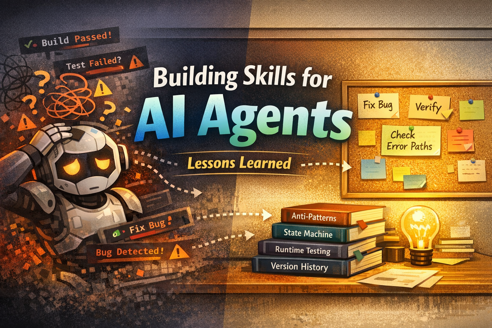

Building Skills for AI Agents: Failure Patterns, Tips, and Hard-Won Wisdom

Part 4 of 4 — Lessons Learned from 200+ Commits of Agent Skill Development



*Continued from Part 3: Architecture Deep Dive — (link to Part 3 on Medium)*

---

## The Honest Truth

Building spec-kit-skills took over 200 commits across three weeks. Along the way, we discovered that making AI agents *reliable* is fundamentally different from making them *capable*.

The agent could always build features. The challenge was getting it to build *the right* features, *the right way*, *every time*.

Here are the lessons — each born from a real failure.

---

## Failure Patterns

### Pattern 1: Build Pass ≠ Feature Works

**The trap:** Your build succeeds, tests pass, linter is clean — and the feature is broken at runtime.

**Real example:** Zustand state selectors created new object references every render. Result: infinite re-renders, broken scroll during streaming. TypeScript saw nothing wrong. Tests passed. The app was unusable.

**Lesson:** Build tools check syntax. Tests check isolated units. Neither checks runtime behavior — animation timing, state interaction, scroll position during streaming. You need runtime verification as a first-class pipeline step, not an afterthought.

**How we fixed it:** The verify phase runs Playwright against the actual UI. If Playwright isn't available, it delegates to the user. It never skips.

---

### Pattern 2: The Agent Forgets Its Own Rules

**The trap:** The agent reads a skill file at the start. 50 messages later, context compression kicks in, and the rules are gone.

**Real example:** During Feature 6 verification, context compression erased the verify-phases.md reference. The agent skipped Playwright UI verification entirely — despite completing it successfully for Features 1 through 5.

**Lesson:** This is the meta-problem. Every other safeguard assumes the agent reads its instructions. If instructions get compressed out, nothing works.

**How we fixed it:** Critical rules inlined at every execution point. State tracked in files — even if the agent forgets the rules, sdd-state.md tells it what step to resume from.

---

### Pattern 3: The Agent Guesses Instead of Reading

**The trap:** The agent generates a plausible value when it could have read the actual value from source code.

**Real example:** The agent guessed CSS color tokens instead of reading them from the source theme file. It assumed "3 sidebar tabs" when the code had 2 (the third was conditional).

**Lesson:** Agents are trained to generate. They'll happily produce a reasonable-looking answer even when the correct answer is one `grep` away. Your skill needs to *force* source reading, not just suggest it.

---

### Pattern 4: Error Paths Don't Exist Until You Ask

**The trap:** Specs describe what happens when things go right. Nobody describes what goes wrong.

**Real example:** A streaming chat feature's spec defined "send message → receive response" but not "loading → streaming → completion → error → cleanup → retry." The implementation had no error state handling.

**Lesson:** Agents are optimistic by nature. Error paths, edge cases, cleanup logic — these only appear if you explicitly ask. The Brief's "What happens when things go wrong?" step exists for this exact reason.

---

### Pattern 5: The "Just One More Thing" Trap

**The trap:** You add a small requirement to an existing Feature. The agent regenerates the entire spec, losing all previously approved criteria.

**How we fixed it:** The `add --to` augmentation flow with SC Preservation. Existing criteria get `[preserved]` tags. New ones get `[new]` tags. The agent can't drop existing criteria unless explicitly contradicted.

---

## Tips for Skill Developers

### Tip 1: Your Skill Is a Contract, Not a Guide

Write your SKILL.md as if it's a legal contract, not a tutorial. Every ambiguous phrase will be interpreted in the easiest way for the agent — which is usually not what you intended.

"Consider running tests after implementation"
→ Agent: "Tests are optional"

"BLOCKING: Run tests. If tests fail, do NOT proceed."
→ Agent: "I must run tests and they must pass"

---

### Tip 2: Anti-Patterns Are More Important Than Patterns

If you show a RIGHT example, the agent has one reference point. If you show a WRONG example followed by a RIGHT example, the agent has a boundary.

Anti-patterns saved us more debugging time than any other technique.

---

### Tip 3: State Machines Beat If/Else

When your skill has multiple states (pending, in_progress, augmented, completed, regression-specify…), model them as a state machine in a file — not as conditional logic in your skill text.

`sdd-state.md` is our state machine. The agent reads the current state, determines valid transitions, and acts accordingly.

---

### Tip 4: Test with Context Compression in Mind

Your skill file will eventually get compressed out of the agent's context. Test for this:

1. Start a conversation
2. Run your skill through a long workflow (50+ messages)
3. Check: does the agent still follow the rules?

If not, you need more inline enforcement and more file-based state tracking.

---

### Tip 5: Delegate What You Can't Automate

The agent can't drag files, can't enter API keys, can't observe terminal UI rendering. Instead of skipping these checks, delegate to the user:

"Drag-and-drop testing skipped (Playwright limitation)"
→ Untested functionality silently passes ❌

"Please drag a file onto the upload zone. Does the status change from 'idle' to 'processing'?"
→ User performs the test, reports result ✅

---

### Tip 6: Version Your Skill Like Software

Skills evolve. Track changes in a history file. Use semantic versioning. When you change a rule, document *why* — future-you (or future-agent) will need that context.

Our `history.md` has over 40 entries. Each explains not just what changed but which failure pattern triggered the change.

---

## The Bigger Picture

spec-kit-skills is one project's attempt at Harness Engineering. The specific implementation — markdown files, domain modules, HARD STOPs — will evolve. But the underlying need won't go away:

**As AI agents become more capable, developers need more structured ways to direct that capability.**

The future isn't "AI writes all the code." It's developers building increasingly sophisticated harnesses — systems that encode domain expertise, enforce quality gates, and maintain context across long-running workflows.

Today it's Claude Code skills. Tomorrow it might be something entirely different. But the patterns — Context Continuity, Enforce Don't Reference, File over Memory — will remain relevant wherever humans and AI agents collaborate on complex software.

---

## Getting Started

```
git clone https://github.com/coolhero/spec-kit-skills.git
cd spec-kit-skills
./install.sh
```

Then try:

```
/code-explore /path/to/interesting-project
/smart-sdd init "your project idea"
```

Read the SCENARIO-CATALOG.md for 32 user-facing scenarios covering greenfield, rebuild, adoption, and exploration workflows.

---

## 🤖 For Agents — Skill Development Checklist

```
skill development checklist:

  structure:
    - SKILL.md under 300 lines (always loaded)
    - commands/ for on-demand workflows
    - reference/ for supporting rules

  enforcement:
    - every critical rule: inline instruction + blocking gate + anti-pattern
    - never "See X.md for details" for critical behavior
    - HARD STOPs use AskUserQuestion, never auto-proceed
    - empty response: always re-ask

  state management:
    - all pipeline state in files, not agent memory
    - state machine file with valid transitions
    - after context compression: agent recovers by reading state file

  common failures:
    - build pass ≠ feature works → need runtime verification
    - agent forgets rules → inline at every execution point
    - agent guesses → force source reading
    - error paths missing → explicit "what goes wrong" in Brief
    - context loss → file-based state recovery

  tips:
    - anti-patterns > patterns (show WRONG before RIGHT)
    - state machines > if/else (model states in files)
    - delegate > skip (ask user when automation fails)
    - version history > memory (document WHY, not just WHAT)
    - 30 inline repetitions > 1 reference that gets ignored
```

---

*This concludes the 4-part series on spec-kit-skills. The project is open-source at github.com/coolhero/spec-kit-skills — contributions, feedback, and experiments welcome.*

*Written using Claude Code (Claude Opus 4.6). This entire series, and the project it describes, was developed through human-AI collaboration. The human designed the harness. The AI operated within it. Both were essential.*
