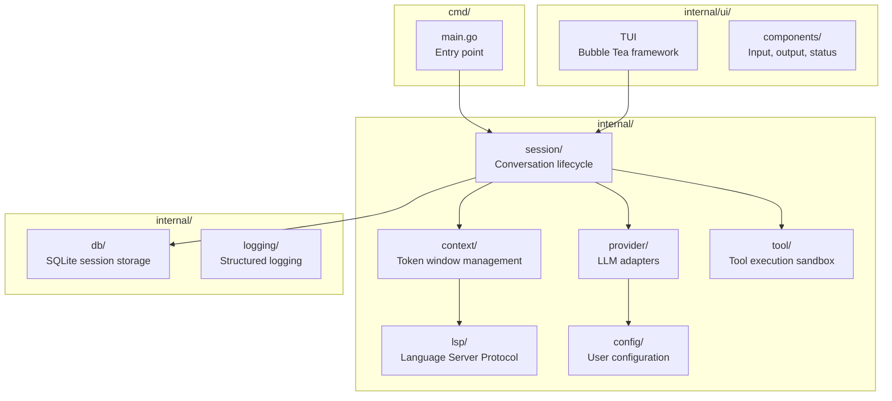

# Orientation — opencode

> Generated by `/code-explore` on 2026-03-18
> Source: `~/Develop/opencode` (Go, TUI application)
> Project type: CLI/TUI agentic coding tool

---

## Architecture Overview

## Module Map

| Module | Path | Description | Traces |
|--------|------|-------------|--------|
| **Session** | `internal/session/` | Conversation lifecycle, message history, turn management | [001](traces/001-context-assembly.md) |
| **Context** | `internal/context/` | Token window assembly, priority scoring, truncation | [001](traces/001-context-assembly.md), [002](traces/002-priority-scoring.md) |
| **Provider** | `internal/provider/` | LLM abstraction (Anthropic, OpenAI, custom) | [003](traces/003-tool-execution.md) |
| **Tool** | `internal/tool/` | Tool definitions, execution sandbox, result injection | [003](traces/003-tool-execution.md) |
| **LSP** | `internal/lsp/` | Language Server integration for code intelligence | [002](traces/002-priority-scoring.md) |
| **UI** | `internal/ui/` | Bubble Tea TUI, input/output components | — |
| **DB** | `internal/db/` | SQLite-based session persistence | — |
| **Config** | `internal/config/` | User configuration, provider keys, preferences | — |

## Exploration Coverage

| Module | Coverage | Traces |
|--------|----------|--------|
| Session | ████████░░ 80% | 001 |
| Context | ██████████ 100% | 001, 002 |
| Provider | ██████░░░░ 60% | 003 |
| Tool | ██████░░░░ 60% | 003 |
| LSP | ████░░░░░░ 40% | 002 |
| UI | ░░░░░░░░░░ 0% | — |
| DB | ░░░░░░░░░░ 0% | — |
| Config | ░░░░░░░░░░ 0% | — |

## Tech Stack

- **Language**: Go 1.22
- **TUI Framework**: Bubble Tea (charmbracelet/bubbletea)
- **Database**: SQLite via modernc.org/sqlite
- **LLM SDKs**: anthropic-go, openai-go
- **LSP**: Custom LSP client implementation
