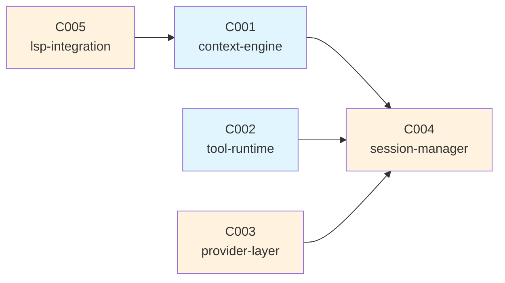

# Synthesis — opencode Exploration

> Generated from 3 traces, ~65% exploration coverage
> Source: opencode (Go, TUI agentic coding tool)
> Purpose: Build my own agentic coding tool based on opencode's patterns

---

## Accumulated Insights

### Patterns to Adopt (💡)

| Insight | Source Trace | Adoption Plan |
|---------|-------------|---------------|
| Token count caching with LRU | 001 (BR-002) | Implement with configurable cache size |
| System prompt never truncated | 001 (BR-001) | Keep as invariant |
| Current turn tool results always included | 001 (BR-004) | Keep as invariant |
| LSP references for context relevance | 002 (BR-010) | Adopt, add semantic similarity as 4th signal |
| Pin floor ensures user control | 002 (BR-008) | Keep — user intent overrides algorithm |
| Permission gate for destructive tools | 003 (BR-011) | Adopt, make configurable per tool |
| Error result for unknown tools (self-correction) | 003 (BR-014) | Adopt as-is |

### Improvements Planned (❓ → design decisions)

| Insight | Source Trace | My Approach |
|---------|-------------|-------------|
| Hardcoded priority weights | 002 (BR-006) | Make weights configurable via config file |
| No large message truncation strategy | 001 | Add per-item truncation (keep first/last N tokens) |
| Sequential tool execution | 003 (BR-016) | Parallel for read-only tools, sequential for writes |
| No output size limits | 003 | Add configurable max result size per tool |
| No Docker sandboxing | 003 | Add optional Docker isolation for bash tool |
| Provider-specific tokenizers not used | 001 | Use provider-specific tokenizer when available |

### Unresolved Questions (❓)

| Question | Source Trace | Resolution needed |
|----------|-------------|-------------------|
| How does system prompt grow? Static or dynamic? | 001 | Need to trace system prompt assembly |
| LSP fallback when no language server? | 002 | Need to check relevance.go fallback path |
| How are sessions persisted and restored? | — | UI and DB modules unexplored |
| How does the TUI render streaming responses? | — | UI module unexplored |

---

## Feature Candidates

| ID | Name | Description | Source Traces | opencode Reference | Differentiation |
|----|------|-------------|---------------|-------------------|-----------------|
| C001 | context-engine | Token-aware context window management with priority-based truncation | 001, 002 | `internal/context/` | Configurable weights, semantic similarity signal, per-item truncation |
| C002 | tool-runtime | Tool definition, dispatch, execution, and result injection | 003 | `internal/tool/` | Docker sandboxing, parallel read-only execution, output size limits |
| C003 | provider-layer | LLM provider abstraction with unified interface | 003 (partial) | `internal/provider/` | Streaming-first design, provider-specific tokenizers |
| C004 | session-manager | Conversation lifecycle, persistence, and restoration | 001 (partial) | `internal/session/`, `internal/db/` | DB-backed instead of file-based |
| C005 | lsp-integration | Language Server Protocol client for code intelligence | 002 | `internal/lsp/` | Cache transitive references, fallback for unsupported languages |

### Entity Consolidation

Entities observed across traces, deduplicated and consolidated:

| Entity | Observed In | Fields (consolidated) | Candidate Owner |
|--------|------------|----------------------|-----------------|
| ContextItem | 001, 002 | `Content`, `Source`, `Type`, `Priority`, `TokenCount`, `Pinned` | C001-context-engine |
| Message | 001, 003 | `Role`, `Content`, `ToolCalls[]`, `ToolResult*` | C004-session-manager |
| TokenCache | 001 | `cache map`, `maxSize` | C001-context-engine |
| ToolCall | 003 | `ID`, `Name`, `Input` | C002-tool-runtime |
| ToolResult | 003 | `ToolUseID`, `Content`, `IsError` | C002-tool-runtime |
| ToolHandler | 003 | `Name()`, `Schema()`, `Execute()` — interface | C002-tool-runtime |
| ToolSchema | 003 | `Name`, `Description`, `InputSchema` | C002-tool-runtime |
| LSPReference | 002 | `URI`, `Range`, `Kind` | C005-lsp-integration |

### API Consolidation

APIs observed across traces, deduplicated:

| API | Signature | Provider Candidate | Consumer Candidate |
|-----|-----------|-------------------|-------------------|
| Assembler.Assemble | `(msgs, files, tools) → ([]Message, error)` | C001 | C004 |
| TokenCounter.Count | `(content) → int` | C001 | C001 (internal) |
| PriorityScorer.Score | `(item) → float64` | C001 | C001 (internal) |
| WindowManager.Fit | `(candidates, budget) → candidates` | C001 | C001 (internal) |
| ToolDispatcher.Dispatch | `(name, input) → (ToolResult, error)` | C002 | C004 |
| ToolHandler.Execute | `(input) → (ToolResult, error)` | C002 | C002 (internal) |
| ReferenceFinder.GetReferences | `(file) → ([]Location, error)` | C005 | C001 |

### Business Rule Consolidation

| Rule | Description | Candidate Owner |
|------|-------------|-----------------|
| BR-001 | System prompt never truncated | C001 |
| BR-002 | Token count caching (LRU) | C001 |
| BR-003 | Last user message always included | C001 |
| BR-004 | Current turn tool results always included | C001, C002 |
| BR-005 | Older messages dropped before recent ones | C001 |
| BR-006 | Priority weights: relevance 50%, recency 30%, pin 20% | C001 |
| BR-007 | Same package relevance boost | C001 |
| BR-008 | Pin floor at 0.8 | C001 |
| BR-009 | Recency exponential decay (half-life 10 turns) | C001 |
| BR-010 | LSP reference scoring (direct 1.0, transitive 0.5) | C005 |
| BR-011 | Write/Bash tools require user approval | C002 |
| BR-012 | Shell timeout (default 120s) | C002 |
| BR-013 | Tool results always appended to current turn | C002 |
| BR-014 | Unknown tool → error result (not crash) | C002 |
| BR-015 | Write generates diff preview | C002 |
| BR-016 | Sequential tool execution | C002 |

---

## Handoff Readiness

### Coverage Assessment

- **Well-understood**: context-engine (C001), tool-runtime (C002) — high confidence for spec definition
- **Partially understood**: provider-layer (C003), session-manager (C004), lsp-integration (C005) — enough for initial spec, may need refinement
- **Unexplored**: UI/TUI rendering, configuration system — not included as candidates (UI is a separate design decision)

### Recommended Next Step

```
/smart-sdd init "Agentic coding tool inspired by opencode"
  → then:
/smart-sdd add --from-explore specs/explore/
  → synthesis.md Feature candidates → Brief input
  → Entity/API consolidation → registry seed
  → Business rules → constitution seed
  → Observations → elaboration context
```

### Dependency Graph (suggested)



Legend: 🟦 Well-understood (high confidence) | 🟨 Partially understood (needs more exploration or refinement during specify)
