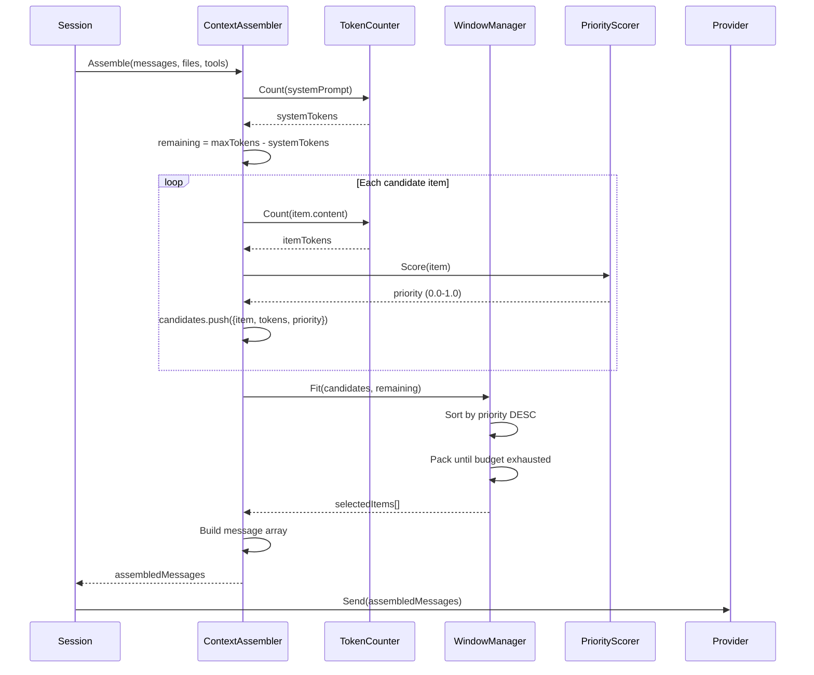

# Trace 001: Context Assembly Flow

> Explored: 2026-03-18
> Trigger: "How does opencode manage LLM context window?"
> Related: [002-priority-scoring](./002-priority-scoring.md) — priority scoring detail

---

## Summary

Context assembly is the process of selecting which messages, files, and tool results fit within the LLM's token limit. opencode uses a priority-based sliding window — every item gets a score, and the assembler packs items in score order until the token budget is exhausted.

## Flow

## Source Trace

| Step | Source Location | Action | Data In → Out |
|------|----------------|--------|---------------|
| 1 | `internal/session/session.go:145` | `NewTurn()` triggers context assembly | `messages[]` → `assembleRequest` |
| 2 | `internal/context/assembler.go:34` | `Assemble(msgs, files, tools)` | `candidates[]` → `tokenBudget` |
| 3 | `internal/context/token.go:67` | `Count(content)` via tiktoken | `string` → `int` (token count) |
| 4 | `internal/context/token.go:23` | Token cache lookup (LRU, 1000 entries) | `hash` → `cachedCount` or miss |
| 5 | `internal/context/priority.go:12` | `Score(item)` — see [trace 002](./002-priority-scoring.md) | `ContextItem` → `float64` |
| 6 | `internal/context/window.go:45` | `Fit(candidates, budget)` — greedy pack | `sorted[]` → `selected[]` |
| 7 | `internal/context/assembler.go:89` | Build final message array | `selected[]` → `[]Message` |
| 8 | `internal/session/session.go:178` | Send to provider | `[]Message` → LLM response |

## Entities Observed

| Entity | Source Location | Fields Observed | Owner (estimated) |
|--------|----------------|-----------------|-------------------|
| ContextItem | `internal/context/item.go:8` | `Content string`, `Source string`, `Type ItemType`, `Priority float64`, `TokenCount int`, `Pinned bool` | context module |
| Message | `internal/session/message.go:5` | `Role string`, `Content string`, `ToolCalls []ToolCall`, `ToolResult *ToolResult` | session module |
| TokenCache | `internal/context/token.go:15` | `cache map[uint64]int`, `maxSize int` | context module |

## APIs Observed

| Interface | Source Location | Signature | Provider → Consumer |
|-----------|----------------|-----------|---------------------|
| Assembler | `internal/context/assembler.go:12` | `Assemble(msgs []Message, files []File, tools []Tool) ([]Message, error)` | context → session |
| TokenCounter | `internal/context/token.go:10` | `Count(content string) int` | context (internal) |
| PriorityScorer | `internal/context/priority.go:8` | `Score(item ContextItem) float64` | context (internal) |
| WindowManager | `internal/context/window.go:10` | `Fit(candidates []Candidate, budget int) []Candidate` | context (internal) |

## Business Rules

| Rule | Source Location | Description |
|------|----------------|-------------|
| BR-001 | `assembler.go:40` | System prompt always included first — never truncated |
| BR-002 | `token.go:23` | Token counts are cached with LRU (1000 entries) — avoids redundant tiktoken calls |
| BR-003 | `window.go:52` | Last user message always included regardless of priority — ensures coherent response |
| BR-004 | `assembler.go:55` | Tool results from the current turn always included — LLM needs them for tool_use flow |
| BR-005 | `window.go:60` | When budget is tight, older messages are dropped before recent ones (recency bias) |

## Observations

- 💡 Token count caching (BR-002) is smart — tiktoken is expensive for large content. Worth adopting.
- 💡 "System prompt never truncated" (BR-001) and "last user message always included" (BR-003) are good invariants to keep.
- 💡 "Current turn tool results always included" (BR-004) is essential for tool_use flow correctness.
- ❓ What happens when a single message exceeds the entire budget? No truncation strategy visible — investigate.
- ❓ How does the system prompt grow? Is it static or does it accumulate context?
- ⚠️ Token counting uses tiktoken but doesn't account for provider-specific tokenizers (Anthropic vs OpenAI differ). Could lead to over/under-estimation.
- 💡 The greedy packing in WindowManager is simple but effective — might consider knapsack optimization for my version.
