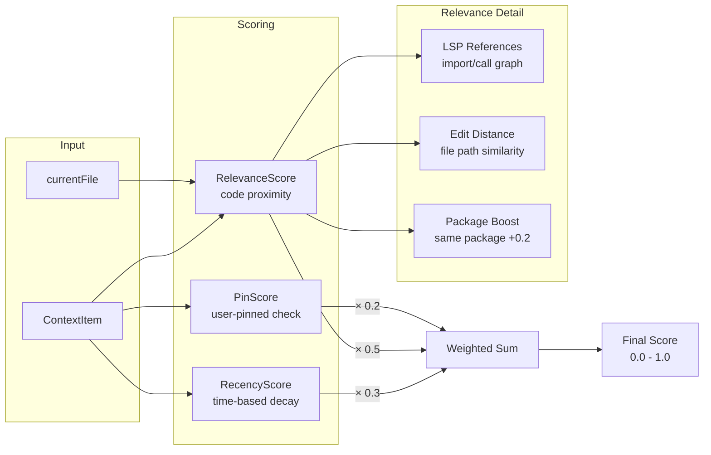

# Trace 002: Priority Scoring System

> Explored: 2026-03-18
> Trigger: "How does opencode decide what's important in the context?"
> Related: [001-context-assembly](./001-context-assembly.md) — parent flow (Step 5)

---

## Summary

Priority scoring determines which context items survive truncation. The system uses a weighted combination of three signals: recency (when was this last relevant), relevance (how related to the current task), and user pinning (explicit user control). LSP references feed into the relevance score, giving code-aware priority.

## Flow

## Source Trace

| Step | Source Location | Action | Data In → Out |
|------|----------------|--------|---------------|
| 1 | `internal/context/priority.go:12` | `Score(item)` entry point | `ContextItem` → `float64` |
| 2 | `internal/context/recency.go:5` | `RecencyScore()` — exponential decay from last reference time | `time.Time` → `float64 (0-1)` |
| 3 | `internal/context/relevance.go:23` | `RelevanceScore(item, currentFile)` | `(item, path)` → `float64 (0-1)` |
| 4 | `internal/lsp/references.go:45` | `GetReferences(file)` — LSP textDocument/references | `path` → `[]Location` |
| 5 | `internal/context/relevance.go:56` | `editDistance(item.Path, currentFile)` — normalized Levenshtein | `(path, path)` → `float64` |
| 6 | `internal/context/relevance.go:67` | Package boost: same Go package → +0.2 | `(pkg, pkg)` → `bool` |
| 7 | `internal/context/priority.go:30` | Weighted sum: `recency*0.3 + relevance*0.5 + pin*0.2` | `(3 scores)` → `final` |
| 8 | `internal/context/priority.go:35` | Pin floor: if `item.Pinned`, final = max(final, 0.8) | `float64` → `float64` |

## Entities Observed

| Entity | Source Location | Fields Observed | Owner (estimated) |
|--------|----------------|-----------------|-------------------|
| ContextItem | `internal/context/item.go:8` | (same as trace 001) | context module |
| LSPReference | `internal/lsp/references.go:12` | `URI string`, `Range Range`, `Kind ReferenceKind` | lsp module |

## APIs Observed

| Interface | Source Location | Signature | Provider → Consumer |
|-----------|----------------|-----------|---------------------|
| ReferenceFinder | `internal/lsp/references.go:8` | `GetReferences(file string) ([]Location, error)` | lsp → context |

## Business Rules

| Rule | Source Location | Description |
|------|----------------|-------------|
| BR-006 | `priority.go:30` | Weight distribution: relevance 50%, recency 30%, pin 20% — relevance is king |
| BR-007 | `relevance.go:67` | Same Go package files get +0.2 relevance boost |
| BR-008 | `priority.go:35` | Pinned items have a minimum score of 0.8 — user intent overrides algorithm |
| BR-009 | `recency.go:12` | Recency uses exponential decay with half-life of 10 turns |
| BR-010 | `relevance.go:40` | LSP reference score = 1.0 if direct import/call, 0.5 if transitive (2-hop) |

## Observations

- 💡 Using LSP references for relevance (BR-010) is clever — gives code-aware priority without embeddings.
- 💡 Pin floor at 0.8 (BR-008) ensures user control always wins. Good UX principle.
- ❓ Weight values (0.3/0.5/0.2) are hardcoded — should these be configurable?
- ❓ What if LSP is unavailable (no language server for this file type)? Fallback strategy?
- 💡 For my project: make weights configurable, add semantic similarity as a fourth signal.
- ⚠️ The 2-hop transitive reference (BR-010) could be expensive in large codebases — no caching visible.
