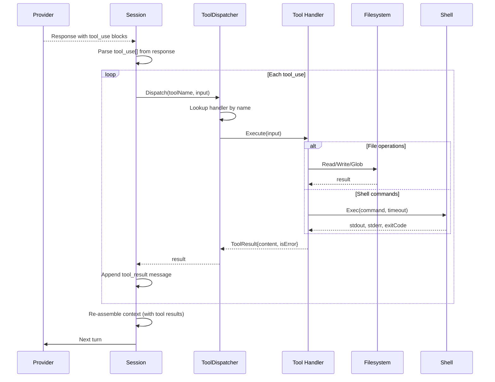

# Trace 003: Tool Execution Pipeline

> Explored: 2026-03-18
> Trigger: "How does opencode execute tools and feed results back?"
> Related: [001-context-assembly](./001-context-assembly.md) — results re-enter context (BR-004)

---

## Summary

Tool execution follows a request-execute-inject loop. The LLM returns tool_use blocks, opencode dispatches each to the appropriate tool handler, executes in a controlled environment, and injects results back into the conversation for the next LLM turn. Tools are defined as interfaces with a schema (for LLM) and an executor (for runtime).

## Flow

## Source Trace

| Step | Source Location | Action | Data In → Out |
|------|----------------|--------|---------------|
| 1 | `internal/session/session.go:195` | Parse `tool_use` blocks from LLM response | `Response` → `[]ToolCall` |
| 2 | `internal/tool/dispatcher.go:23` | `Dispatch(name, input)` — lookup handler | `(string, json)` → `ToolHandler` |
| 3 | `internal/tool/dispatcher.go:45` | Permission check — some tools require user approval | `ToolCall` → `bool (allowed)` |
| 4 | `internal/tool/handlers/read.go:12` | `ReadFile` handler — reads file content | `{path}` → `{content}` |
| 5 | `internal/tool/handlers/write.go:15` | `WriteFile` handler — writes with diff preview | `{path, content}` → `{diff, written}` |
| 6 | `internal/tool/handlers/bash.go:20` | `Bash` handler — shell execution with timeout | `{command, timeout}` → `{stdout, stderr, exit}` |
| 7 | `internal/tool/handlers/glob.go:8` | `Glob` handler — file pattern matching | `{pattern}` → `{matches[]}` |
| 8 | `internal/tool/dispatcher.go:67` | Wrap result as `ToolResult` message | `result` → `Message{role: tool}` |
| 9 | `internal/session/session.go:220` | Append tool_result, re-enter turn loop | `Message` → next LLM call |

## Entities Observed

| Entity | Source Location | Fields Observed | Owner (estimated) |
|--------|----------------|-----------------|-------------------|
| ToolCall | `internal/session/message.go:25` | `ID string`, `Name string`, `Input json.RawMessage` | session module |
| ToolResult | `internal/tool/result.go:5` | `ToolUseID string`, `Content string`, `IsError bool` | tool module |
| ToolHandler | `internal/tool/handler.go:8` | `Name() string`, `Schema() Schema`, `Execute(input) (Result, error)` | tool module (interface) |
| ToolSchema | `internal/tool/schema.go:5` | `Name string`, `Description string`, `InputSchema json.RawMessage` | tool module |

## APIs Observed

| Interface | Source Location | Signature | Provider → Consumer |
|-----------|----------------|-----------|---------------------|
| ToolHandler | `internal/tool/handler.go:8` | `Execute(input json.RawMessage) (ToolResult, error)` | tool → dispatcher |
| ToolDispatcher | `internal/tool/dispatcher.go:10` | `Dispatch(name string, input json.RawMessage) (ToolResult, error)` | tool → session |
| PermissionChecker | `internal/tool/permission.go:5` | `Check(tool string, input json.RawMessage) bool` | tool (internal) |

## Business Rules

| Rule | Source Location | Description |
|------|----------------|-------------|
| BR-011 | `dispatcher.go:45` | Write and Bash tools require user approval (permission gate) |
| BR-012 | `handlers/bash.go:30` | Shell commands have a configurable timeout (default 120s) |
| BR-013 | `session.go:220` | Tool results are always appended to the current turn — never dropped |
| BR-014 | `dispatcher.go:50` | Unknown tool names return error result (not crash) — LLM can self-correct |
| BR-015 | `handlers/write.go:25` | File writes generate a diff preview before actual write |
| BR-016 | `dispatcher.go:70` | Multiple tool_use blocks in one response are executed sequentially (not parallel) |

## Observations

- 💡 Permission gate (BR-011) is essential — adopt this pattern. Consider making it configurable per tool.
- 💡 Sequential execution (BR-016) is safe but slow — consider parallel execution for read-only tools.
- 💡 Error result for unknown tools (BR-014) lets the LLM self-correct instead of crashing.
- ❓ No sandboxing beyond permission checks — bash can do anything the user can do. Consider Docker isolation.
- ❓ No output size limits on tool results — a large file read could blow the context window.
- ⚠️ Write handler generates diff but doesn't verify the diff is correct — no AST-level validation.
- 💡 For my project: add tool result size limits, parallel read-only execution, Docker sandboxing option.
